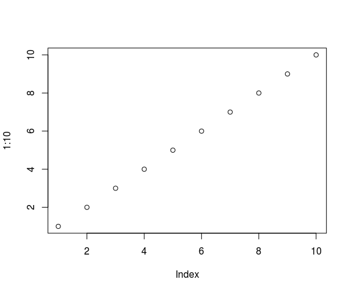

# Instalando R e RStudio
Jônatan Tatsch  
11-08-2015  


- - -


- - -

# Introdução

O curso de Análise de dados ambientais com o R (ADAR) será ministrado no Labaratório Setorial de Informática (LSI) do Centro de Ciências Naturais e Exatas ([CCNE](http://w3.ufsm.br/ccne/)) da [UFSM](http://site.ufsm.br/). O LSI possui *Desktops* com sistema operacional Linux [Ubuntu](http://ubuntu-br.org/). 
Nesse documento descreve-se como instalar o R e o [RStudio](http://www.rstudio.com/) no Linux Ubuntu. 

[R](https://www.r-project.org/about.html) é uma linguagem e um ambiente de programação para computação estatística e análise de dados interativa. O R é um software livre, de código fonte  aberto e funciona em diversos sistemas operacionais (Linux, Windows e MacOS).

O [RStudio](http://www.rstudio.com/) é um ambiente de desenvolvimento integrado (IDE) para o R e será utilizado no curso.

O R pode ser instalado a partir dos binários pré-compilados ou do código fonte. Aqui descreve-se a instalação do R a partir dos binários e como configurar o Linux Ubuntu para atualizar automaticamente o R.


# R sempre atualizado

O [R](http://www.r-project.org/) é um software multiplataforma (Windows, Linux e MacOS) distribuído  na **Rede Abrangente de Arquivos do R** ([CRAN](http://cran.r-project.org/mirrors.html)). Geralmente há duas atualizações ao ano. A versão mais atual é a R version 3.2.1 (2015-06-18). Para que ele seja atualizado automaticamente no Ubuntu precisamos adicionar o [repósitório do R](http://cran.r-project.org/mirrors.html) mais próximo da nossa região à lista de repositórios do sistema. No nosso caso, o repositório mais próximo é o da UFPR (<http://cran-r.c3sl.ufpr.br/>).

## Adicionando o repositório do R na Lista de repositórios do Ubuntu

A lista de repositórios do sistema é armazenada no arquivo `/etc/apt/sources.list`. Vamos abrir um terminal linux (use o atalho `Ctr+Alt+t`) e ver o conteúdo desse arquivo pelo seguinte comando no no terminal linux:
   
~~~~~~~
$ cat /etc/apt/sources.list 
~~~~~~~

As primeiras linhas desse arquivo devem ser similares ao mostrado abaixo:


```
 [1] # deb cdrom:[Ubuntu 14.04.2 LTS _Trusty Tahr_ - Release amd64 (20150218.1)]/ trusty main restricted
 [2]                                                                                                    
 [3] # See http://help.ubuntu.com/community/UpgradeNotes for how to upgrade to                          
 [4] # newer versions of the distribution.                                                              
 [5] deb http://br.archive.ubuntu.com/ubuntu/ trusty main restricted                                    
 [6] deb-src http://br.archive.ubuntu.com/ubuntu/ trusty main restricted                                
 [7]                                                                                                    
 [8] ## Major bug fix updates produced after the final release of the                                   
 [9] ## distribution.                                                                                   
[10] deb http://br.archive.ubuntu.com/ubuntu/ trusty-updates main restricted                            
[11] deb-src http://br.archive.ubuntu.com/ubuntu/ trusty-updates main restricted                        
[12]                                                                                                    
[13] ## N.B. software from this repository is ENTIRELY UNSUPPORTED by the Ubuntu                        
[14] ## team. Also, please note that software in universe WILL NOT receive any                          
[15] ## review or updates from the Ubuntu security team.                                                
```

Note que o nome da versão Ubuntu na máquina acima é a `trusty` (Ubuntu 14.04), mas na sua máquina pode ser outra versão como a `utopic` (Ubuntu 14.10), [entre outras](http://releases.ubuntu.com/). O nome da versão Ubuntu utilizada no seu sistema pode ser obtido pelo comando:

~~~~~~~
$ cat /etc/lsb-release
~~~~~~~

Precisamos incluir no arquivo `sources.list` o repositório da UFPR. Assim o gerenciador de pacotes [apt](http://pt.wikipedia.org/wiki/Advanced_Packaging_Tool),  usado para instalação, atualização e remoção de pacotes em distribuições Debian GNU/Linux, fará a atualização do R quando uma nova versão estiver disponível. Ou seja, você estará utilizando sempre versão mais atual do R.

Vamos adicionar o endereço do repositório da UFPR na última linha do arquivo `sources.list` através de alguns comandos do linux. Essa tarefa requer privilégios de superusuário, ou seja você precisa da senha de administrador do sistema. Vamos trocar de usuário comum para super usuário. 

~~~~~~~
$ sudo su
~~~~~~~

Vamos definir uma variável com o endereço do repositório.
     
     # repos="deb http://cran-r.c3sl.ufpr.br/bin/linux/ubuntu utopic/"
 
Note que a variável `repos` é uma sequência de caracteres com as seguintes informações:

~~~~~~~
deb `linkRepositorioSelecionado`/bin/linux/ubuntu `versaoUbuntu`/
~~~~~~~
 
A `versaoUbuntu` deve ser informada conforme a versão de sua máquina (`utopic` no caso dos desktops do LSI).  Para acrescentar essa informação no final do arquivo `sources.list` digite:

    # echo $repos >> /etc/apt/sources.list

Podemos retornar a sessão de usuário comum (*lsi*):

    # exit

## [APT protegido](https://wiki.debian.org/SecureApt) (adaptado da [CRAN](http://cran.r-project.org) seção Secure Apt).  

Os arquivos para Ubuntu na [CRAN](http://cran.r-project.org) são assinados com uma chave. Para adicionar essa chave no seu sistema digite o seguinte comando (requer senha de super usuário):

    $ gpg --keyserver hkp://keyserver.ubuntu.com:80 --recv-keys E084DAB9
        
e então use essa informação como entrada no `apt-key` com

    $ gpg -a --export E084DAB9 | sudo apt-key add -
    
Se aparecer a mensagem de que a chave pública foi importada, então não há necessidade de executar os comandos abaixo. Mas caso seja impresso alguma mensagem de erro, um método alternativo pode ser usado para obter a chave com os comandos:
  
    $ gpg --keyserver keyserver.ubuntu.com --recv-key E084DAB9
    $ gpg -a --export E084DAB9 | sudo apt-key add -

Se os comandos acima falharem você pode tentar:

    $ sudo apt-key adv --keyserver keyserver.ubuntu.com --recv-keys E084DAB9
    
## Atualização da lista de repositórios do Ubuntu e instalação do R

Após fazer as configurações da lista de repositórios e adicionar a chave é necessário fazer a atualização dessa lista (requer poderes de super usuário):

    $ sudo apt-get update
    
Agora, instale o binário do R:
 
    $ sudo apt-get install r-base

## Local para instalação de pacotes

Para termos melhor controle sobre os pacotes do R instalados no sistema é recomendado criar um diretório (`/home/lsi/.R/libs`) no seu `home`. No nosso caso o `home` refere-se ao diretório `$/home/lsi`, altere o nome do *lsi* conforme seu caso.

    $ mkdir -p /home/lsi/.R/libs/
    
Para informar ao R onde procurar os pacotes que instalamos criamos um arquivo chamado `.Renviron` no diretório `HOME` contendo a linha `R_LIBS=/home/lsi/.R/libs/`, o que pode ser feito com o  comando:

    $ echo 'R_LIBS=/home/lsi/.R/libs/' >> /home/lsi/.Renviron
    
Esse caminho fica então visível ao R, o que pode ser verificado pela função do R `.libPaths()` que pode ser executado na linha de comando do R.     


## Iniciando o R

Para iniciar o R no Ubuntu, digite `R` no cursor do terminal:

    $ R

A partir desse momento começamos uma sessão no R. Vamos gerar uma sequência de 1 a 10 e plotá-la.


```r
1:10
```

```
 [1]  1  2  3  4  5  6  7  8  9 10
```

```r
plot(1:10)
```



# RStudio no Ubuntu

O RStudio é um ambiente integrado de desenvolvimento ([IDE](http://en.wikipedia.org/wiki/Integrated_development_environment)) construído especificamente para o R. Existem [diversas opções de IDEs](http://www.sciviews.org/_rgui/projects/Editors.html) para o R. Nesse curso utilizaremos o RStudio. Assim como R pode ser baixado gratuitamente e é multiplataforma. O ambiente do RStudio disponibiliza o console do R, um editor com realce da sintaxe do R, ferramentas para gráficos, navegação de diretórios, manejo do espaço de trabalho, depuração de código e páginas de ajuda do R.

Para instalação você precisa saber seu sistema operacional e é 64 ou 32-bit. No Linux Ubuntu essa informação é obtida pelo comando linux:

    $ arch

Se retornar **x86_64** sua máquina é 64-bit.

Com essa informação, siga os seguintes passos:

  1. acesse [RStudio](http://www.rstudio.com/)
  2. clique em *Download RStudio*
  3. clique *Desktop*
  4. clique em *Download RStudio Desktop*
  5. clique sobre o link da sua plataforma, p.ex.: *RStudio 0.99.467 - Debian 8+/Ubuntu 12.04+ (64-bit)*
  6. clique sobre o arquivo baixado com o botão direito, abra com *Ubuntu Software Center* e clique em `instalar`.

Abra o RStudio digitando no terminal:

    $ rstudio &
    
Agora você está pronto para começar a programar com R aproveitando as facilidades que o RStudio oferece.

# Referências

Outros links que podem ajudar na instalação do [R](https://cran.r-project.org/bin/linux/ubuntu/README) e do [RStudio](http://www.rstudio.com/ide/download/desktop).


