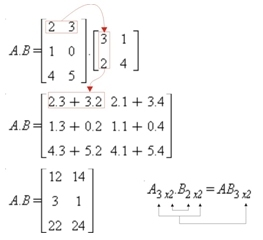

```{r Chunk0, comment="",prompt=FALSE, echo=FALSE, eval=TRUE, error=TRUE,highlight=TRUE,message=FALSE,warning=FALSE, results='hide'}
rm(list=ls())
# definindo globalmente tz = "GMT"
#Sys.setenv(TZ = 'GMT')
# data manipulation packages
pcks <- c("knitr", "knitcitations", "pander", "htmlTable")
invisible(sapply(pcks, require, character.only = TRUE, quietly = TRUE))
# configuraçoes knitr
opts_chunk$set(cache = FALSE, fig.path = "figs/")
```

- - -


- - -

# Objetivos

Nesta seção vamos:

- ver como os dados podem ser estruturados no R 
- conhecer os atributos dessas estruturas
- criar e manipular essas estruturas

#  Estruturas de dados

Existem diferentes formas de armazenar dados no R. Algumas vezes os dados precisam ser armazenados de forma mais complexa do que por exemplo vetores. 

O R possui uma variedade de estruturas (**Figura 1**). As mais utilizadas são:

- *data frame* (tabela de dados)

- *matrix* (matriz)

- *list* (lista)

- *array* e *vector* (vetor)


# Vetor

Um vetor é uma coleção de elementos. Os vetores são amplamente usados e compõem a estrutura básica de dados do R, por ser uma linguagem vetorizada. 

Os vetores podem ser de dois tipos: **vetores atômicos** e **listas**. 

## Vetores atômicos 

Os **vetores atômicos** são constituem a estrutura de dados mais simples do R (como se fossem os átomos do R). Um vetor atômico é uma coleção de elementos, em que todos são do mesmo tipo de dado (todos `double`, ou `integer`, ou `logical`, etc). 

Como linguagem vetorizada, as operações são aplicadas a cada elemento do vetor automaticamente, sem a necessidade de laços (ou *loopings*) ao longo do vetor. Esse conceito pode ser estranho para quem vem de outras linguagens, mas é uma das grandes vantagens do R.

Vetores não tem dimensões, ou seja não existem é um vetor linha ou vetor coluna. 

### Propriedades

+ `typeof()` (tipo de dado?)

+ `length()` (tamanho?) e 

+ `attributes` (informações acionais específicas do dado), entre eles o atributo mais comum está o `names()`.

### Criação

**Vetores atômicos** são geralmente criados com `c()`, abreviatura para o verbo **combinar ou concatenar**.

```{r chunk7, message=FALSE, comment="",prompt=FALSE }
# vetor numérico
vetor_num <- c(5, 2.5, 4.5)
# Note o sufixo L que distingue variaveis "double" de "integers"
vetor_int <- c(1L, 6L, 10L)
# Vetor logico
vetor_log <- c(T, FALSE, TRUE, FALSE)
# Vetor de caracteres
vetor_char <- c("Analise de dados", "ambientais com o R")
```

Vetores atômicos podem ser criados a partir de outros vetores aninhados entre si pela função `c()`.

```{r chunk71, message=FALSE, comment="",prompt=FALSE, tidy=FALSE}
v1 <- 1           # vetor com 1 elemento
v2 <- c(2)        # vetor com 1 elemento
v3 <- c(4, 6)     # vetor com 2 elemento
```

Formas diferentes para criação de vetor que resultam num mesmo vetor:

```{r, message=FALSE, comment="",prompt=FALSE, tidy=FALSE}
(v_123 <- c(v1, v2, v3))
(v_123a <- c(1, c(v2, v3)))
(v_123b <- c(vetor_num, c(v1, v2), v3))
v <- c(1, 2, 4, 6)
v
```

### Coerção de vetores

```{r chunk72, message=FALSE, comment="",prompt=FALSE }
c("a", 1)
as.numeric(c(F, F, T))
```

Você pode manualmente forçar um tipo de vetor para outro usando funções de coerção: `as.character()`, `as.double()`,`as.integer()`, `as.logical()`. Coerção frequentemente acontece automaticamente, mas geralmente será mostrada uma mensagem quando ocorrer.

Vamos usar a coerção no seguinte caso. Imagine um vetor com valores de chuva mensal de um ano e outro vetor com os meses do ano. Note a diferença da forma como criamos o vetor `meses` e o vetor `months`. Como descobrir o número de meses sem chuva nesse ano?
```{r chunk73, message=FALSE, comment="",prompt=FALSE }
# vetor com nomes criados com 1 comando
meses <- c(jan = 1, fev = 2, mar = 3 , abr = 4, mai = 5, jun = 6,
           jul = 7, ago = 8, set = 9, out = 10, nov = 11, dez = 12)
meses
## vetor definido e depois adiciona-se o nome das variáveis
months <- c(1, 2, 3, 4, 5, 6, 7, 8, 9, 10, 11, 12)
names(months) <- c("Jan", "Feb", "Mar", "Apr", "May", "Jun", "Jul", "Aug", "Sep", "Oct", "Nov", "Dec")
months
# o atibuto mais comum de um vetor
attributes(meses)
length(meses)
# Vetor com dados de prec
chuva <- c(100, 0, 20, 140, 110, 50, 90, 0, 0 , 10, 0, 6)
length(chuva)
# quando nao choveu?
seco <- chuva == 0
seco
# coerção de lógico para numérico
seco01 <- as.numeric(seco)
#seco01 <- as.integer(seco)
seco01
# total de meses secos no ano
sum(seco01)
# também funciona com vetores lógicos
sum(seco)
```

### Nomeando vetores

Nós podemos nomear um vetor de 3 formas:

+ Durante a criação

+ Modificando um vetor

+ Criando um vetor modificado

Nomes devem ser únicos (sem repetições), porque para filtragem de elementos de um vetor ou a seleção de um subconjunto (razão pela qual usam-se os `names`) retornará somente o primeiro elemento que tiver nome repetido.
```{r chunk74, message=FALSE, comment="",prompt=FALSE }
# Durante a criação:
x <- c(a = 1, b = 2, c = 3)
x
# Modificando um vetor: 
x <- 1:3; names(x) <- c("a", "b", "c")
x
# Criando um vetor modificado
x <- setNames(1:3, c("a", "b", "c"))
x
```

Nem todos elementos precisam ter nomes. Se os nomes são faltantes, `names()` retornará um string vazia ("") para aqueles elementos. Se todos forem faltantes, `names()` retornará `NULL`.
```{r chunk75, message=FALSE, comment="",prompt=FALSE }
y <- c(a = 1, 2, 3)
names(y)
z <- c(1, 2, 3)
names(z)
```

Podemos criar um vetor sem nomes usando a função `unname(x)`, ou remover `names` com `names(x) <- NULL`.

```{r chunk76, message=FALSE, comment="",prompt=FALSE }
a <- c(dia1 = 12, dia2 = 20, dia3 = 10)
a
names(a)
a_sn <- unname(a)
a_sn
names(a_sn)
```

- - -

## Operações com vetores

Para multiplicar cada elemento de um vetor por um valor é usar o operador de multiplicação  (*). O mesmo procedimento se aplica as demais operações de soma, subtração, divisão, exponenciação e etc.
```{r chunk77, message=FALSE, comment="",prompt=FALSE }
x <- 1:10
x * 3
x + 2
x - 3
x/4
2^(x/4)
x^2
sqrt(x)
```

Operações vetoriais podem ser estendidas para mais de um vetor.

```{r chunk78, message=FALSE, comment="",prompt=FALSE }
# criando 2 vetores de mesmo tamanho
x <- 1:10
y <- -5:4
# somando-os
x + y
x - y
x * y
x/y
x^y
2^x
x %% y
# tamanho dos vetores
length(x)
length(y)
length(x + y)
```

Uma peculiaridade do R é o tratamento de operações com vetores de tamanhos diferentes. O vetor menor é reciclado, de forma que seus elementos sejam repetidos em ordem até atingirem o tamanho do vetor mais longo envolvido na operação. 

```{r chunk79, message=FALSE, comment="",prompt=FALSE, tidy=TRUE}
v1 <- c(3, 5, 88, 90)
v2 <- c(2, 1)  
v1 + v2
```

Se o vetor mais longo não é múltiplo do mais curto, o R imprime um aviso.

```{r chunk710, message=FALSE, comment="",prompt=FALSE, tidy=TRUE}
v1 <- c(3, 5, 88, 90)
v2 <- c(2, 1, 3)  
v1 + v2
```

A reciclagem é intrinsecamente usada em operações envolvendo vetores.

```{r chunk711, message=FALSE, comment="",prompt=FALSE, tidy=TRUE}
v1
cte <- 4
v1 * cte
```

O número 4 nesse caso é reciclado 4 vezes e então multiplicado por cada elemento do vetor `v1`.
Avisos e erros:

```{r chunk712, message=FALSE, comment="",prompt=FALSE, tidy=TRUE, eval=TRUE, echo=TRUE, error=TRUE}
v1 <- c(3, 5, 88, 90)
srt(v1)
sqrt(-v1)
```

Comparações também funcionam com vetores.

```{r chunk713, message=FALSE, comment="",prompt=FALSE, tidy=TRUE, eval=TRUE, echo=TRUE, error=TRUE}
x <= 5
x > y
x < y
```

Entre os operadores lógicos vistos na [tabela 1 do tópico 4](https://rawgit.com/jdtatsch/adar-ufsm/master/4_TiposDeDados.html#tab_oper_log) alguns deles não foram vistos. Vamos então usar o operador `%in%` para verificar se um vetor está contido parcial ou totalmente em outro vetor.

```{r ,comment="",prompt=FALSE,}
# operador está contido em 
2:4 %in% x
# 2:4 são elementos de x?
is.element(2:4, x)
```

A função `nchar()` também funciona sobre cada elemento do vetor. Esse é mais um exemplo de função vetorizada do R.

```{r chunk714, message=FALSE, comment="",prompt=FALSE, tidy=TRUE, eval=TRUE, echo=TRUE, error=TRUE}
nchar(month.name)
nchar(y)
```

### Operadores `any` e `all`


```{r chunk715, message=FALSE, comment="",prompt=FALSE, tidy=TRUE}
vetor <- c(0, 1,-1,-2, 3, 5, -5)
all(vetor < 0)               # todas as posições são maiores que 0 ?
any(vetor > 0)               # alguma posição é maior que 0?
```

Ambas as funções sintetizam a informação:

- `all()` verifica se a condição avaliada é válida para todos elementos do vetor;
- `any()` verifica se a condição avaliada é válida para pelo menos um dos elementos do vetor;

As funções fornecem um único valor (vetor lógico de tamanho 1) para resumir ou descrever o resultado da condição aplicada ao vetor.

- - -

## Sequências {.tabset}

Vimos nas seções anteriores que é muito simples criar sequências de números inteiros com o operador `:`.  Nesta seção veremos outras formas de gerar sequências, como uma sequência de números não inteiros e sequências de números repetidos. 

### Sequências de números inteiros

Sequências de números formam um vetor. Há diversas formas de se gerar sequências no R. Para gerar uma sequência de 1 até 365, em vez de escrevermos cada número e combiná-los usando `c(1,2,3,...,365)`, podemos usar o operador `:` da seguinte forma:
 
```{r chunk716, message=FALSE, comment="",prompt=FALSE, tidy=FALSE}
# dias do ano
dda <- 1:365
dda
# sequencia de anos
anos <- 1961:1990
anos
# sequencia de inteiros decrescente
si_dec <- 10:-10
si_dec
# sequencia de numeros não inteiros
seqn <- 1.5:10
seqn
c(seqn, 10)
```

### Sequências de números não inteiros

Mas para gerar uma sequencia de números não inteiros há uma função específica para tal tarefa.
```{r chunk717, message=FALSE, comment="",prompt=FALSE, tidy=FALSE}
# igual a c(snum, 10), mas usando o seq
(snum_b <- seq(from = 1.5, to = 10, by = 0.5))
```

Exemplos de sequência de anos, meses e dias.
```{r chunk718, message=FALSE, comment="",prompt=FALSE, tidy=FALSE}
# vetor com de anos decimais (2 valores por dia)
anos_dec <- seq(2010, 2011, length.out = 365*2)
# para ver só o início do vetor ao invés de todo o vetor
head(anos_dec)
# mas não dá pra ver a parte decimal, vamos alterar as opções 
# aumentando as casas decimais
options(digits = 6)
# verifique agora
head(anos_dec)
# só os primeiros 30 elementos
head(anos_dec, 30)
# para ver só o final do vetor yrFrac
tail(anos_dec)
# para ver só os último 50 elementos do yrFrac
tail(anos_dec, 50)
# pentadas
pent <- seq(from = 1, to = 365, by = 5)
# dencendios
decd <- seq(from = 1, to = 365, by = 10)
# fracoes de dia 
frac_d30mn <- seq(0, 365, length.out = 365*48) + 1
head(frac_d30mn, 48*2)
tail(frac_d30mn, 48*2)
# diferentes funções para gerar uma sequência
an <- c(1,7,2,5,3,2)
# gerando uma sequencia a partir de um número
seq_len(length.out = 6)
# gerando uma sequência a partir de um número
seq(6)
# de acordo com o tamanho do vetor gera-se uma sequencia 
seq(along = an)
seq(along = 0) #! melhor opção para gerar sequencias do tamanho do vetor
seq(0) #! cuidado, veja ?seq para entender a razão desse resultado inusitado
# conflito entre parâmetros
# a <-seq(from = -5, to = 5, by = 0.05, length.out=200)
s5by <- seq(from = -5, to = 5, by = 0.05)
length(s5by)
tail(s5by)
s5len <- seq(from = -5, to = 5, length.out = 200)
length(s5len)
tail(s5len)
```

### Sequências de números repetidos

```{r chunk719, message=FALSE, comment="",prompt=FALSE }
rep_t4 <- rep(1:2, times = 4)
rep_t4
rep_e31 <-rep(1:12, each = 31)
rep_e31
rep_t13 <- rep(c("chuva","sol"), times = c(1,3))
rep_t13
rep_t13_t4 <- rep(rep(c("chuva","sol"), times = c(1,3)), times = 4)
rep_t13_t4
```        

- - -


## Indexação de vetores {.tabset}

Os elementos de um vetor são indexados e para acessá-los usamos a notação de índices do R. 

Podemos selecionar partes de um vetor por números (posição do elemento), caracteres (nome) e vetores lógicos. 

Através do operador `[` podemos acessar ou filtrar elementos de um vetor. O operador colchete `[` aplicado a um vetor retornará um vetor.

Considere os seguintes vetores como exemplo:

```{r chunk720, message=FALSE, comment="",prompt=FALSE, tidy=FALSE}
# vetor de chuva mensal para um dado ano 
prec <- c(300, 150, 210, 12, 0, 0, 12, 22, 80, 100, 0, 280)
meses <- c("Jan", "Fev", "Mar", "Abr", "Mai", "Jun", "Jul","Ago", "Set", "Out", "Nov", "Dez")
names(prec) <- meses
prec
# gráfico de barras
barplot(prec)
box()
# temperatura do ar média mensal para um dado ano
temp <- c(25, 23.2, 22.5, 21, 19, 17.6, 18, 19.7, 21.3, 22, 24, 26.8)
names(temp) <- meses
temp
plot(temp, type = "o")
```

Como selecionar o valor de chuva e temperatura só para janeiro?

Usando a seguinte sintaxe: 

`vetor[i]`

onde `i` representa os elementos a serem selecionados.

### Indexação por vetores inteiros

#### Positivos

Para selecionar o valor de chuva e temperatura só para janeiro, digitamos:

```{r chunk721, message=FALSE, comment="",prompt=FALSE, tidy=FALSE}
prec_jan <- prec[1]
prec_jan
temp_jan <- temp[1]
temp_jan
```

Como selecionar os últimos valores dos vetores de chuva e temperatura?

```{r Chun722, message=FALSE, comment="",prompt=FALSE, tidy=FALSE}
# vetor de temperatura do ar média mensal de um ano qualquer
temp_dez <- temp[length(temp)]
temp_dez
prec_dez <- prec[length(prec)]
prec_dez
```

Como selecionar os valores de chuva do trimestre JJA e de temperatura para o trimestre DJF?

```{r chunk723, message=FALSE, comment="",prompt=FALSE, tidy=FALSE}
sel_prec <- c(6,7,8)
# vetor de chuva JJA
prec_jja <- prec[sel_prec]
prec_jja
# total de chuva trimestral nesse ano
prect_jja_tot <- sum(prec_jja)
prect_jja_tot
# vetor de temperatura DJF
sel_temp <- c(12,1,2)
temp_djf <- temp[sel_temp]
temp_djf
# temp média trimestral nesse ano
temp_djf_med <- mean(temp_djf)
temp_djf_med
```

#### Negativos

Como selecionar todos valores menos o primeiro e o último?

```{r chunk724, message=FALSE, comment="",prompt=FALSE, tidy=FALSE}
# exceto o primeiro e ultimo
prec[-c(1, length(prec))]
# exceto os 3 primeiros meses
temp[-c(1:3)]
# exceto os 3 últimos meses
temp[-c(length(temp):(length(temp)-2))]
```

###  Indexação por nomes

```{r chunk727c, message=FALSE, comment="",prompt=FALSE, tidy=TRUE}
prec["Jan"]
prec[c("Dez", "Fev", "Jun")]
```

###  Indexação por vetores lógicos

Vamos criar um vetor lógico e usá-lo para exemplificar a seleção lógica de elementos de um vetor. 

```{r chunk725, message=FALSE, comment="",prompt=FALSE, tidy=TRUE}
vetor_l <- c(TRUE, FALSE, FALSE, TRUE, TRUE, FALSE, TRUE, FALSE, TRUE, FALSE, FALSE, TRUE)
meses[vetor_l]
```        

Os elementos de `vetor_l` correspondentes a `TRUE` foram selecionados. Aplicando-se a função `sum()` a um vetor lógico obtemos o total de elementos verdadeiros:

```{r chunk726, message=FALSE, comment="",prompt=FALSE, tidy=TRUE}
sum(vetor_l)
```       

Vamos considerar agora a seguinte forma do vetor lógico (`vetor_l`) e relembrar da **coerção** de vetores.

```{r chunk727, message=FALSE, comment="",prompt=FALSE}
# vetor lógico
vetor_l <- c(T, F)
meses[vetor_l]
vetor_l <- c(T, F, F)
meses[vetor_l]
prec[c(T,F)]
temp[c(rep(F,3),T)]
``` 

A indexação pode ser feita também por comparações:

```{r chunk728, message=FALSE, comment="",prompt=FALSE}
# vetor prec
prec
# teste para chuva > 80 mm/mês
prec > 80
# salvando resultado do teste
above80 <- prec > 80
# extraindo valores atendidos ao teste
prec[above80]
# teste para meses com chuva abaixo da média mensal
(prec_med <- mean(prec))
# salvando resultado do teste
(below_avg <- prec < prec_med)
# extraindo valores que atendem a condição
prec[below_avg]
# extraindo os 3 primeiros meses com prec abaixo da média
prec[below_avg][1:3]
# forma equivalente em uma linha só
prec[prec < mean(prec)][1:3]
# teste para meses com prec diferente de zero
prec[prec != 0]
``` 

<span style="color:red; font-size:1.7em;">Fim da 3ª aula ([site do curso](https://rawgit.com/jdtatsch/adar-ufsm/master/5_EstruturaDeDados.html)) </span>

###  Indexação com múltiplas condições

Nos exemplo acima vimos como buscar os os elementos de um vetor para apenas uma condição. Entretanto frequentemente precisamos testar mais condições. Por exemplo, para condições do tipo:

- $0.5 < prec \leq 100$ 
- $temp < 5$  ou $temp \geq 25$ 

precisamos usar os operadores relacionais:

- `&` e `&&` (\"e"\)

- `|` e `||` (\"ou"\)

A ordem das operações pode ser controladas por parênteses. Os operadores `&` e `|` são vetorizados (retornam vetores de mesmo tamanho que os vetores testados). 

As diferenças entre os operadores são mostradas nos exemplos a seguir.

```{r chunk729, message=FALSE, comment="",prompt=FALSE, tidy=TRUE}
# prec
prec
# combinação de operador lógico e relacional
below100 <- prec > 0 & prec <= 100
prec_cond1 <- prec[below100]
prec_cond1
```

A forma dupla (`&&` ou `||`) compara somente um elemento de cada lado, enquanto a forma normal (`&` e `|`), compara cada elemento dos vetores em cada lado.

```{r chunk7290, message=FALSE, comment="",prompt=FALSE, tidy=TRUE}
a <- c(1, 1, 0, 1)
b <- c(2, 1, 0, 1)
# forma normal verifica cada elemento de a e cada elemento de b
a == 1 & b == 1
# forma dupla verifica somente o primeiro elemento de a e o primeiro elemento de b
# retornando somente um resultado
a == 1 && b == 1
```

```{r chunk729011, message=FALSE, comment="",prompt=FALSE, echo=FALSE, eval=FALSE}
(prec[1:3] > 200) & (prec[10:length(prec)] > 200)
(prec[1:3] > 200) | (prec[10:length(prec)] > 200)
(prec[1:3] > 200) && (prec[10:length(prec)] > 200)
(prec[1:3] > 200) && (prec[10:length(prec)] > 200)
all(prec[1:3] > 100) & all(prec[10:length(prec)] > 200)
```

```{r chunk72901, message=FALSE, comment="",prompt=FALSE, echo=FALSE, out.width=200}
oper <- c("a", "b", "a==1", "b==1", "a == 1 & b == 1", "a == 1 && b == 1") 
desc <- data.frame(
                   a,
                   b,
                   a == 1, 
                   b == 1,
                   a == 1 & b == 1,
                   a == 1 && b == 1)
names(desc) <- oper
desc[2:nrow(desc),6] <- ""
pander(desc, caption = "Demostração da diferença entre & e &&.")
```

Podem haver mais que duas condições a serem testadas. As condições podem ser combinadas usando múltiplos `&` ou `|`. As diferentes condições podem ser agrupadas por parênteses assim como operações matemáticas. Sem parênteses, a ordem das operações é semelhante a das operações matemáticas:

- **PEMDAS**: Parênteses > Expoentes > Multiplicação > Divisão > Adição e Subtração 

Onde `&`é equivalente à **multiplicação** e `|` é equivalente à **adição**, logo **e** tem precedência sobre **ou**.

```{r chunk7292, message=FALSE, comment="",prompt=FALSE}
# vetor de horas
horas <- 0:23
# vetor de temperaturas horárias
tar_hor <- c(19.9, 19.8, 19.5, 19.4, 19.4, 19.3, 
             19.2, 19, 19.2, 19.5, 20.1, 20.6, 20.9, 
             21.8, 22.5, 22.6, 22.5, 22, 21.4, 20.1, 
             20, 19.8, 19.6, 19.4)
# gráfico do varição horária da temperatura do ar
plot(horas, tar_hor, type = "o", pch = 20)
# temperaturas noturnas abaixo de 20ºC
(night_below20 <- (horas < 6 | horas > 18) & tar_hor < 20)
tar_hor[night_below20]
# destacando no gráfico
points(x = horas[night_below20], 
       y = tar_hor[night_below20], 
       pch = 20,      # tipo de símbolo para os ponts
       col = "blue",  # cor do símbolo
       cex = 2)       # tamanho do ponto
# temperaturas abaixo de 20ºC que não ocorreram a noite
day_below20 <- tar_hor < 20 & !night_below20
points(horas[day_below20], tar_hor[day_below20], pch = 20, col = "red", cex = 2)
# adicionando linha horizontal ao longo da temperatura = 20ºC
abline(h = 20, col = "gray")
```

Vimos que a filtragem consiste em extrair elementos de um vetor que satisfaça uma (ou várias) condição(ões). Entretanto em alguns casos o interesse é na posição dentro do vetor  na qual a condição ocorre. Nós podemos localizar essas ocorrências usando a função `which()`:

```{r chunk730, message=FALSE, comment="",prompt=FALSE, tidy=TRUE}
# prec sem nomes
names(prec) <- NULL
# combinação de operador lógico e relacional
below100
which(below100)
# qual os meses em que a chuva foi acima da media
which(prec > prec_med)
prec[which(prec > prec_med)]
# Qual a temp quando a chuva ou a temp foi acima da media?
sel <- which(prec > prec_med | !temp < mean(temp))
sel
prec[sel]
# quais posições do vetor prec não choveu
which(prec == 0)
# quando ocorreu a prec max
which(prec == max(prec))
# equivalente a ...
which.max(prec)
# seleciona só a primeira ocorrência!
which.min(prec)
prec
``` 

Um outro operador útil para comparação entre vetores é o operador `%in%`, que pode ser interpretado como \"está contido em\". O **resultado é um vetor de mesmo tamanho que o vetor a esquerda do teste**. 

```{r chunk731, message=FALSE, comment="",prompt=FALSE, tidy=TRUE}
# compare o tamanho dos vetores resultantes
which(meses %in% c("JAN", "Feb", "Mar"))
# note a diferença 
which(c("JAN", "Feb", "Mar") %in% meses)
cond <- names(temp) %in% c( "Jun","Jul","Ago")
quais <- which(cond)
quais
prec[cond]
prec[quais]
``` 

## Substituição de elementos de um vetor

```{r chunk732, message=FALSE, comment="",prompt=FALSE, tidy=FALSE}
# posição a ser alterada
pos <- 10
# valor da temperatura naquela posição
old_temp <- temp[pos]   
old_temp
# vetor de temperatura
temp
# substituição do valor original por um novo valor
new_temp <- 30
# alterando temperatura do mês de outubro
temp[pos] <- new_temp
temp
```
  
A substituição também pode ser feita também pelo nome das variáveis.

```{r chunk733, message=FALSE, comment="",prompt=FALSE, tidy=FALSE}
prec
prec["Mai"] <- 5
temp
temp[c("Mai", "Jul")] <- temp[c("Mai", "Jul")] + 2
temp
```

## Criação de vetores com `vector`

Outra forma de se criar vetores é através da função `vector()`.

```{r chunk734, message=FALSE, comment="",prompt=FALSE, tidy=TRUE}
# criação de vetor v
v <- 3
v
# adicionando elementos
v[2] <- 100
v
v[5] <- 6
v
# adicionando elementos de vetores
x <- c(88,5,12,13)
x <- c(x[1:3], 168, x[4]) # insere 168 antes do 13
x
# outra opção 
k <- vector()
class(k)
# vetor k existe?
ls()
# alocando o valor 45 no 3º elemento de k
k[3] <- 45
k
class(k)
# diminuindo o tamanho de k
length(k) 
length(k) <- 2
k
length(k) <- 0
k
class(k)
is.null(k)
# exemplo
temp <- c(25, 23.2, 22.5, 21, 19, 17.6, 18, 19.7, 21.3, 22, 24, 26.8)
temp_orig  <- temp
# mostrando o vetor temp
temp
temp[] 
# substituir todos elementos do vetor temp por um vetor com apenas um valor
temp <- 0 
temp
# vamos redefinir temp e comparar o anterior com o obtido com o próximo comando
temp <- temp_orig;
temp[1:length(temp)] <- 0
temp
# qual diferença de x <- 0 e x[] <-0 ?
temp <- temp_orig
temp[] <- 0  
temp
# Um vetor com tamanho pre-definido e do tipo numeric
umvetor <- vector(mode = "numeric", length=100)
umvetor
# populando o vetor
umvetor[1] <- 10
umvetor[10] <- 100
umvetor
```

## Vetores nulos e elementos faltantes

Seja qual for a razão, ao realizar um experimento em condições reais sempre haverá situações em que não conhecemos o valor de uma determinada variável. Por exemplo, a série de uma variável meteorológica medida em estação de superfície, sempre ocorrem datas em que não há registro da variável. Falha instrumental, dado não coletado pelo observador, falta de energia, são causas inerentes de falhas em séries climáticas de longo prazo. 
No R dados faltantes são representados pela string `NA`.

```{r chunk735, message=FALSE, comment="",prompt=FALSE, error = TRUE}
v1 <- c(1:8,NA)
v1 > 5    # NA sai na resposta
# teste lógico com o operador idêntico "=="
v1 == NA  
# não funcionou, porque há funções específicas para vetores com NA
onde_falta <- is.na(v1)
# função apropriada p/ checar se tem NAs
faltante <- which(is.na(v1));
v1[-faltante]
# ou 
v1[!onde_falta]
# vamos calcular a média de v1
sum(v1)/length(v1)
# vamos remover valores NA
sum(v1[-faltante])/length(v1[-faltante])
sum(v1[!onde_falta])/length(v1[!onde_falta])
# mas o R possui a função mean 
mean(v1) 
# não retornou o que desejamos, removendo as posicoes dos dados faltantes
mean(v1[-faltante])
# ok, mas olhando o help ...
#?mean
mean(v1, na.rm=TRUE)
# definir como faltante todos elementos de v1
v1[] <- NA
v1
length(v1)
# vetor com dados faltantes indicados por -999
# substituir onde é -999 por NA
x <- c(-999, 10, 15, -999, 50)
x == -999
x[x == -999] <- NA 
# total de dados faltantes
sum(!is.na(x))
```


## Diferença entre `NA` e `NULL`

O `NULL` é um tipo de dado especial do R.

```{r chunk738, message=FALSE, comment="",prompt=FALSE, tidy=TRUE, error=TRUE}
# v1 existe ?
ls()
exists("v1")
# vamos anular todo v1
v1 <- NULL
ls()
v1
# NULL
vetor1 <- c()
vetor2 <- NULL;
is.null(c(vetor1,vetor2))
# vetor1 e vetor2 são equivalentes?
identical(vetor1, vetor2)
# remoção de elementos de um vetor com NULL
a <- c(10, 2, NA, 20)
a
typeof(a)
# remover de a o dado faltante
a <- a[!is.na(a)]
a
# é possível remover um elemento com o NULL?
a[length(a)] <- NULL
a
a <- a[-length(a)]
a
typeof(a)
# anulando a
a <- NULL
# qual modo de um objeto nulo?
typeof(a)
# qual modo de NA?
b <- NA
b
typeof(b)
length(a)
length(b)
```

- - -

# Matrix

Vetores são objetos unidimensionais. Vetores multidimensionais são denominados *arrays*. As matrizes são um caso especial de *array* em que o número de dimensões é igual a 2, uma dimensão são as linhas e a outra as colunas. Os dados armazenados em uma matriz são de uma única classe (ou `numeric`, ou `character`, por exemplo).

## Criação de matrizes

### Função `dim()` 

Podemos converter um vetor atômico em uma array de n dimensões através do atributo dimensão: `dim()`. Para fazer isso, definimos o atributo `dim`(dimensão) a um vetor numérico de tamanho `n`. 
O R reorganizará os elementos do vetor de acordo com as dimensões.

```{r Chunk111, message=FALSE, comment="",prompt=FALSE, tidy=TRUE, echo=TRUE, eval=TRUE}
v <- 1:12
length(v)
attributes(v)
class(v)
## cópia de v
vetor <- v
## conversão de vetor para matriz
dim(v) <- c(3, 4)  # 1a dimensão: linhas , 2a dimensão: colunas 
## vetor é vector?
is.vector(v)
## vetor é matrix?
is.matrix(v)
## classe de vetor
class(v)
attributes(v)
v
## invertendo as dimensões
dim(v) <- c(4, 3)
v
class(v)
typeof(v)
```

O R usa o primeiro valor de `dim()` para o número de linhas e o segundo para o número de colunas. De forma geral em operações que usam linhas e colunas, as linhas vem sempre em primeiro.
É importante notar que o R sempre preenche cada matriz ao longo das colunas ao invés das linhas.
Para mais controle na forma como R reorganiza os dados em linhas e colunas, podemos utilizar a função `matrix()` ou `array()`. Elas fazem a mesma coisa que a `dim()` porém com argumentos mais versáteis para este processo.

### Função `matrix()` 

Note como os números foram distribuídos na matriz com 3 linhas e 4 colunas. Outra forma simples de se criar uma matriz é usando a função `matrix()`.

Ao aplicarmos a função `matrix()` a um vetor sem especificar nenhum argumento ela produz uma matriz de uma coluna.

```{r Chunk1121, message=FALSE, comment="",prompt=FALSE, tidy=TRUE, echo=TRUE, eval=TRUE}
## atribuindo novas dimensões ao vetor
m <- matrix(vetor) # matriz de uma coluna
m
```

Se desejamos construir uma matriz com 3 linhas e 4 colunas a partir do vetor `vetor` podemos usar as seguintes expressões equivalentes:

```{r Chunk1122, message=FALSE, comment="",prompt=FALSE, tidy=TRUE, echo=TRUE, eval=TRUE}
## criando a matriz gerada com dim
mat <- matrix(vetor, nrow = 3, ncol = 4) 
mat
## não há necessidade de especificar ambos ncol e nrow
mat <- matrix(vetor, nrow = 3) 
mat
```

Poderíamos criar a matriz `mat` especificando os elementos individualmente:

```{r Chunk1123, message=FALSE, comment="",prompt=FALSE, tidy=TRUE, echo=TRUE, eval=TRUE}
## criando a matriz gerada com dim
mat <- matrix(nrow = 3, ncol = 4)
mat
mat[1,1] <- 1
mat[2,1] <- 2
mat[3,1] <- 3
mat[1,2] <- 4
mat[2,2] <- 5
mat[3,2] <- 6
mat[1,3] <- 7
mat[2,3] <- 8
mat[3,3] <- 9
mat[1,4] <- 10
mat[2,4] <- 11
mat[3,4] <- 12
mat
```

No exemplo a seguir os dados do vetor aparecem distribuídos ao longo das linhas e não das colunas como no caso acima. Nós definimos isso com o argumento **`byrow = TRUE`** da função `matrix`:

```{r Chunk1124, message=FALSE, comment="",prompt=FALSE, tidy=TRUE, echo=TRUE, eval=TRUE}
## byrow = T
mat <- matrix(vetor, ncol = 4, byrow = T) 
mat
```

## Nomes das linhas e colunas de uma matriz

Nas matrizes, assim como nos vetores, também é possível dar nomes aos elementos para tornar a leitura da informação mais clara. 
Vamos usar os vetores de temperatura mensal dos anos de `1990:1992`para construir uma matriz com os meses ao longo das colunas e  os anos ao longo das linhas. 

```{r Chunk121, message=FALSE, comment="",prompt=FALSE, tidy=TRUE, echo=TRUE, eval=TRUE}
## temperatura do ar média mensal do ano de 1990
temp90 <- c(25.00, 23.20, 22.50, 21.00, 19.00, 17.60,
            18.00, 19.70, 21.30, 22.00, 24.00, 26.80)
## temperatura do ar média mensal do ano de 1991
temp91 <- c(24.89, 24.07, 23.56, 23.11, 18.29, 18.22,
            16.72, 19.37, 20.08, 21.45, 26.61, 25.99)
## temperatura do ar média mensal do ano de 1992
temp92 <- c(23.2, 26.61, 18, 23.11, 26.8, 21.3, 18.22,
            21.45, 19.7, 22.5, 24.07, 20.08)
## vetor com as temperaturas dos 3 anos
vtemp <- c(temp90, temp91, temp92)
vtemp
## arranjar matrix com meses ao longo das colunas e anos ao longo das linhas
temp_mat <- matrix(vtemp, ncol = 12, byrow = T)
temp_mat
## cópia da matriz temp_mat (sem nomes)
temp_matO <- temp_mat
```

Atribuindo nomes às linhas (`rownames()`) e colunas (`colnames()`) da matriz criada dos vetores de temperatura mensal (`temp_mat`).

```{r Chunk122, message=FALSE, comment="",prompt=FALSE, tidy=TRUE, echo=TRUE, eval=TRUE}
## atribuindo nomes as colunas e linhas da temp_mat
rownames(temp_mat) <- c("ano1990", "ano1991", "ano1992")
colnames(temp_mat) <- c("Jan", "Fev", "Mar", "Abr", "Mai",
                        "Jun", "Jul","Ago", "Set", "Out", 
                        "Nov", "Dez")
temp_mat
```

## Indexação de matrizes

Como acessamos o valor de temperatura de maio de 1991 na matriz `temp_mat`?

```{r Chunk131, message=FALSE, comment="",prompt=FALSE, tidy=TRUE, echo=TRUE, eval=TRUE}
temp_mat   # matriz de temperaturas com nomes
temp_matO  # matriz de temperaturas sem nomes
## qual a linha do ano de 1991
linha <- 2
## qual a coluna do mês de maio
coluna <- 5
## extraindo
temp_mat[linha, coluna]
## ou usando os nomes
temp_mat["ano1991", "Mai"]
```

Com o operador `[` podemos usar todos os esquemas de indexação vistos na Unidade de **Seleção e filtragem de dados**.

```{r Chunk132, message=FALSE, comment="",prompt=FALSE, tidy=TRUE, echo=TRUE, eval=TRUE}
## temperaturas de todos janeiros
temp_mat[ , 1]
temp_mat[ , "Jan"]
## só as temperaturas de 1990 e 1993
temp_mat[-2 , ]
## só as temperaturas dos verões
temp_mat[, c(12, 1, 2)]
## invertendo ordem das colunas
temp_mat[, ncol(temp_mat):1]
## invertendo ordem das colunas e das linhas
temp_mat[3:1, 12:1]
## invertendo ordem das colunas e das linhas
temp_mat[c(2,1,3), c(6:1,12,10:8)]
## só as temperaturas dos invernos
temp_mat[, colnames(temp_mat) %in% c("Jun", "Jul", "Ago") ]
## exceto as temperaturas dos invernos
temp_mat[, -which(colnames(temp_mat) %in% c("Jun", "Jul", "Ago")) ]
## seleção de colunas intercaladas da matriz: mês sim, mês nao
temp_mat[,c(T,F)]
## 2 meses sim, 1 mes não
temp_mat[,c(T,T,F)]
```

Podemos fazer uso do operador `[` de forma aninhada:

```{r Chunk133, message=FALSE, comment="",prompt=FALSE, tidy=TRUE, echo=TRUE, eval=TRUE}
temp_mat[, 1:6]
temp_mat[, 1:6]["ano1991",]
temp_mat[, 1:6]["ano1991",][2:4]
```

Podemos substituir valores de uma submatriz da matriz:

```{r Chunk134, message=FALSE, comment="",prompt=FALSE, tidy=TRUE, echo=TRUE, eval=TRUE}
M <- temp_mat
M
## 1990 e 1992 os meses de jan e dez 
M[c(1,3), c(1,12)]
## matriz com novos valores
matrix(c(21, 22, 23, 24), ncol = 2)
## substituindo
M[c(1,3), c(1,12)] <- matrix(c(21, 22, 23, 24), ncol = 2)
M
```

Outro exemplo:

```{r Chunk135, message=FALSE, comment="",prompt=FALSE, tidy=TRUE, echo=TRUE, eval=TRUE}
 mx <- matrix(nrow = 3, ncol = 3)
 my <- matrix(c(4,5,2,3), nrow = 2)
 my
 mx[2:3, 2:3] <- my
 mx
```

## Número de linhas e colunas de uma matriz

```{r Chunk141, message=FALSE, comment="",prompt=FALSE, tidy=TRUE, echo=TRUE, eval=TRUE}
M
ncol(temp_mat)
nrow(temp_mat)
dim(temp_mat)
```

Existem funções específicas para saber a coluna e a linha cada elemento de uma matriz.

```{r Chunk142, message=FALSE, comment="",prompt=FALSE, tidy=TRUE, echo=TRUE, eval=TRUE}
## colunas de cada elemento da matriz
col(temp_mat)
## linhas de cada elemento da matriz
row(temp_mat)
## elementos de matriz
m <- matrix(1:16, nrow = 4, byrow = T)
m
## nós veremos mais sobre a função paste futuramente
elementos <- paste("m", row(m), col(m), sep = "")
mel <- matrix(elementos, ncol = 4)
mel
## qual colunas de M são idênticas a 1
col(m)==1
## seleciona na M colunas idênticas a 1
mel[col(m)==1]
## qual colunas de M são idênticas a 1 ou 3?
col(m)==1 | col(m)==3
## Usando operadores relacionais
row(m)==1
col(m)==3
row(m)==1 | col(m)==3
## seleciona valores de M posicionados na linha 1 OU na coluna 6
mel[row(m)==1 | col(m)==4]
m[row(m)==1 | col(m)==4]
## seleciona valores de M posicionados na linha 1 E na coluna 6
mel[row(m)==4 & col(m)==4]
m[row(m)==4 & col(m)==4]
```

## Acrescentando linhas e colunas a uma matriz

```{r Chunk151, message=FALSE, comment="",prompt=FALSE, tidy=TRUE, echo=TRUE, eval=TRUE}
(temp_mat_lin <- rbind(temp90, temp91, temp92))
(temp_mat_col <- cbind(temp90, temp91, temp92))
## recursão
rbind(1:10, 11, 21:25)
cbind(10:6, 5:4, 0)
```

## Operações matriciais

A primeira entre as diversas funções de álgebra matricial no R é a transposta `t()`.
```{r Chunk161, message=FALSE, comment="",prompt=FALSE, tidy=TRUE, echo=TRUE, eval=TRUE}
temp_mat
t(temp_mat)
mel
t(mel)
## diagonal de mel
diag(mel)
```

### Multiplicação matricial

Operações algébricas, incluindo a multiplicação `*`, atuam elemento a elemento sobre matrizes. Mas se a intenção é fazer uma multiplicação matricial usamos o operador (`%*%`).



```{r Chunk1611, comment="",prompt=FALSE, tidy=TRUE, echo=TRUE, eval=TRUE, error=TRUE}
## multiplicação de duas matrizes
A <- matrix(c(2,1,4,3,0,5),ncol=2)
A
B <- matrix(c(3,2,1,4), ncol = 2)
B
A * B
prodMat <- A %*% B
prodMat
## multiplicação de uma matriz por um escalar
m
m * 2
```

### Adição matricial

```{r Chunk1621, message=FALSE, comment="",prompt=FALSE, tidy=TRUE, echo=TRUE, eval=TRUE}
m
m + m
```

### Produto escalar

```{r Chunk1631, message=FALSE, comment="",prompt=FALSE, tidy=TRUE, echo=TRUE, eval=TRUE}
u <- 1:3
v <- c(5, 12, 13) 
u * v
## produto escalar = u.v = 1*5 + 2*12 + 3*13
crossprod(u, v)
```

### Determinante

```{r Chunk1641, message=FALSE, comment="",prompt=FALSE, tidy=TRUE, echo=TRUE, eval=TRUE}
## matriz exemplo
mat_ex <- matrix(c(1, -7, 3, 5, -9, 2, 6, 6, 1), ncol = 3)
det(mat_ex)
```

### Solução de sistemas lineares
x1 + x2 = 2

-x1 + x2 = 4

 Qual os  valores de x1 e x2?
```{r Chunk1651, message=FALSE, comment="",prompt=FALSE, tidy=TRUE, echo=TRUE, eval=TRUE}
## matrizes do sistema linear
coefs <- matrix(c(1, -1, 1, 1), ncol = 2)
y <- c(2, 4)
x <- solve(coefs, y)
x
```


## Conversão de `matrix` para `vector`

Frequentemente é mais conveniente trabalhar com um vetor do que com uma matriz, por isso precisamos saber como fazer o caminho inverso. Quando criamos uma matriz (p. ex.: `temp_mat`) no início da seção ela foi baseada em um vetor (`vtemp`). Como fazemos para voltar aquele vetor original a partir da matriz?

```{r Chunk171, message=FALSE, comment="",prompt=FALSE, echo=TRUE, eval=TRUE}
## desmanchando matrizes
mel
## note as diferenças
mel[1,1]
mel[1]
## resulta em uma submatriz
mel[1:4, 1:4]
## resulta em um vetor
mel[1:4]
## submatriz da temp_mat
temp_mat[1:3,1:3]
## vetor gerado de 3 elementos de mat
temp_mat[1:3]
## numero de elementos na matriz
nel <- nrow(temp_mat)*ncol(temp_mat)
nel
temp_mat[1: nrow(temp_mat)*ncol(temp_mat) ]
## vetor de temperaturas
vtemp <- temp_mat[1:(ncol(temp_mat)*nrow(temp_mat))]
vtemp
## outra forma de converte temp_mat para vetor
c(temp_mat)
## função formal para converter 
as.vector(temp_mat)
## mais uma forma de converte temp_mat para vetor
array(temp_mat)
## para desmanchar a matriz com os elementos seguindo a ordem das linhas 
c(t(temp_mat))
as.vector(t(temp_mat))
## serie temporal de temp_mat
stemp <- c(t(temp_mat))
plot(stemp, type = "o")
## criar matriz com colunas temp e meses 1:12
cbind(rep(1:12, nrow(temp_mat)),stemp)
## dados de temp e meses
tempdat <- cbind(1:12, stemp)
## plot da temperatura pelos meses (os meses repetem)
plot(tempdat, 
     type = "p", ## tipo de grafico: pontos
     pch = 20,   ## codigo numérico do simbolo do ponto
     col = rep(1:3, each = ncol(temp_mat)),  ## cores dos pontos
     cex = rep(seq(1, 2 , by = 0.5), each = ncol(temp_mat)), ## aumenta tamanho dos pontos
     las = 1,   ## orientação dos labels dos eixos perpendiculares ao eixo
     ylab = expression(Tar~(degree~C)), ## label da variável y
     xlab = "meses", ## label da variavel x
     main = "Temperatura mensal (1990-1992)" ## título
    )# end plot 
## para entender a variação nas cores e símbolos usadas no gráfico
cbind(meses = 1:12, temp = stemp, 
      cores = rep(1:3, each = ncol(temp_mat)), ## cores
      simb_tam = rep(seq(1, 2 , by = 0.5), each = ncol(temp_mat))
      ) ## tamanho dos símbolos 
```


- - - 

# Funções utilizadas

TO DO

- `c()`


```{r, message=FALSE, comment="", prompt=FALSE, echo = FALSE, eval=FALSE}
# Exercícios
Descubra outras duas formas para criação de vetores.
```


<br/>

<p style="font-family: verdana; font-size: 14px; font-style: italic; background: whitesmoke; color: black; line-height: 14px;width: 900px;">Próximo: [Manipulacao de Dados](https://rawgit.com/jdtatsch/adar-ufsm/master/6_ManipulacaoDeDados.html)</p> 


