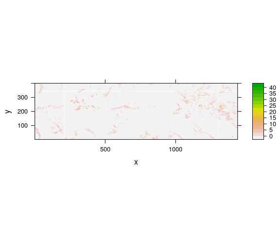
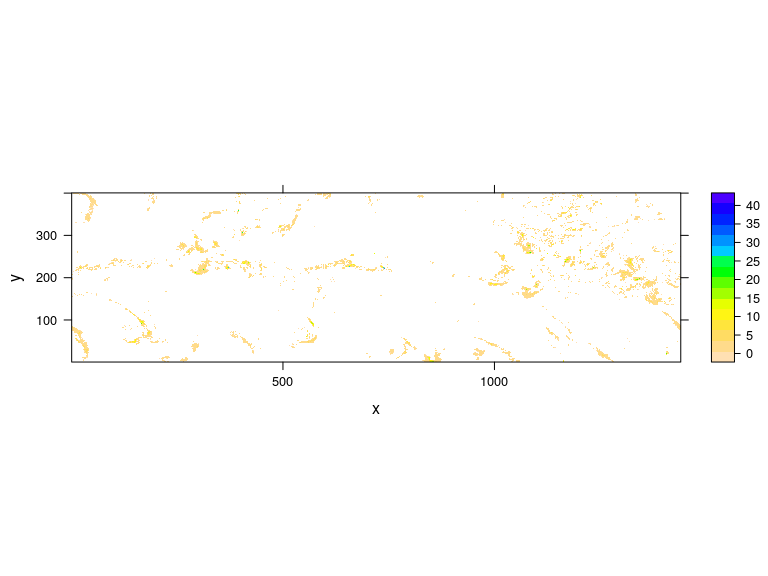
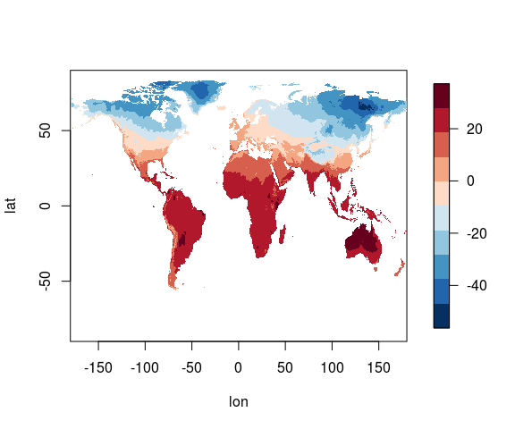
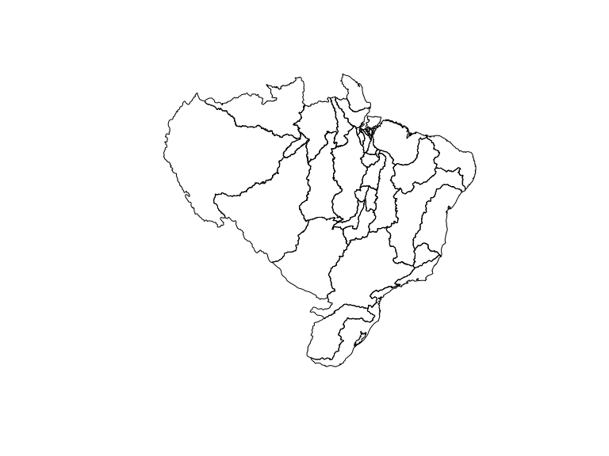

- - -


- - -

# Objetivos 

O R permite ler dados de uma variedade de fontes e formatos. Nesta unidade veremos como importar dados de arquivos texto, binários e de outros softwares para o R. Nesta seção vamos:

- ver como **importar dados no R**[^1] 
- conhecer os formatos mais comuns de dados reconhecidos pelo R
- ler arquivos de dados meteorológicos de fontes brasileiras

[^1]: Para uma descrição mais abrangente sobre importação e exportação de dados no R consulte a documentação de cada função e o manual [R Data Import/Export](http://cran.r-project.org/doc/manuals/r-release/R-data.html).


# Amostras pequenas de dados

## Entrada dados pela linha de comando

Até agora nós trabalhamos com dados que criados a partir de comandos diretamente digitados no console do R. Para criação de vetores usamos a função `c` que combina valores em um vetor. 


```r
# Exemplo: vetor
v1 <- c(1,3,4:8,10)
v1
#> [1]  1  3  4  5  6  7  8 10
```

### scan()

Nós podemos informar os números de um vetor a partir do teclado, um de cada vez usando e quando terminar teclar enter:


```r
# Exemplo: vetor
v2 <- scan()
# digite os números do v1, ao terminar, tecle enter
```

A função `scan()` também pode ler dados de arquivos, mas a sua saída é um vetor, ou seja ela não mantém a  estrutura dos dados contidos no arquivo.


```r
# Exemplo: vetor
vetor_aq <- scan("data/airquality.txt")
# parte inicial dos dados
head(vetor_aq, 100)
#>   [1]   41.0  190.0    7.4   67.0    5.0    1.0   36.0  118.0    8.0   72.0
#>  [11]    5.0    2.0   12.0  149.0   12.6   74.0    5.0    3.0   18.0  313.0
#>  [21]   11.5   62.0    5.0    4.0  -99.9  -99.9   14.3   56.0    5.0    5.0
#>  [31]   28.0  -99.9   14.9   66.0    5.0    6.0   23.0  299.0    8.6   65.0
#>  [41]    5.0    7.0   19.0   99.0   13.8   59.0    5.0    8.0    8.0   19.0
#>  [51]   20.1   61.0    5.0    9.0  -99.9  194.0    8.6   69.0    5.0   10.0
#>  [61]    7.0 -999.0    6.9   74.0    5.0   11.0   16.0  256.0    9.7   69.0
#>  [71]    5.0   12.0   11.0  290.0    9.2   66.0    5.0   13.0   14.0  274.0
#>  [81]   10.9   68.0    5.0   14.0   18.0   65.0   13.2   58.0    5.0   15.0
#>  [91]   14.0  334.0   11.5   64.0    5.0   16.0   34.0  307.0   12.0   66.0
# parte final
tail(vetor_aq, 100)
#>   [1]  24.0  10.9  71.0   9.0  14.0  13.0 112.0  11.5  71.0   9.0  15.0
#>  [12]  46.0 237.0   6.9  78.0   9.0  16.0  18.0 224.0  13.8  67.0   9.0
#>  [23]  13.0  27.0  10.3  76.0   9.0  18.0  24.0 238.0  10.3  68.0   9.0
#>  [34]  19.0  16.0 201.0   8.0  82.0   9.0  20.0  13.0 238.0  12.6  64.0
#>  [45]   9.0  21.0  23.0  14.0   9.2  71.0   9.0  22.0  36.0 139.0  10.3
#>  [56]  81.0   9.0  23.0   7.0  49.0  10.3  69.0   9.0  24.0  14.0  20.0
#>  [67]  16.6  63.0   9.0  25.0  30.0 193.0   6.9  70.0   9.0  26.0 -99.9
#>  [78] 145.0  13.2  77.0   9.0  27.0  14.0 191.0  14.3  75.0   9.0  28.0
#>  [89]  18.0 131.0   8.0  76.0   9.0  29.0  20.0 223.0  11.5  68.0   9.0
#> [100]  30.0
# dados são importados como vetor
is.vector(vetor_aq)
#> [1] TRUE
mode(vetor_aq)
#> [1] "numeric"
```

Vimos que `dataframes` são geralmente criados pela função `data.frame`, conforme o exemplo abaixo.


```r
# Exemplo: dataframe 
dados <- data.frame(dates = c("2013-01-01", "2013-01-01", "2013-01-01"),
                    cidade = c("Santa Maria", "Sao Sepe", "Caçapava"), 
                    temperatura = c(31, 35, 21),
                    chuva = c(3, 10, 14))
dados                    
#>        dates      cidade temperatura chuva
#> 1 2013-01-01 Santa Maria          31     3
#> 2 2013-01-01    Sao Sepe          35    10
#> 3 2013-01-01    Caçapava          21    14
```

### readline()

Para ler apenas uma linha de dados a partir do teclado como `character` usamos a função **`readline()`**:


```r
sentenca <- readline(prompt = "digite alguma coisa e tecle enter para continuar: ")
#> digite alguma coisa e tecle enter para continuar:
sentenca
#> [1] ""
```

Esta função pode ser utilizada como uma forma de controlar um *looping*. Esse exemplo ilustra o uso da função `lapply()` para execução de laços ou *loopings* ao longo de um vetor de índices. Essa função será vista futuramente no curso.


```r
# para reprodutibilidade
set.seed(123)
# looping ao longo da sequência de 1 a 5
l <- sapply(1:5, 
         function(i){
           # cria vetor com números aleatórios com distribuição uniforme
           x <- runif(n = 100, min = 1,max = 50)
             # anomalia acumulada
             y <- cumsum(x - mean(x))
              plot(y, type = "o")
              abline(h = 0, lty = 2)
               # leitura de linha, só após teclar enter vai gerar próximo gráfico
               readline(prompt = "tecle <enter> para continuar: ")
         }
       )
l
```

### Impressão na tela

No modo interativo do R podemos imprimir os valores de um objeto na tela digitando o nome do objeto.


```r
x <- 1:3
y <- x^2
y
#> [1] 1 4 9
# ou 
print(x^2)
#> [1] 1 4 9
```

Entretanto isso não é possível quando precisamos mostrar o valor de uma variável dentro do corpo de uma função ou dentro de um laço (*looping*). Nesse caso podemos usar a função `print()`:


```r
# dentro de uma função 
# digitando o nome do objeto não imprimi na tela
fcubo <- function(x) {
         classe <- class(x)
         # intenção de mostrar objeto de entrada
         classe
         x^3
        }
fcubo(2)
#> [1] 8
# adicionando print 
cubo <- function(x) {
         # mostra objeto de entrada
         classe <- class(x)
         print(classe)
         x^3
        }
fcubo(-3) # não imprime classe do objeto de entrada
#> [1] -27
cubo(-3)  # imprime classe do objeto de entrada
#> [1] "numeric"
#> [1] -27
```

#### `cat()` ao invés de `print()`

É melhor usar a função `cat()` ao invés da função `print()`, já que a `print()` permite a impressão de apenas um único objeto enquanto a `cat()` não. Compare os resultados das duas funções:


```r
print("abc")
#> [1] "abc"
cat("abc\n") # \n indica quebra de linha
#> abc
x
#> [1] 1 2 3
cat("os elementos de x são: ", x, "\n")
#> os elementos de x são:  1 2 3
cat("os elementos de x são: ", x, sep = "")
#> os elementos de x são: 123
cat("os elementos de x são: ", x, sep = "\n")
#> os elementos de x são: 
#> 1
#> 2
#> 3
k <- c(5, 12, 13, 8, 88)
cat(k, sep = c(".","___"," ---> ","\n","\n"))
#> 5.12___13 ---> 8
#> 88
```

## textConnection()

Imagine que você tivesse recebido essa amostra de dados por e-mail:
   
    dates      cidade temperatura chuva
    2013-01-01 SM          13     3
    2013-01-01 SS          30    10
    2013-01-01 CV          22    12

Para converter essa pequena amostra de dados em um *dataframe* nós podemos selecionar, copiar e colar o texto no primeiro argumento da função `textConnection`, e então usar a função `read.table`. 


```r
texto <- "       dates      cidade temperatura chuva
    2013-01-01 SM          31     3
    2013-01-01 SS          35    10
    2013-01-01 CV          21    14"
# conexão de texto
tc <- textConnection(object = texto)
tc
#> A connection with                            
#> description "texto"         
#> class       "textConnection"
#> mode        "r"             
#> text        "text"          
#> opened      "opened"        
#> can read    "yes"           
#> can write   "no"
x <- read.table(file = tc, header = TRUE)
x
#>        dates cidade temperatura chuva
#> 1 2013-01-01     SM          31     3
#> 2 2013-01-01     SS          35    10
#> 3 2013-01-01     CV          21    14
```

# Exportando e recuperando objetos do R no formato textual

## `dput()`, `dget`, `dump` e `source`.

Uma função útil para passar os dados a alguém que precisa reproduzi-los é a função `dput()` (que pode ser traduzido como "despejar"). Ela escreve uma representação textual de um objeto R que pode ser escrita em um arquivo. Para recriar o objeto basta usar a função `dget()`.


```r
x
#>        dates cidade temperatura chuva
#> 1 2013-01-01     SM          31     3
#> 2 2013-01-01     SS          35    10
#> 3 2013-01-01     CV          21    14
# representação textual do objeto x
dput(x)
#> structure(list(dates = structure(c(1L, 1L, 1L), .Label = "2013-01-01", class = "factor"), 
#>     cidade = structure(c(2L, 3L, 1L), .Label = c("CV", "SM", 
#>     "SS"), class = "factor"), temperatura = c(31L, 35L, 21L), 
#>     chuva = c(3L, 10L, 14L)), .Names = c("dates", "cidade", "temperatura", 
#> "chuva"), class = "data.frame", row.names = c(NA, -3L))
# salva representação textual de x em um arquivo
dput(x, file = "data/x.txt")
# recuperando x a partir do arquivo
y <- dget("data/x.txt")
# alterar valores de y
y <- y[, 3:4] - sqrt(2)
y
#>   temperatura     chuva
#> 1    29.58579  1.585786
#> 2    33.58579  8.585786
#> 3    19.58579 12.585786
# verificar existência de x e y 
ls()
#>  [1] "cubo"     "dados"    "fcubo"    "k"        "pcks"     "sentenca"
#>  [7] "tc"       "texto"    "v1"       "vetor_aq" "x"        "y"
# listando variáveis que começam com x ou y
ls(pattern = "^[xy]")
#> [1] "x" "y"
# salvando mais de um objeto em um arquivo
dump(ls(pattern = "^[xy]"), file = "R/xy.R")
# vamos apagar x e y do espaco de trabalho
rm(x, y)
# x e y não existem mais
ls()
#>  [1] "cubo"     "dados"    "fcubo"    "k"        "pcks"     "sentenca"
#>  [7] "tc"       "texto"    "v1"       "vetor_aq"
# recuperando os objetos x e y salvos em xy.R
source("R/xy.R")
ls()
#>  [1] "cubo"     "dados"    "fcubo"    "k"        "pcks"     "sentenca"
#>  [7] "tc"       "texto"    "v1"       "vetor_aq" "x"        "y"
x
#>        dates cidade temperatura chuva
#> 1 2013-01-01     SM          31     3
#> 2 2013-01-01     SS          35    10
#> 3 2013-01-01     CV          21    14
y
#>   temperatura     chuva
#> 1    29.58579  1.585786
#> 2    33.58579  8.585786
#> 3    19.58579 12.585786
```

Portanto diferente da escrita dos dados em si para um arquivo texto as funções `dump()` e `dput()` armazenam os **dados** e os **metadados**, assim outro usuário não precisa especificá-los novamente. Assim o usuário que recebe a saída do `dput()` em um arquivo, pode recriar os dados pelo comando `dget("nomedoarquivo")`. 


```r
# representação textual de um data.frame
x2 <- structure(list(dates = c("2013-01-01", "2013-01-01", "2013-01-01"), 
                     cidade = c("SM", "SS", "CV"), 
                     temperatura = c(31L, 35L, 21L), 
                     chuva = c(3L, 10L, 14L)), 
                     .Names = c("dates", "cidade", "temperatura", "chuva"), 
                class = "data.frame", 
                row.names = c(NA, -3L)
                )
x2
#>        dates cidade temperatura chuva
#> 1 2013-01-01     SM          31     3
#> 2 2013-01-01     SS          35    10
#> 3 2013-01-01     CV          21    14
```

**Vantagens:**

- armazena os **dados e os metadados**
- rápida e fácil recuperação dos dados

**Desvantagens:**

- armazenamento de dados nesse formato não é muito eficiente em termos de espaço em disco
- pouca legibilidade dos dados 

Esse procedimento é geralmente recomendado para fornecer pequenas amostras de dados (e-mails por exemplo)

# Dados de pacotes do R

O `R` possui diversos conjuntos de dados internos que são automaticamente carregados quando iniciado. Esses dados são usados nos exemplos do `help()` de diversas funções para ilustrar o uso e a aplicação delas. Esses dados podem ser carregados com a função `data`.


```r
data()
# Annual Precipitation in US Cities, p/ mais informações "?precip"
data(precip)
# primeiros 30 elementos dos dados precip
head(precip, n = 30)
#>              Mobile              Juneau             Phoenix 
#>                67.0                54.7                 7.0 
#>         Little Rock         Los Angeles          Sacramento 
#>                48.5                14.0                17.2 
#>       San Francisco              Denver            Hartford 
#>                20.7                13.0                43.4 
#>          Wilmington          Washington        Jacksonville 
#>                40.2                38.9                54.5 
#>               Miami             Atlanta            Honolulu 
#>                59.8                48.3                22.9 
#>               Boise             Chicago              Peoria 
#>                11.5                34.4                35.1 
#>        Indianapolis          Des Moines             Wichita 
#>                38.7                30.8                30.6 
#>          Louisville         New Orleans            Portland 
#>                43.1                56.8                40.8 
#>           Baltimore              Boston             Detroit 
#>                41.8                42.5                31.0 
#>    Sault Ste. Marie              Duluth Minneapolis/St Paul 
#>                31.7                30.2                25.9
# New York Air Quality Measurements, , p/ mais informações "?airquality"
data(airquality)
# primeiras linhas dos dados
head(airquality, n = 10)
#>    Ozone Solar.R Wind Temp Month Day
#> 1     41     190  7.4   67     5   1
#> 2     36     118  8.0   72     5   2
#> 3     12     149 12.6   74     5   3
#> 4     18     313 11.5   62     5   4
#> 5     NA      NA 14.3   56     5   5
#> 6     28      NA 14.9   66     5   6
#> 7     23     299  8.6   65     5   7
#> 8     19      99 13.8   59     5   8
#> 9      8      19 20.1   61     5   9
#> 10    NA     194  8.6   69     5  10
```

# Arquivos texto

Dados armazenados em um arquivo texto (do tipo [ASCII](http://pt.wikipedia.org/wiki/ASCII])) podem ser facilmente importados no R.

O formato mais comum de armazenar uma tabela de dados num arquivo texto é com os registros ao longo das linhas e as variáveis ao longo das colunas. Os valores de cada coluna de uma linha são separados por um caractere separador: vírgula (`,`), espaço (`,`), tab (`\t`) e etc.

**A função mais importante para leitura de dados de um arquivo texto é a `read.table()` que  armazena os dados no formato de uma dataframe**. Essa função possui diversos parâmetros para ajustar a importação de acordo com as peculiaridades do formato de dados do arquivo. O valor *default* do parâmetro `sep` é um ou mais caracteres de `espaço` e `tabs`. Devido as diversas opções de separadores existem outras funções essencialmente iguais a `read.table()` com a diferença no separador, por exemplo as funções: `read.csv(), read.csv2(), read.delim()` usam como o argumento separador `,`, `;` e `\t` . Para detalhes sobre essas funções o *help* de cada uma. Uma vez que essas funções aceitam qualquer argumento da `read.table()` elas são mais convenientes que usar a `read.table()` e configurar os argumentos apropriados manualmente.

Alguns argumentos da função `read.table()` são:

* `file` nome do arquivo
* `header` lógico (TRUE ou FALSE) indicando se o arquivo tem ou não linha de cabeçalho
* `sep` um caractere indicando como as colunas são separadas
* `colClasses`, um vetor caractere indicando as classes de cada coluna no conjunto de dados
* `nrows`, número de linhas no conjunto de dados
* `comment.char`, um caractere indicando o caractere usado como comentário (para ignorar essas linhas)
* `skip`, o número de linhas que devem ser "puladas" desde o início do arquivo
* `stringsAsFactors`, lógico, as variáveis do tipo `character` devem ser codificadas como `factor`?

Esse último argumento pode ser definido também através da configuração global de opções no R pelo comando: `options(stringsAsFactors=FALSE)`.

Quando se faz a leitura de dados com `read.table("nome_do_arquivo")` o R automaticamente: 

+ pula linhas que começam com '#'
+ descobre quantas linhas tem o arquivo e quanta memória precisa ser alocada
+ descobre qual o tipo de variável em cada coluna

Para arquivos de tamanho moderado a pequeno essa forma de especificar os argumentos funciona satisfatoriamente. Vamos ver alguns exemplos de leitura de dados hidrometeorológicos no formato texto amplamente usados em aplicações da Meteorologia.

## Arquivos textos de bases de dados hidrometeorológicos brasileiras

### [hidroweb-ANA](http://hidroweb.ana.gov.br/)


```r
# definindo interpretação de caracteres: caracteres não devem ser tratados como fatores
options(stringsAsFactors = FALSE)
# leitura de dados pluviométricos diários da ANA
dprec <- read.csv2(file = "data/CHUVAS.TXT", 
                   skip = 15, 
                   head = T, 
                   fill = T)
# primeiras linhas
head(dprec)
#>   X..EstacaoCodigo NivelConsistencia       Data TipoMedicaoChuvas Maxima
#> 1          3054002                 1 01/01/1934                 1     NA
#> 2          3054002                 1 01/02/1934                 1   66.3
#> 3          3054002                 1 01/03/1934                 1   55.0
#> 4          3054002                 1 01/04/1934                 1   54.5
#> 5          3054002                 1 01/05/1934                 1   30.5
#> 6          3054002                 1 01/06/1934                 1   42.5
#>   Total DiaMaxima NumDiasDeChuva MaximaStatus TotalStatus
#> 1    NA        NA             NA            0           0
#> 2 174.7         6             10            1           1
#> 3 160.7         9             10            1           1
#> 4  98.4         1              4            1           1
#> 5 119.4        29              8            1           1
#> 6 191.6        13             11            1           1
#>   NumDiasDeChuvaStatus TotalAnual TotalAnualStatus Chuva01 Chuva02 Chuva03
#> 1                    0         NA                0      NA      NA      NA
#> 2                    0         NA                0    15.5     3.5     0.0
#> 3                    0         NA                0     0.0     0.0     0.0
#> 4                    0         NA                0    54.5     0.0     0.0
#> 5                    1         NA                0     0.0    19.0    26.7
#> 6                    0         NA                0     0.0     0.0    21.5
#>   Chuva04 Chuva05 Chuva06 Chuva07 Chuva08 Chuva09 Chuva10 Chuva11 Chuva12
#> 1      NA    10.5     3.0    11.1     0.0       0     0.0     0.0     0.0
#> 2     0.0    11.9    66.3     1.0    40.0       0     0.0     0.0     1.1
#> 3     0.0     0.0     0.0     0.0     0.0      55    11.7     5.0     0.0
#> 4     0.0     0.0    18.5     0.0    19.5       0     0.0     0.0     0.0
#> 5     0.0     3.2     4.2     0.0     0.0       0     0.0     0.0     0.0
#> 6    12.7     8.7     0.0     0.0     0.0       0     0.0    27.3    37.5
#>   Chuva13 Chuva14 Chuva15 Chuva16 Chuva17 Chuva18 Chuva19 Chuva20 Chuva21
#> 1     0.0     0.0       0    37.6       0    18.4    12.5     0.0     0.0
#> 2    24.7     0.0       0     0.0       0     0.0     0.0     0.0     0.0
#> 3     7.5     9.5       0     3.0       1    23.0     0.0     0.0     0.0
#> 4     0.0     0.0       0     0.0       0     0.0     0.0     0.0     0.0
#> 5     0.0     0.0       0     0.0       0     0.0     0.0     0.0    20.5
#> 6    42.5     0.0       0     0.0       0     0.0     0.0     0.7     3.2
#>   Chuva22 Chuva23 Chuva24 Chuva25 Chuva26 Chuva27 Chuva28 Chuva29 Chuva30
#> 1    67.5    12.3     0.0     0.0       0       0       0     0.0     0.0
#> 2     0.0     0.0     8.2     2.5       0       0       0      NA      NA
#> 3     0.0     0.0     0.0     0.0       0       0       0     0.0    23.5
#> 4     0.0     0.0     0.0     5.9       0       0       0     0.0     0.0
#> 5     0.0     0.0     0.0     1.3       0       0      14    30.5     0.0
#> 6     3.0     0.0    33.5     0.0       0       0       1     0.0     0.0
#>   Chuva31 Chuva01Status Chuva02Status Chuva03Status Chuva04Status
#> 1     0.0             0             0             0             0
#> 2      NA             1             1             1             1
#> 3    21.5             1             1             1             1
#> 4      NA             1             1             1             1
#> 5     0.0             1             1             1             1
#> 6      NA             1             1             1             1
#>   Chuva05Status Chuva06Status Chuva07Status Chuva08Status Chuva09Status
#> 1             1             1             1             1             1
#> 2             1             1             1             1             1
#> 3             1             1             1             1             1
#> 4             1             1             1             1             1
#> 5             1             1             1             1             1
#> 6             1             1             1             1             1
#>   Chuva10Status Chuva11Status Chuva12Status Chuva13Status Chuva14Status
#> 1             1             1             1             1             1
#> 2             1             1             1             1             1
#> 3             1             1             1             1             1
#> 4             1             1             1             1             1
#> 5             1             1             1             1             1
#> 6             1             1             1             1             1
#>   Chuva15Status Chuva16Status Chuva17Status Chuva18Status Chuva19Status
#> 1             1             1             1             1             1
#> 2             1             1             1             1             1
#> 3             1             1             1             1             1
#> 4             1             1             1             1             1
#> 5             1             1             1             1             1
#> 6             1             1             1             1             1
#>   Chuva20Status Chuva21Status Chuva22Status Chuva23Status Chuva24Status
#> 1             1             1             1             1             1
#> 2             1             1             1             1             1
#> 3             1             1             1             1             1
#> 4             1             1             1             1             1
#> 5             1             1             1             1             1
#> 6             1             1             1             1             1
#>   Chuva25Status Chuva26Status Chuva27Status Chuva28Status Chuva29Status
#> 1             1             1             1             1             1
#> 2             1             1             1             1             0
#> 3             1             1             1             1             1
#> 4             1             1             1             1             1
#> 5             1             1             1             1             1
#> 6             1             1             1             1             1
#>   Chuva30Status Chuva31Status  X
#> 1             1             1 NA
#> 2             0             0 NA
#> 3             1             1 NA
#> 4             1             0 NA
#> 5             1             1 NA
#> 6             1             0 NA
# últimas linhas
tail(dprec)
#>      X..EstacaoCodigo NivelConsistencia       Data TipoMedicaoChuvas
#> 1279          3054002                 2 01/07/2005                 1
#> 1280          3054002                 2 01/08/2005                 1
#> 1281          3054002                 2 01/09/2005                 1
#> 1282          3054002                 2 01/10/2005                 1
#> 1283          3054002                 2 01/11/2005                 1
#> 1284          3054002                 2 01/12/2005                 1
#>      Maxima Total DiaMaxima NumDiasDeChuva MaximaStatus TotalStatus
#> 1279   44.8  69.5         4              4            1           1
#> 1280   19.9  91.4        30              9            1           1
#> 1281   49.8 149.2        24             12            1           1
#> 1282   57.2 145.3         4              6            1           1
#> 1283   14.2  36.0        24              5            1           1
#> 1284   11.2  22.0        31              6            1           1
#>      NumDiasDeChuvaStatus TotalAnual TotalAnualStatus Chuva01 Chuva02
#> 1279                    1     1123.4                1     0.0     0.0
#> 1280                    1     1123.4                1     0.0     0.0
#> 1281                    1     1123.4                1     3.8    11.3
#> 1282                    1     1123.4                1     0.0     0.0
#> 1283                    1     1123.4                1     0.0     0.0
#> 1284                    1     1123.4                1     0.0     0.0
#>      Chuva03 Chuva04 Chuva05 Chuva06 Chuva07 Chuva08 Chuva09 Chuva10
#> 1279       0    44.8     0.0     0.0     0.0       0     0.0     0.0
#> 1280       0     0.0     0.0     0.0     0.5       0     0.1     0.0
#> 1281       0     0.0     0.0     0.0     0.0       0     8.9    24.7
#> 1282       0    57.2    19.6     0.0     0.0       0     0.0     0.0
#> 1283       0     0.0    13.2     6.3     0.0       0     0.0     0.0
#> 1284       0     2.1     1.9     0.0     0.0       0     0.0     0.0
#>      Chuva11 Chuva12 Chuva13 Chuva14 Chuva15 Chuva16 Chuva17 Chuva18
#> 1279     0.0       0       0     0.0     0.0    12.9     9.7     0.0
#> 1280     0.0       0       0     0.0     0.0     0.0     0.0    14.1
#> 1281     9.7       0       0     0.2    15.6     0.1     0.0     3.2
#> 1282     0.0       0       0    46.3     0.0     3.9     0.2     0.0
#> 1283     0.0       0       0     0.0     1.4     0.0     0.9     0.0
#> 1284     0.0       0       0     0.0     0.0     0.0     2.2     0.0
#>      Chuva19 Chuva20 Chuva21 Chuva22 Chuva23 Chuva24 Chuva25 Chuva26
#> 1279     0.0       0     0.0     2.1     0.0     0.0     0.0       0
#> 1280     0.0       0     6.3    19.7     6.4    17.1     0.0       0
#> 1281     4.5       0     0.0     0.0     0.0    49.8     0.0       0
#> 1282     0.0       0     0.0     0.0     0.0     0.0    18.1       0
#> 1283     0.0       0     0.0     0.0     0.0    14.2     0.0       0
#> 1284     0.7       0     0.0     0.0     0.0     0.0     0.0       0
#>      Chuva27 Chuva28 Chuva29 Chuva30 Chuva31 Chuva01Status Chuva02Status
#> 1279       0       0     0.0     0.0     0.0             1             1
#> 1280       0       0     7.3    19.9     0.0             1             1
#> 1281       0       0     0.0    17.4      NA             1             1
#> 1282       0       0     0.0     0.0     0.0             1             1
#> 1283       0       0     0.0     0.0      NA             1             1
#> 1284       0       0     0.0     3.9    11.2             1             1
#>      Chuva03Status Chuva04Status Chuva05Status Chuva06Status Chuva07Status
#> 1279             1             1             1             1             1
#> 1280             1             1             1             1             1
#> 1281             1             1             1             1             1
#> 1282             1             1             1             1             1
#> 1283             1             1             1             1             1
#> 1284             1             1             1             1             1
#>      Chuva08Status Chuva09Status Chuva10Status Chuva11Status Chuva12Status
#> 1279             1             1             1             1             1
#> 1280             1             1             1             1             1
#> 1281             1             1             1             1             1
#> 1282             1             1             1             1             1
#> 1283             1             1             1             1             1
#> 1284             1             1             1             1             1
#>      Chuva13Status Chuva14Status Chuva15Status Chuva16Status Chuva17Status
#> 1279             1             1             1             1             1
#> 1280             1             1             1             1             1
#> 1281             1             1             1             1             1
#> 1282             1             1             1             1             1
#> 1283             1             1             1             1             1
#> 1284             1             1             1             1             1
#>      Chuva18Status Chuva19Status Chuva20Status Chuva21Status Chuva22Status
#> 1279             1             1             1             1             1
#> 1280             1             1             1             1             1
#> 1281             1             1             1             1             1
#> 1282             1             1             1             1             1
#> 1283             1             1             1             1             1
#> 1284             1             1             1             1             1
#>      Chuva23Status Chuva24Status Chuva25Status Chuva26Status Chuva27Status
#> 1279             1             1             1             1             1
#> 1280             1             1             1             1             1
#> 1281             1             1             1             1             1
#> 1282             1             1             1             1             1
#> 1283             1             1             1             1             1
#> 1284             1             1             1             1             1
#>      Chuva28Status Chuva29Status Chuva30Status Chuva31Status  X
#> 1279             1             1             1             1 NA
#> 1280             1             1             1             1 NA
#> 1281             1             1             1             0 NA
#> 1282             1             1             1             1 NA
#> 1283             1             1             1             0 NA
#> 1284             1             1             1             1 NA
 # corrigindo nome da primeira coluna
 names(dprec)[1] <- "EstacaoCodigo"
 # removendo última coluna que só tem NAs
 dprec <- dprec[ , -ncol(dprec)]
  # estrutura dos dados
  str(dprec)
#> 'data.frame':	1284 obs. of  75 variables:
#>  $ EstacaoCodigo       : int  3054002 3054002 3054002 3054002 3054002 3054002 3054002 3054002 3054002 3054002 ...
#>  $ NivelConsistencia   : int  1 1 1 1 1 1 1 1 1 1 ...
#>  $ Data                : chr  "01/01/1934" "01/02/1934" "01/03/1934" "01/04/1934" ...
#>  $ TipoMedicaoChuvas   : int  1 1 1 1 1 1 1 1 1 1 ...
#>  $ Maxima              : num  NA 66.3 55 54.5 30.5 42.5 10.5 30.3 36.8 69.2 ...
#>  $ Total               : num  NA 174.7 160.7 98.4 119.4 ...
#>  $ DiaMaxima           : int  NA 6 9 1 29 13 6 30 19 5 ...
#>  $ NumDiasDeChuva      : int  NA 10 10 4 8 11 7 8 4 7 ...
#>  $ MaximaStatus        : int  0 1 1 1 1 1 1 1 1 1 ...
#>  $ TotalStatus         : int  0 1 1 1 1 1 1 1 1 1 ...
#>  $ NumDiasDeChuvaStatus: int  0 0 0 0 1 0 0 0 0 0 ...
#>  $ TotalAnual          : num  NA NA NA NA NA NA NA NA NA NA ...
#>  $ TotalAnualStatus    : int  0 0 0 0 0 0 0 0 0 0 ...
#>  $ Chuva01             : num  NA 15.5 0 54.5 0 0 0 0 0 0 ...
#>  $ Chuva02             : num  NA 3.5 0 0 19 0 0 0 0 0 ...
#>  $ Chuva03             : num  NA 0 0 0 26.7 21.5 0 0 0 0 ...
#>  $ Chuva04             : num  NA 0 0 0 0 12.7 0 0 0 20.8 ...
#>  $ Chuva05             : num  10.5 11.9 0 0 3.2 8.7 0 27.5 0 69.2 ...
#>  $ Chuva06             : num  3 66.3 0 18.5 4.2 0 10.5 0 5 6.1 ...
#>  $ Chuva07             : num  11.1 1 0 0 0 0 4 2.9 0 0 ...
#>  $ Chuva08             : num  0 40 0 19.5 0 0 0 5.4 0 0 ...
#>  $ Chuva09             : num  0 0 55 0 0 0 0 0 0 0 ...
#>  $ Chuva10             : num  0 0 11.7 0 0 0 0 13.6 0 0 ...
#>  $ Chuva11             : num  0 0 5 0 0 27.3 0 0 34.5 0 ...
#>  $ Chuva12             : num  0 1.1 0 0 0 37.5 0 0 0 0 ...
#>  $ Chuva13             : num  0 24.7 7.5 0 0 42.5 1.2 0 0 0 ...
#>  $ Chuva14             : num  0 0 9.5 0 0 0 0.7 0 0 0 ...
#>  $ Chuva15             : num  0 0 0 0 0 0 0 0 0 0 ...
#>  $ Chuva16             : num  37.6 0 3 0 0 0 0 1.8 0 0 ...
#>  $ Chuva17             : num  0 0 1 0 0 0 0 17 0 0 ...
#>  $ Chuva18             : num  18.4 0 23 0 0 0 7.2 0 0 0 ...
#>  $ Chuva19             : num  12.5 0 0 0 0 0 0 0 36.8 0 ...
#>  $ Chuva20             : num  0 0 0 0 0 0.7 0 0 17.7 0 ...
#>  $ Chuva21             : num  0 0 0 0 20.5 3.2 0 0 0 0 ...
#>  $ Chuva22             : num  67.5 0 0 0 0 3 0 0 0 0 ...
#>  $ Chuva23             : num  12.3 0 0 0 0 0 0 0 0 14 ...
#>  $ Chuva24             : num  0 8.2 0 0 0 33.5 0 0 0 40 ...
#>  $ Chuva25             : num  0 2.5 0 5.9 1.3 0 0 0 0 1 ...
#>  $ Chuva26             : num  0 0 0 0 0 0 1.1 0 0 5.4 ...
#>  $ Chuva27             : num  0 0 0 0 0 0 5.9 0 0 0 ...
#>  $ Chuva28             : num  0 0 0 0 14 1 0 0 0 0 ...
#>  $ Chuva29             : num  0 NA 0 0 30.5 0 0 0 0 0 ...
#>  $ Chuva30             : num  0 NA 23.5 0 0 0 0 30.3 0 0 ...
#>  $ Chuva31             : num  0 NA 21.5 NA 0 NA 0 1.8 NA 0 ...
#>  $ Chuva01Status       : int  0 1 1 1 1 1 1 1 1 1 ...
#>  $ Chuva02Status       : int  0 1 1 1 1 1 1 1 1 1 ...
#>  $ Chuva03Status       : int  0 1 1 1 1 1 1 1 1 1 ...
#>  $ Chuva04Status       : int  0 1 1 1 1 1 1 1 1 1 ...
#>  $ Chuva05Status       : int  1 1 1 1 1 1 1 1 1 1 ...
#>  $ Chuva06Status       : int  1 1 1 1 1 1 1 1 1 1 ...
#>  $ Chuva07Status       : int  1 1 1 1 1 1 1 1 1 1 ...
#>  $ Chuva08Status       : int  1 1 1 1 1 1 1 1 1 1 ...
#>  $ Chuva09Status       : int  1 1 1 1 1 1 1 1 1 1 ...
#>  $ Chuva10Status       : int  1 1 1 1 1 1 1 1 1 1 ...
#>  $ Chuva11Status       : int  1 1 1 1 1 1 1 1 1 1 ...
#>  $ Chuva12Status       : int  1 1 1 1 1 1 1 1 1 1 ...
#>  $ Chuva13Status       : int  1 1 1 1 1 1 1 1 1 1 ...
#>  $ Chuva14Status       : int  1 1 1 1 1 1 1 1 1 1 ...
#>  $ Chuva15Status       : int  1 1 1 1 1 1 1 1 1 1 ...
#>  $ Chuva16Status       : int  1 1 1 1 1 1 1 1 1 1 ...
#>  $ Chuva17Status       : int  1 1 1 1 1 1 1 1 1 1 ...
#>  $ Chuva18Status       : int  1 1 1 1 1 1 1 1 1 1 ...
#>  $ Chuva19Status       : int  1 1 1 1 1 1 1 1 1 1 ...
#>  $ Chuva20Status       : int  1 1 1 1 1 1 1 1 1 1 ...
#>  $ Chuva21Status       : int  1 1 1 1 1 1 1 1 1 1 ...
#>  $ Chuva22Status       : int  1 1 1 1 1 1 1 1 1 1 ...
#>  $ Chuva23Status       : int  1 1 1 1 1 1 1 1 1 1 ...
#>  $ Chuva24Status       : int  1 1 1 1 1 1 1 1 1 1 ...
#>  $ Chuva25Status       : int  1 1 1 1 1 1 1 1 1 1 ...
#>  $ Chuva26Status       : int  1 1 1 1 1 1 1 1 1 1 ...
#>  $ Chuva27Status       : int  1 1 1 1 1 1 1 1 1 1 ...
#>  $ Chuva28Status       : int  1 1 1 1 1 1 1 1 1 1 ...
#>  $ Chuva29Status       : int  1 0 1 1 1 1 1 1 1 1 ...
#>  $ Chuva30Status       : int  1 0 1 1 1 1 1 1 1 1 ...
#>  $ Chuva31Status       : int  1 0 1 0 1 0 1 1 0 1 ...
# Fazendo a mesma leitura com read.table
dprec2 <- read.table(file = "data/CHUVAS.TXT", 
                   skip = 15, 
                   head = T, 
                   stringsAsFactors = FALSE,
                   fill = T,
                   sep = ";",
                   dec = ",")
head(dprec2)
#>   X..EstacaoCodigo NivelConsistencia       Data TipoMedicaoChuvas Maxima
#> 1          3054002                 1 01/01/1934                 1     NA
#> 2          3054002                 1 01/02/1934                 1   66.3
#> 3          3054002                 1 01/03/1934                 1   55.0
#> 4          3054002                 1 01/04/1934                 1   54.5
#> 5          3054002                 1 01/05/1934                 1   30.5
#> 6          3054002                 1 01/06/1934                 1   42.5
#>   Total DiaMaxima NumDiasDeChuva MaximaStatus TotalStatus
#> 1    NA        NA             NA            0           0
#> 2 174.7         6             10            1           1
#> 3 160.7         9             10            1           1
#> 4  98.4         1              4            1           1
#> 5 119.4        29              8            1           1
#> 6 191.6        13             11            1           1
#>   NumDiasDeChuvaStatus TotalAnual TotalAnualStatus Chuva01 Chuva02 Chuva03
#> 1                    0         NA                0      NA      NA      NA
#> 2                    0         NA                0    15.5     3.5     0.0
#> 3                    0         NA                0     0.0     0.0     0.0
#> 4                    0         NA                0    54.5     0.0     0.0
#> 5                    1         NA                0     0.0    19.0    26.7
#> 6                    0         NA                0     0.0     0.0    21.5
#>   Chuva04 Chuva05 Chuva06 Chuva07 Chuva08 Chuva09 Chuva10 Chuva11 Chuva12
#> 1      NA    10.5     3.0    11.1     0.0       0     0.0     0.0     0.0
#> 2     0.0    11.9    66.3     1.0    40.0       0     0.0     0.0     1.1
#> 3     0.0     0.0     0.0     0.0     0.0      55    11.7     5.0     0.0
#> 4     0.0     0.0    18.5     0.0    19.5       0     0.0     0.0     0.0
#> 5     0.0     3.2     4.2     0.0     0.0       0     0.0     0.0     0.0
#> 6    12.7     8.7     0.0     0.0     0.0       0     0.0    27.3    37.5
#>   Chuva13 Chuva14 Chuva15 Chuva16 Chuva17 Chuva18 Chuva19 Chuva20 Chuva21
#> 1     0.0     0.0       0    37.6       0    18.4    12.5     0.0     0.0
#> 2    24.7     0.0       0     0.0       0     0.0     0.0     0.0     0.0
#> 3     7.5     9.5       0     3.0       1    23.0     0.0     0.0     0.0
#> 4     0.0     0.0       0     0.0       0     0.0     0.0     0.0     0.0
#> 5     0.0     0.0       0     0.0       0     0.0     0.0     0.0    20.5
#> 6    42.5     0.0       0     0.0       0     0.0     0.0     0.7     3.2
#>   Chuva22 Chuva23 Chuva24 Chuva25 Chuva26 Chuva27 Chuva28 Chuva29 Chuva30
#> 1    67.5    12.3     0.0     0.0       0       0       0     0.0     0.0
#> 2     0.0     0.0     8.2     2.5       0       0       0      NA      NA
#> 3     0.0     0.0     0.0     0.0       0       0       0     0.0    23.5
#> 4     0.0     0.0     0.0     5.9       0       0       0     0.0     0.0
#> 5     0.0     0.0     0.0     1.3       0       0      14    30.5     0.0
#> 6     3.0     0.0    33.5     0.0       0       0       1     0.0     0.0
#>   Chuva31 Chuva01Status Chuva02Status Chuva03Status Chuva04Status
#> 1     0.0             0             0             0             0
#> 2      NA             1             1             1             1
#> 3    21.5             1             1             1             1
#> 4      NA             1             1             1             1
#> 5     0.0             1             1             1             1
#> 6      NA             1             1             1             1
#>   Chuva05Status Chuva06Status Chuva07Status Chuva08Status Chuva09Status
#> 1             1             1             1             1             1
#> 2             1             1             1             1             1
#> 3             1             1             1             1             1
#> 4             1             1             1             1             1
#> 5             1             1             1             1             1
#> 6             1             1             1             1             1
#>   Chuva10Status Chuva11Status Chuva12Status Chuva13Status Chuva14Status
#> 1             1             1             1             1             1
#> 2             1             1             1             1             1
#> 3             1             1             1             1             1
#> 4             1             1             1             1             1
#> 5             1             1             1             1             1
#> 6             1             1             1             1             1
#>   Chuva15Status Chuva16Status Chuva17Status Chuva18Status Chuva19Status
#> 1             1             1             1             1             1
#> 2             1             1             1             1             1
#> 3             1             1             1             1             1
#> 4             1             1             1             1             1
#> 5             1             1             1             1             1
#> 6             1             1             1             1             1
#>   Chuva20Status Chuva21Status Chuva22Status Chuva23Status Chuva24Status
#> 1             1             1             1             1             1
#> 2             1             1             1             1             1
#> 3             1             1             1             1             1
#> 4             1             1             1             1             1
#> 5             1             1             1             1             1
#> 6             1             1             1             1             1
#>   Chuva25Status Chuva26Status Chuva27Status Chuva28Status Chuva29Status
#> 1             1             1             1             1             1
#> 2             1             1             1             1             0
#> 3             1             1             1             1             1
#> 4             1             1             1             1             1
#> 5             1             1             1             1             1
#> 6             1             1             1             1             1
#>   Chuva30Status Chuva31Status  X
#> 1             1             1 NA
#> 2             0             0 NA
#> 3             1             1 NA
#> 4             1             0 NA
#> 5             1             1 NA
#> 6             1             0 NA
```

### [BDMEP-INMET](http://www.inmet.gov.br/portal/index.php?r=bdmep/bdmep)


```r
x <- read.csv2(file = "data/83004.txt", 
               header = FALSE, 
               skip = 16,
               stringsAsFactors = FALSE,
               na.strings = ""
               )
head(x)
#>      V1         V2   V3   V4   V5   V6   V7   V8 V9   V10  V11 V12  V13
#> 1 83004 02/08/1993    0 <NA> <NA> <NA> <NA> <NA> NA  <NA> <NA>  NA <NA>
#> 2 83004 01/01/1995    0 <NA> <NA> <NA> 26.8 <NA> NA  <NA> <NA>  NA <NA>
#> 3 83004 01/01/1995 1200 21.2 22.5   20 <NA> 19.5 80 924.6 <NA>  32    4
#> 4 83004 01/01/1995 1800 <NA> 25.2 21.5 <NA> <NA> 73 922.9 <NA>  32    2
#> 5 83004 02/01/1995    0 <NA> 20.7 20.3 28.9 <NA> 97 924.2 <NA>   0    0
#> 6 83004 02/01/1995 1200  3.2 23.8 20.6 <NA> 19.9 76 924.7 <NA>  32    3
#>    V14  V15  V16   V17   V18      V19 V20
#> 1 <NA> <NA>  1.4  <NA>  <NA>     <NA>  NA
#> 2  1.5 <NA>  1.6 22.04 86.75        2  NA
#> 3 <NA>   10 <NA>  <NA>  <NA>     <NA>  NA
#> 4 <NA>   10 <NA>  <NA>  <NA>     <NA>  NA
#> 5  1.3   10  1.1 23.32    83 2.666667  NA
#> 6 <NA>   10 <NA>  <NA>  <NA>     <NA>  NA
str(x)
#> 'data.frame':	5863 obs. of  20 variables:
#>  $ V1 : chr  "83004" "83004" "83004" "83004" ...
#>  $ V2 : chr  "02/08/1993" "01/01/1995" "01/01/1995" "01/01/1995" ...
#>  $ V3 : int  0 0 1200 1800 0 1200 1800 0 1200 1800 ...
#>  $ V4 : chr  NA NA "21.2" NA ...
#>  $ V5 : chr  NA NA "22.5" "25.2" ...
#>  $ V6 : chr  NA NA "20" "21.5" ...
#>  $ V7 : chr  NA "26.8" NA NA ...
#>  $ V8 : chr  NA NA "19.5" NA ...
#>  $ V9 : int  NA NA 80 73 97 76 66 95 86 94 ...
#>  $ V10: chr  NA NA "924.6" "922.9" ...
#>  $ V11: chr  NA NA NA NA ...
#>  $ V12: int  NA NA 32 32 0 32 32 0 0 5 ...
#>  $ V13: chr  NA NA "4" "2" ...
#>  $ V14: chr  NA "1.5" NA NA ...
#>  $ V15: chr  NA NA "10" "10" ...
#>  $ V16: chr  "1.4" "1.6" NA NA ...
#>  $ V17: chr  NA "22.04" NA NA ...
#>  $ V18: chr  NA "86.75" NA NA ...
#>  $ V19: chr  NA "2" NA NA ...
#>  $ V20: logi  NA NA NA NA NA NA ...
```

Os dados lidos não incluíram a linha de cabeçalho com os nomes das variáveis. Nós pulamos essa linha porque o nome das variáveis está de acordo como número de colunas do arquivo. Então se tentarmos ler um arquivo de dados que contém linhas com número de registros diferentes ocorrerá um erro pois os dados não são tabulares. 

Outro aspecto nos dados lidos é que aparecem vários `<NA>`, que é o símbolo para dados do tipo `character` faltantes. A razão dos terem sido interpretados dessa forma deve-se a um caractere (`</pre>`) encontrado na última linha do arquivo. Digite na linha de um terminal linux o comando:

    tail data/83004.txt 
    
para imprimir na tela apenas a parte final do arquivo. 
Para que os dados numéricos não sejam interpretados como caractere nós poderíamos executar a função `read.table(..., nrows = 5878)`, que ignoraria a última linha do arquivo e os dados seriam interpretados como `numeric`.


```r
x1 <- read.csv2(file="data/83004.txt", 
               header = FALSE, 
               skip = 16,
               stringsAsFactors = FALSE,
               dec = ".",
               na.strings = "",
               nrows = 5878              
)
head(x1)
#>      V1         V2   V3   V4   V5   V6   V7   V8 V9   V10 V11 V12 V13 V14
#> 1 83004 02/08/1993    0   NA   NA   NA   NA   NA NA    NA  NA  NA  NA  NA
#> 2 83004 01/01/1995    0   NA   NA   NA 26.8   NA NA    NA  NA  NA  NA 1.5
#> 3 83004 01/01/1995 1200 21.2 22.5 20.0   NA 19.5 80 924.6  NA  32   4  NA
#> 4 83004 01/01/1995 1800   NA 25.2 21.5   NA   NA 73 922.9  NA  32   2  NA
#> 5 83004 02/01/1995    0   NA 20.7 20.3 28.9   NA 97 924.2  NA   0   0 1.3
#> 6 83004 02/01/1995 1200  3.2 23.8 20.6   NA 19.9 76 924.7  NA  32   3  NA
#>   V15 V16   V17   V18      V19 V20
#> 1  NA 1.4    NA    NA       NA  NA
#> 2  NA 1.6 22.04 86.75 2.000000  NA
#> 3  10  NA    NA    NA       NA  NA
#> 4  10  NA    NA    NA       NA  NA
#> 5  10 1.1 23.32 83.00 2.666667  NA
#> 6  10  NA    NA    NA       NA  NA
str(x1)
#> 'data.frame':	5863 obs. of  20 variables:
#>  $ V1 : chr  "83004" "83004" "83004" "83004" ...
#>  $ V2 : chr  "02/08/1993" "01/01/1995" "01/01/1995" "01/01/1995" ...
#>  $ V3 : int  0 0 1200 1800 0 1200 1800 0 1200 1800 ...
#>  $ V4 : num  NA NA 21.2 NA NA 3.2 NA NA 4.4 NA ...
#>  $ V5 : num  NA NA 22.5 25.2 20.7 23.8 26.4 22 23 23.4 ...
#>  $ V6 : num  NA NA 20 21.5 20.3 20.6 21.6 21.4 21.3 22.6 ...
#>  $ V7 : num  NA 26.8 NA NA 28.9 NA NA 25.4 NA NA ...
#>  $ V8 : num  NA NA 19.5 NA NA 19.9 NA NA 20.7 NA ...
#>  $ V9 : int  NA NA 80 73 97 76 66 95 86 94 ...
#>  $ V10: num  NA NA 925 923 924 ...
#>  $ V11: num  NA NA NA NA NA NA NA NA NA NA ...
#>  $ V12: int  NA NA 32 32 0 32 32 0 0 5 ...
#>  $ V13: num  NA NA 4 2 0 3 5 0 0 3 ...
#>  $ V14: num  NA 1.5 NA NA 1.3 NA NA 0.2 NA NA ...
#>  $ V15: num  NA NA 10 10 10 10 10 10 10 10 ...
#>  $ V16: num  1.4 1.6 NA NA 1.1 NA NA 1.3 NA NA ...
#>  $ V17: num  NA 22 NA NA 23.3 ...
#>  $ V18: num  NA 86.8 NA NA 83 ...
#>  $ V19: num  NA 2 NA NA 2.67 ...
#>  $ V20: logi  NA NA NA NA NA NA ...
```

Outra alternativa seria converter as colunas de interesse (todas exceto as de 1 a 3) para `numeric` através da função `as.numeric()` usando a função `apply` ao longo das colunas:


```r
# corrigindo classe dos dados
# convertendo de character para numeric
x[, -c(1:3)] <- apply(x[,-c(1:3)], 2, as.numeric)
str(x)
#> 'data.frame':	5863 obs. of  20 variables:
#>  $ V1 : chr  "83004" "83004" "83004" "83004" ...
#>  $ V2 : chr  "02/08/1993" "01/01/1995" "01/01/1995" "01/01/1995" ...
#>  $ V3 : int  0 0 1200 1800 0 1200 1800 0 1200 1800 ...
#>  $ V4 : num  NA NA 21.2 NA NA 3.2 NA NA 4.4 NA ...
#>  $ V5 : num  NA NA 22.5 25.2 20.7 23.8 26.4 22 23 23.4 ...
#>  $ V6 : num  NA NA 20 21.5 20.3 20.6 21.6 21.4 21.3 22.6 ...
#>  $ V7 : num  NA 26.8 NA NA 28.9 NA NA 25.4 NA NA ...
#>  $ V8 : num  NA NA 19.5 NA NA 19.9 NA NA 20.7 NA ...
#>  $ V9 : num  NA NA 80 73 97 76 66 95 86 94 ...
#>  $ V10: num  NA NA 925 923 924 ...
#>  $ V11: num  NA NA NA NA NA NA NA NA NA NA ...
#>  $ V12: num  NA NA 32 32 0 32 32 0 0 5 ...
#>  $ V13: num  NA NA 4 2 0 3 5 0 0 3 ...
#>  $ V14: num  NA 1.5 NA NA 1.3 NA NA 0.2 NA NA ...
#>  $ V15: num  NA NA 10 10 10 10 10 10 10 10 ...
#>  $ V16: num  1.4 1.6 NA NA 1.1 NA NA 1.3 NA NA ...
#>  $ V17: num  NA 22 NA NA 23.3 ...
#>  $ V18: num  NA 86.8 NA NA 83 ...
#>  $ V19: num  NA 2 NA NA 2.67 ...
#>  $ V20: num  NA NA NA NA NA NA NA NA NA NA ...
# razão dos avisos
as.numeric("NA")
#> Warning: NAs introduced by coercion
#> [1] NA
```

Mas e o nome das variáveis?

Nós ignoramos a linha de cabeçalho por que nos dados do INMET ocorre uma variável denominada `VelocidadeVentoInsolacao`. Essa *string* deveria ser separada em duas.


```r
# lendo somente o nome das variaveis
vnames <- read.csv2(file="data/83004.txt", 
                    header = FALSE, 
                    skip = 15,
                    stringsAsFactors = FALSE,
                    dec = ".",
                    na.strings = "",
                    nrows = 1)
vnames
#>        V1   V2   V3           V4            V5             V6         V7
#> 1 Estacao Data Hora Precipitacao TempBulboSeco TempBulboUmido TempMaxima
#>           V8              V9               V10           V11          V12
#> 1 TempMinima UmidadeRelativa PressaoAtmEstacao PressaoAtmMar DirecaoVento
#>                        V13          V14              V15             V16
#> 1 VelocidadeVentoInsolacao Nebulosidade Evaporacao Piche Temp Comp Media
#>                      V17                       V18 V19
#> 1 Umidade Relativa Media Velocidade do Vento Media  NA
# convertendo de dataframe para vetor
vnames <- c(t(vnames))
# número de variáveis é diferente do número de colunas do arquivo
length(vnames) == ncol(x)
#> [1] FALSE
# corrigindo nomes das variaveis
#   substitui "VelocidadeVentoInsolacao" por "VelocidadeVento"
vnames[13] <- "VelocidadeVento"
# acresenta na 14a posição dos nomes a variável "insolacao" e
# desloca os elementos orginais do vetor 
vnames <- c(vnames[1:13], "insolacao", vnames[14:length(vnames)])
length(vnames)
#> [1] 20
ncol(x)
#> [1] 20
names(x) <- vnames
head(x)
#>   Estacao       Data Hora Precipitacao TempBulboSeco TempBulboUmido
#> 1   83004 02/08/1993    0           NA            NA             NA
#> 2   83004 01/01/1995    0           NA            NA             NA
#> 3   83004 01/01/1995 1200         21.2          22.5           20.0
#> 4   83004 01/01/1995 1800           NA          25.2           21.5
#> 5   83004 02/01/1995    0           NA          20.7           20.3
#> 6   83004 02/01/1995 1200          3.2          23.8           20.6
#>   TempMaxima TempMinima UmidadeRelativa PressaoAtmEstacao PressaoAtmMar
#> 1         NA         NA              NA                NA            NA
#> 2       26.8         NA              NA                NA            NA
#> 3         NA       19.5              80             924.6            NA
#> 4         NA         NA              73             922.9            NA
#> 5       28.9         NA              97             924.2            NA
#> 6         NA       19.9              76             924.7            NA
#>   DirecaoVento VelocidadeVento insolacao Nebulosidade Evaporacao Piche
#> 1           NA              NA        NA           NA              1.4
#> 2           NA              NA       1.5           NA              1.6
#> 3           32               4        NA           10               NA
#> 4           32               2        NA           10               NA
#> 5            0               0       1.3           10              1.1
#> 6           32               3        NA           10               NA
#>   Temp Comp Media Umidade Relativa Media Velocidade do Vento Media NA
#> 1              NA                     NA                        NA NA
#> 2           22.04                  86.75                  2.000000 NA
#> 3              NA                     NA                        NA NA
#> 4              NA                     NA                        NA NA
#> 5           23.32                  83.00                  2.666667 NA
#> 6              NA                     NA                        NA NA
```

Finalmente vamos escrever os dados do INMET corretamente organizados.


```r
write.csv2(x,
           file = "data/83004_clean.txt", 
           na = "-9999",
           row.names = FALSE)
```


## Arquivos texto com linhas e colunas em branco

Vamos importar o arquivo texto `airquality.txt` que possui algumas linhas e colunas faltantes.


```r
# leitura do arquivo airquality.txt
aq0 <- read.table(file = "data/airquality.txt", 
                  na.strings = "-99.9", 
                  head = FALSE)
#> Error in scan(file = file, what = what, sep = sep, quote = quote, dec = dec, : line 123 did not have 6 elements
```

A função `count.fields()` permite contar o número de registros em cada linha. Assim encontramos as linhas com número de registros fora do padrão.


```r
# conta o num. de registros por linha
cf <- count.fields(file = "data/airquality.txt", sep = " ")
cf
#>   [1] 6 6 6 6 6 6 6 6 6 6 6 6 6 6 6 6 6 6 6 6 6 6 6 6 6 6 6 6 6 6 6 6 6 6 6
#>  [36] 6 6 6 6 6 6 6 6 6 6 6 6 6 6 6 6 6 6 6 6 6 6 6 6 6 6 6 6 6 6 6 6 6 6 6
#>  [71] 6 6 6 6 6 6 6 6 6 6 6 6 6 6 6 6 6 6 6 6 6 6 6 6 6 6 6 6 6 6 6 6 6 6 6
#> [106] 6 6 6 6 6 6 6 6 6 6 6 6 6 6 6 6 6 5 6 6 6 6 6 6 6 6 6 6 6 6 6 6 6 6 5
#> [141] 6 6 6 6 6 6 6 6 6 6 6 6 6
# contando ocorrências de registros
table(cf)
#> cf
#>   5   6 
#>   2 151
# linhas com 5 registros
qlinha <- which(cf == 5)
qlinha
#> [1] 123 140
# Contornando a falta de registros com o argumento fill = T
# que preenche colunas faltantes com NA
aq <- read.table(file = "data/airquality.txt", 
                 na.strings = "-99.9", 
                 head = FALSE, 
                 fill = T)
names(aq) <-  c("Ozone",  "Solar.R", "Wind", "Temp", "Month", "Day")
# primeiras linhas do dados
head(aq)
#>   Ozone Solar.R Wind Temp Month Day
#> 1    41     190  7.4   67     5   1
#> 2    36     118  8.0   72     5   2
#> 3    12     149 12.6   74     5   3
#> 4    18     313 11.5   62     5   4
#> 5    NA      NA 14.3   56     5   5
#> 6    28      NA 14.9   66     5   6
# resumo da estrutura dos dados
str(aq)
#> 'data.frame':	153 obs. of  6 variables:
#>  $ Ozone  : int  41 36 12 18 NA 28 23 19 8 NA ...
#>  $ Solar.R: int  190 118 149 313 NA NA 299 99 19 194 ...
#>  $ Wind   : num  7.4 8 12.6 11.5 14.3 14.9 8.6 13.8 20.1 8.6 ...
#>  $ Temp   : int  67 72 74 62 56 66 65 59 61 69 ...
#>  $ Month  : int  5 5 5 5 5 5 5 5 5 5 ...
#>  $ Day    : int  1 2 3 4 5 6 7 8 9 10 ...
# resumo estatístico dos dados
summary(aq)
#>      Ozone           Solar.R            Wind             Temp      
#>  Min.   :  1.00   Min.   :-999.0   Min.   : 1.700   Min.   :56.00  
#>  1st Qu.: 18.00   1st Qu.: 109.2   1st Qu.: 7.400   1st Qu.:72.00  
#>  Median : 31.50   Median : 202.0   Median : 9.700   Median :79.00  
#>  Mean   : 42.13   Mean   : 169.9   Mean   : 9.958   Mean   :77.88  
#>  3rd Qu.: 63.25   3rd Qu.: 258.2   3rd Qu.:11.500   3rd Qu.:85.00  
#>  Max.   :168.00   Max.   : 334.0   Max.   :20.700   Max.   :97.00  
#>  NA's   :37       NA's   :5                                        
#>      Month            Day      
#>  Min.   :5.000   Min.   : 1.0  
#>  1st Qu.:6.000   1st Qu.: 8.0  
#>  Median :7.000   Median :16.0  
#>  Mean   :6.993   Mean   :15.7  
#>  3rd Qu.:8.000   3rd Qu.:23.0  
#>  Max.   :9.000   Max.   :31.0  
#>                  NA's   :2
# Solar.R == -999 ?
# Radiação solar negativa é fisicamente impossível
# provável erro de digitação para  o label de dado faltante
aq <- read.table(file = "data/airquality.txt", 
                 na.strings =c("-99.9","-999"), 
                 head = FALSE, 
                 fill = T)
names(aq) <- c("Ozone", "Solar.R", "Wind", "Temp", "Month", "Day")
summary(aq)
#>      Ozone           Solar.R           Wind             Temp      
#>  Min.   :  1.00   Min.   :  7.0   Min.   : 1.700   Min.   :56.00  
#>  1st Qu.: 18.00   1st Qu.:115.8   1st Qu.: 7.400   1st Qu.:72.00  
#>  Median : 31.50   Median :205.0   Median : 9.700   Median :79.00  
#>  Mean   : 42.13   Mean   :185.9   Mean   : 9.958   Mean   :77.88  
#>  3rd Qu.: 63.25   3rd Qu.:258.8   3rd Qu.:11.500   3rd Qu.:85.00  
#>  Max.   :168.00   Max.   :334.0   Max.   :20.700   Max.   :97.00  
#>  NA's   :37       NA's   :7                                       
#>      Month            Day      
#>  Min.   :5.000   Min.   : 1.0  
#>  1st Qu.:6.000   1st Qu.: 8.0  
#>  Median :7.000   Median :16.0  
#>  Mean   :6.993   Mean   :15.7  
#>  3rd Qu.:8.000   3rd Qu.:23.0  
#>  Max.   :9.000   Max.   :31.0  
#>                  NA's   :2
# salvando arquivo com correções em arquivo separado por tab
write.table(x = aq, 
            file = "data/aq.txt", 
            sep = "\t", 
            na = "-999", 
            dec = ".", 
            row.names = FALSE)
# mostra arquivo
file.show("data/aq.txt")
```

Fazendo alterações manuais nos dados `aq` via R:


```r
# editar dados
aq_new <- fix(aq)
```

## Arquivos formatados com largura fixa

Alguns arquivos texto com dados tabulares podem não conter separadores (para p.ex. economizar espaço de disco). Outros arquivos podem ser formatados usando largura fixa para reservar o espaço de cada variável, o que facilita a legibilidade dos dados. Nesses casos usamos a função `read.fwf()`. Vamos usar como exemplo o arquivo de dados do Índice de Oscilação Sul (SOI) obtido no site do [National Weather Service - Climate Prediction Center (NWS-CPC)](http://www.cpc.ncep.noaa.gov).


```r
# link para os dados do SOI
link <- "http://www.cpc.ncep.noaa.gov/data/indices/soi"
```

Abrindo o link dos dados no navegador para visualização do formato.


```r
browseURL(url = link)
```

Leitura dos dados: 


```r
#soi <- read.fwf(file = link,                           # nome do arquivo ou link
soi <- read.fwf(file = "data/SOI.txt",                       # sem internet, usar esse arquivo
                skip = 4,                               # pula 4 linhas
                header = FALSE,                             # sem cabeçalho
                nrows = 70,                             # num. de linhas
                widths = c(4, rep(6,12)),                # largura dos campos das variáveis
                na.strings = "-999.9",                  # string para dados faltantes
                col.names = scan("data/SOI.txt",             # varredura do arquivo
                #col.names = scan(link,             # varredura do arquivo
                                 what = "character",    # tipo dos dados a serem lidos
                                 skip = 3,              # pula 3 linhas
                                 nmax = 13)             # num. max de registros a serem lidos
                )
```

Vamos alterar a estrutura dos dados: ao invés dos dados serem distribuídos ao longo das colunas, vamos estruturá-los como série temporal, ou seja cada valor mensal corresponderá a uma linha. 


```r
# converte a matriz de dados para um vetor (em sequencia cronológica)
soi_v <- c(t(soi[, -1]))
# criando um dataframe com valores de SOI, mes e ano
soi_df <- data.frame(ano = rep(soi$YEAR, each = 12),
                     mes = rep(1:12, length(soi[,1])),
                     soi = soi_v)
# escrevendo dados SOI em um arquivo CSV
write.csv(x = soi_df, 
          file = "data/SOI.csv", 
          na = "-999.9", 
          row.names = FALSE)
```

Vamos ler os dados reestruturados que foram salvos no formato [csv](http://en.wikipedia.org/wiki/Comma-separated_values) usando uma função que permite a escolha do arquivo de forma iterativa.


```r
# leitura de dados com escolha interativa do arquivo
soi.df <- read.csv(file = file.choose(),
                   # file.choose só é válido em sistema *unix
                   # no windows é choose.file()
                   header = T,
                   na.strings = "-999.9")
```

Clique duas vezes sobre o arquivo `SOI.csv`.


```r
head(soi.df)
#>    ano mes  soi
#> 1 1951   1  2.5
#> 2 1951   2  1.5
#> 3 1951   3 -0.2
#> 4 1951   4 -0.5
#> 5 1951   5 -1.1
#> 6 1951   6  0.3
str(soi.df)
#> 'data.frame':	840 obs. of  3 variables:
#>  $ ano: int  1951 1951 1951 1951 1951 1951 1951 1951 1951 1951 ...
#>  $ mes: int  1 2 3 4 5 6 7 8 9 10 ...
#>  $ soi: num  2.5 1.5 -0.2 -0.5 -1.1 0.3 -1.7 -0.4 -1.8 -1.6 ...
```

A função `read.fortran()` é uma função similar à `read.fwf()` e permite usar especificações de colunas no estilo [Fortran](http://en.wikipedia.org/wiki/Fortran).

## Arquivos texto não estruturados

Em alguns casos é necessário ler arquivos textos sem uma estrutura definida como no caso de arquivos delimitados. Se o arquivo não é bem estruturado é mais fácil ler cada linha de texto separadamente e depois decompor e manipular o conteúdo do texto. 
A função `readLines()` é adequada para isso. Cada linha é tratada como um elemento de um vetor do tipo `character`.

Vamos importar os dados do INMET, mas dessa vez vamos focar no cabeçalho, onde estão as informações da estação meteorológica.


```r
# leitura do cabecalho do arquivo de dados de uma estação do inmet
cab <- readLines("data/83004.txt")
head(cab)
#> [1] "--------------------"                                 
#> [2] "BDMEP - INMET"                                        
#> [3] "--------------------"                                 
#> [4] "Estação           : SAO PAULO  IAG  - SP (OMM: 83004)"
#> [5] "Latitude  (graus) : -23.65"                           
#> [6] "Longitude (graus) : -46.61"
# somente linhas com coordenadas da estação
cab[5:7]
#> [1] "Latitude  (graus) : -23.65" "Longitude (graus) : -46.61"
#> [3] "Altitude  (metros): 800.00"
is.vector(cab[5:7])
#> [1] TRUE
# arranjando em coluna
cbind(cab[5:7])
#>      [,1]                        
#> [1,] "Latitude  (graus) : -23.65"
#> [2,] "Longitude (graus) : -46.61"
#> [3,] "Altitude  (metros): 800.00"
# selecionando somente os dados e o nome das variáveis
cab[-c(1:15)][1:10]
#>  [1] "Estacao;Data;Hora;Precipitacao;TempBulboSeco;TempBulboUmido;TempMaxima;TempMinima;UmidadeRelativa;PressaoAtmEstacao;PressaoAtmMar;DirecaoVento;VelocidadeVentoInsolacao;Nebulosidade;Evaporacao Piche;Temp Comp Media;Umidade Relativa Media;Velocidade do Vento Media;"
#>  [2] "83004;02/08/1993;0000;;;;;;;;;;;;;1.4;;;;"                                                                                                                                                                                                                              
#>  [3] "83004;01/01/1995;0000;;;;26.8;;;;;;;1.5;;1.6;22.04;86.75;2;"                                                                                                                                                                                                            
#>  [4] "83004;01/01/1995;1200;21.2;22.5;20;;19.5;80;924.6;;32;4;;10;;;;;"                                                                                                                                                                                                       
#>  [5] "83004;01/01/1995;1800;;25.2;21.5;;;73;922.9;;32;2;;10;;;;;"                                                                                                                                                                                                             
#>  [6] "83004;02/01/1995;0000;;20.7;20.3;28.9;;97;924.2;;0;0;1.3;10;1.1;23.32;83;2.666667;"                                                                                                                                                                                     
#>  [7] "83004;02/01/1995;1200;3.2;23.8;20.6;;19.9;76;924.7;;32;3;;10;;;;;"                                                                                                                                                                                                      
#>  [8] "83004;02/01/1995;1800;;26.4;21.6;;;66;921.5;;32;5;;10;;;;;"                                                                                                                                                                                                             
#>  [9] "83004;03/01/1995;0000;;22;21.4;25.4;;95;922.7;;0;0;0.2;10;1.3;22.54;93.5;1;"                                                                                                                                                                                            
#> [10] "83004;03/01/1995;1200;4.4;23;21.3;;20.7;86;923.6;;0;0;;10;;;;;"
# escrevendo dados com writeLines
writeLines(text = cab[-c(1:15)] , con = "data/83004_limpo.txt")
# visualizando dados gerados sem cabeçalho usando função system
# (específico para sistema *unix)
system("head -11 data/83004_limpo.txt", intern = TRUE)
#>  [1] "Estacao;Data;Hora;Precipitacao;TempBulboSeco;TempBulboUmido;TempMaxima;TempMinima;UmidadeRelativa;PressaoAtmEstacao;PressaoAtmMar;DirecaoVento;VelocidadeVentoInsolacao;Nebulosidade;Evaporacao Piche;Temp Comp Media;Umidade Relativa Media;Velocidade do Vento Media;"
#>  [2] "83004;02/08/1993;0000;;;;;;;;;;;;;1.4;;;;"                                                                                                                                                                                                                              
#>  [3] "83004;01/01/1995;0000;;;;26.8;;;;;;;1.5;;1.6;22.04;86.75;2;"                                                                                                                                                                                                            
#>  [4] "83004;01/01/1995;1200;21.2;22.5;20;;19.5;80;924.6;;32;4;;10;;;;;"                                                                                                                                                                                                       
#>  [5] "83004;01/01/1995;1800;;25.2;21.5;;;73;922.9;;32;2;;10;;;;;"                                                                                                                                                                                                             
#>  [6] "83004;02/01/1995;0000;;20.7;20.3;28.9;;97;924.2;;0;0;1.3;10;1.1;23.32;83;2.666667;"                                                                                                                                                                                     
#>  [7] "83004;02/01/1995;1200;3.2;23.8;20.6;;19.9;76;924.7;;32;3;;10;;;;;"                                                                                                                                                                                                      
#>  [8] "83004;02/01/1995;1800;;26.4;21.6;;;66;921.5;;32;5;;10;;;;;"                                                                                                                                                                                                             
#>  [9] "83004;03/01/1995;0000;;22;21.4;25.4;;95;922.7;;0;0;0.2;10;1.3;22.54;93.5;1;"                                                                                                                                                                                            
#> [10] "83004;03/01/1995;1200;4.4;23;21.3;;20.7;86;923.6;;0;0;;10;;;;;"                                                                                                                                                                                                         
#> [11] "83004;03/01/1995;1800;;23.4;22.6;;;94;922.1;;5;3;;10;;;;;"
```

A função `writeLines()` escreve os elementos do vetor de caracteres um de cada vez em um arquivo texto.

## Arquivos texto grandes

Mas quando os dados são grandes a definição desses argumentos na chamada da função fazem o R rodar de forma mais rápida e eficiente.
Quando trabalha-se com dados enormes algumas coisas importantes são: 

- ler o *help* da `read.table()`, que contém diversas dicas

- fazer um cálculo aproximado da memória requerida para armazenar seus dados, se os dados são maiores que a memória de sua máquina você já pode parar aqui.

- defina o argumento `comment.char = ""` se não há linhas comentadas em seu arquivo de dados.

- Use o argumento `colClasses`. Especificando as classes das variáveis torna o R até 2 vezes mais rápido na leitura.

- defina o número de linhas no arquivo texto. No linux você pode usar o comando `wc -l arquivo` para determinar o seu número de linhas.

Quando se trabalha com dados enormes as informações sobre seu sistema operacional são fundamentais:

+ quantidade de memória disponível e aplicações em uso

         $ htop

+ usuários logados no mesmo sistema

         $ last

+ sistema operacional (SO), 32 ou 64 bit?


```r
data.frame(Sys.info())
                                                        Sys.info..
sysname                                                      Linux
release                                          4.4.0-119-generic
version        #143~14.04.1-Ubuntu SMP Mon Apr 2 18:04:36 UTC 2018
nodename                                              hidrosferica
machine                                                     x86_64
login                                                      unknown
user                                           hidrometeorologista
effective_user                                 hidrometeorologista
```


É possível estimar a memória necessária para leitura de dados. Suponha um conjunto de dados de 1500000 linhas e 120 colunas, todas colunas são da classe `numeric`. Aproximadamente quanta memória é necessária para armazená-lo em um *dataframe*? Vamos assumir que os dados sejam numéricos não inteiros (8 bytes/registro).

+ 1500000 x 120 x 8 bytes/registro = 1440000000 bytes = 1440000000/(2^20^) bytes/MB = 1373.29 MB = 1,34 GB


```r
# cálculo de memória
bytes_per_reg <- 8
nlins <- 1500000
ncols <- 120
res <- nlins * ncols * bytes_per_reg
res/(2^20) # bytes/MB
#> [1] 1373.291
res/(2^20)/1000 # GB
#> [1] 1.373291
```

Para mais informações sobre a função `read.table()` consulte o help da função `?read.table`.

Se seus dados estão disponíveis em uma planilha do Excel ou similar, você pode exportá-lo para o formato [csv](http://en.wikipedia.org/wiki/Comma-separated_values) (*comma separated value*) via `<salvar como>`. 
Se você possui uma grande quantidade de arquivos no formato Excel, considere o post [Read Excel files from R](http://www.r-bloggers.com/read-excel-files-from-r/) do [Rbloogers](http://www.r-bloggers.com) para referência.


# Arquivos de dados binários 

Vários softwares armazenam dados no formato binário. Os arquivos no formato binário são frequentemente menores que os de formato texto. Em contrapartida, a legibilidade humana dos dados é menor em comparação ao formato texto ASCII.

## Salvando e carregando dados do R

Em situações que os dados brutos exigem um processamento de dados significativo salvar os dados em formato binário próprio do R torna-se uma alternativa prática para análise posterior dos dados. 

### Salvando e carregando objetos em arquivos `.RData`

Para mostrar como usar as funções `save()` e `load()` vamos utilizar os dados pluviométricos lidos anteriormente e selecionar as colunas de interesse. Depois disso o objeto `chuva_df` será armazenado em arquivo binário do R com a extensão `.RData`.


```r
# primeiras linhas
head(dprec[, 1:10])
#>   EstacaoCodigo NivelConsistencia       Data TipoMedicaoChuvas Maxima
#> 1       3054002                 1 01/01/1934                 1     NA
#> 2       3054002                 1 01/02/1934                 1   66.3
#> 3       3054002                 1 01/03/1934                 1   55.0
#> 4       3054002                 1 01/04/1934                 1   54.5
#> 5       3054002                 1 01/05/1934                 1   30.5
#> 6       3054002                 1 01/06/1934                 1   42.5
#>   Total DiaMaxima NumDiasDeChuva MaximaStatus TotalStatus
#> 1    NA        NA             NA            0           0
#> 2 174.7         6             10            1           1
#> 3 160.7         9             10            1           1
#> 4  98.4         1              4            1           1
#> 5 119.4        29              8            1           1
#> 6 191.6        13             11            1           1
# selecionando somente dados diarios do dia 1 a 31 de cada ano
chuva_df <- dprec[, c(3, 14:44)]
# arquivo binario do R
save(chuva_df, file = "data/chuva_df.RData")
# verificando se arquivo foi salvo no diretório
file.exists("data/chuva_df.RData")
#> [1] TRUE
```

Como o objeto `chuva_df` foi salvo em um arquivo, vamos removê-lo e então recuperá-lo carregando os dados armazenado no arquivo `chuva_df.RData`.


```r
# apagando chuva_df do ambiente de trabalho
rm(chuva_df)
# verifica existência de objeto
exists(chuva_df)
#> Error in exists(chuva_df): object 'chuva_df' not found
# carregando chuva_df
load(file = "data/chuva_df.RData")
ls()
#>  [1] "airquality"    "aq"            "bytes_per_reg" "cab"          
#>  [5] "cf"            "chuva_df"      "cubo"          "dados"        
#>  [9] "dprec"         "dprec2"        "fcubo"         "k"            
#> [13] "link"          "ncols"         "nlins"         "pcks"         
#> [17] "precip"        "qlinha"        "res"           "sentenca"     
#> [21] "soi"           "soi_df"        "soi.df"        "soi_v"        
#> [25] "tc"            "texto"         "v1"            "vetor_aq"     
#> [29] "vnames"        "x"             "x1"            "x2"           
#> [33] "y"
# para carregar os dados e saber o nome com que foram salvos
print(load(file = "data/chuva_df.RData"))
#> [1] "chuva_df"
head(chuva_df[, 1:10])
#>         Data Chuva01 Chuva02 Chuva03 Chuva04 Chuva05 Chuva06 Chuva07
#> 1 01/01/1934      NA      NA      NA      NA    10.5     3.0    11.1
#> 2 01/02/1934    15.5     3.5     0.0     0.0    11.9    66.3     1.0
#> 3 01/03/1934     0.0     0.0     0.0     0.0     0.0     0.0     0.0
#> 4 01/04/1934    54.5     0.0     0.0     0.0     0.0    18.5     0.0
#> 5 01/05/1934     0.0    19.0    26.7     0.0     3.2     4.2     0.0
#> 6 01/06/1934     0.0     0.0    21.5    12.7     8.7     0.0     0.0
#>   Chuva08 Chuva09
#> 1     0.0       0
#> 2    40.0       0
#> 3     0.0      55
#> 4    19.5       0
#> 5     0.0       0
#> 6     0.0       0
```

Um **vantagem desse formato** é que os objetos criados podem ser lidos pelo R independente do sistema operacional e da arquitetura do computador, tornando muito prático o acesso aos dados. 
Cada vez que uma sessão do R é finalizada, uma janela surge perguntando se deseja salvar o espaço de trabalho (`save the workspace image`), que nada mais é do que um arquivo binário chamado `.RData` no diretório de trabalho. Assim quando iniciar a sessão se o arquivo `.RData` estiver no diretório de trabalho ele será automaticamente carregado tornando todos os objetos da última sessão disponíveis novamente. 
Se você deseja salvar o espaço de trabalho em outro momento use a função `save.image()`.

Quando desejamos salvar só uma parte dos dados uma opção é usar a função `rm()` (uma abreviação de **remove**) para remover objetos que não são de interesse antes de finalizar a sessão do R. A função `save()`permite salvar *mais de um objeto* em um mesmo arquivo. 


```r
save(cab, chuva_df, file = "data/dados_prec.RData")
ls()
#>  [1] "airquality"    "aq"            "bytes_per_reg" "cab"          
#>  [5] "cf"            "chuva_df"      "cubo"          "dados"        
#>  [9] "dprec"         "dprec2"        "fcubo"         "k"            
#> [13] "link"          "ncols"         "nlins"         "pcks"         
#> [17] "precip"        "qlinha"        "res"           "sentenca"     
#> [21] "soi"           "soi_df"        "soi.df"        "soi_v"        
#> [25] "tc"            "texto"         "v1"            "vetor_aq"     
#> [29] "vnames"        "x"             "x1"            "x2"           
#> [33] "y"
rm(cab, chuva_df)
ls()
#>  [1] "airquality"    "aq"            "bytes_per_reg" "cf"           
#>  [5] "cubo"          "dados"         "dprec"         "dprec2"       
#>  [9] "fcubo"         "k"             "link"          "ncols"        
#> [13] "nlins"         "pcks"          "precip"        "qlinha"       
#> [17] "res"           "sentenca"      "soi"           "soi_df"       
#> [21] "soi.df"        "soi_v"         "tc"            "texto"        
#> [25] "v1"            "vetor_aq"      "vnames"        "x"            
#> [29] "x1"            "x2"            "y"
# carrega e imprime na tela nome dos dados carregados
print(load("data/dados_prec.RData"))
#> [1] "cab"      "chuva_df"
```

### `readRDS()` e `saveRDS()`

As funções `readRDS()` e `writeRDS()` são similares a `load()` e `save()`, respectivamente, exceto que elas lidam com **um único objeto**. Em contrapartida elas possuem a flexibilidade nomear o objeto lido com um nome diferente do qual ele foi salvo.
Vamos alterar o formato da data do *dataframe* `chuva_df` e salvá-lo no arquivo `chuva_df.rds`.


```r
# salvar dados em um arquivo rds
head(chuva_df[, 1:10])
#>         Data Chuva01 Chuva02 Chuva03 Chuva04 Chuva05 Chuva06 Chuva07
#> 1 01/01/1934      NA      NA      NA      NA    10.5     3.0    11.1
#> 2 01/02/1934    15.5     3.5     0.0     0.0    11.9    66.3     1.0
#> 3 01/03/1934     0.0     0.0     0.0     0.0     0.0     0.0     0.0
#> 4 01/04/1934    54.5     0.0     0.0     0.0     0.0    18.5     0.0
#> 5 01/05/1934     0.0    19.0    26.7     0.0     3.2     4.2     0.0
#> 6 01/06/1934     0.0     0.0    21.5    12.7     8.7     0.0     0.0
#>   Chuva08 Chuva09
#> 1     0.0       0
#> 2    40.0       0
#> 3     0.0      55
#> 4    19.5       0
#> 5     0.0       0
#> 6     0.0       0
# alterando formato de datas da coluna Data
chuva_df$Data <- as.Date(x = chuva_df$Data, format = "%d/%m/%Y")
saveRDS(object = chuva_df, file = "data/chuva_df.rds")
file.exists("data/chuva_df.rds")
#> [1] TRUE
```

Após salvar o *dataframe* `chuva_df` vamos removê-lo do ambiente da sessão e recuperá-lo com a função `readRDS()`.


```r
# removendo chuva_df do ambiente
rm(chuva_df)
# recuperando dados do arquivo em uma variável com nome diferente do original
prec_ana <- readRDS("data/chuva_df.rds")
head(prec_ana[, 1:10])
#>         Data Chuva01 Chuva02 Chuva03 Chuva04 Chuva05 Chuva06 Chuva07
#> 1 1934-01-01      NA      NA      NA      NA    10.5     3.0    11.1
#> 2 1934-02-01    15.5     3.5     0.0     0.0    11.9    66.3     1.0
#> 3 1934-03-01     0.0     0.0     0.0     0.0     0.0     0.0     0.0
#> 4 1934-04-01    54.5     0.0     0.0     0.0     0.0    18.5     0.0
#> 5 1934-05-01     0.0    19.0    26.7     0.0     3.2     4.2     0.0
#> 6 1934-06-01     0.0     0.0    21.5    12.7     8.7     0.0     0.0
#>   Chuva08 Chuva09
#> 1     0.0       0
#> 2    40.0       0
#> 3     0.0      55
#> 4    19.5       0
#> 5     0.0       0
#> 6     0.0       0
```

## Arquivos binários do [TRMM](http://pmm.nasa.gov/trmm)

*Download* do arquivo binário com estimativa da precipitação pelo satélite TRMM. O produto 3B42  possui resolução espacial de 0.25º, cobertura espacial global e temporal de 3 horas.


```r
# ftp com aruivos binários de estimativa de precipitação a cada 3 h do TRMM 3B42
ftp_trmm_file <- "ftp://disc2.nascom.nasa.gov/data/TRMM/Gridded/3B42_V7/201407/3B42.140701.09z.7.precipitation.bin"
# download do arquivo
download.file(ftp_trmm_file, destfile = file.path("data",basename(ftp_trmm_file)))
# leitura do link para o arquivo readme 
readme <- readLines("ftp://disc2.nascom.nasa.gov/data/TRMM/Gridded/3B42_V7/readme")
# escrevendo readme em arquivo texto 
writeLines(text = readme, con = "data/readme_TRMM.txt")
# abrindo arquivo para visualização
file.show("readme_TRMM.txt")
```

Leitura do arquivo binário.


```r
# importando arquivo binário  
bin_data <- readBin(con = file.path("data",basename(ftp_trmm_file)),
                    what = "numeric", 
                    endian = "big",
                    size = 4,
                    n = 1440*400)
```


```
#> [1] TRUE
#>  num [1:400, 1:1440] 0 0 0 0 0 0 0 0 0 0 ...
```

Para visualizarmos os dados lidos, vamos usar a função `levelplot()` do pacote [lattice](http://cran.r-project.org/web/packages/lattice/index.html). Essa função permite rapidamente visualizar o campo espacial da precipitação. As cores que devem ser usados para colorir os níveis de variação da precipitação. Vamos remover os dados abaixo de 0.5 mm/h para destacar os sistemas precipitantes.


```r
# Visualização dos dados
# install.packages(lattice, dep = TRUE)
require(lattice)
# definindo paleta de cores para o gráfico
paleta <- rev(topo.colors(32)) # rev() inverte a ordem do vetor
levelplot(t(m),
          col.regions = rev(terrain.colors(32)), 
          xlab = "x", 
          ylab = "y")
```

<!-- -->

```r
# para melhor visualização vamos substituir valores abaixo de 0.1 mm/dia por NA
m[m < 0.5] <- NA
# gráfico com valores apenas onde choveu
levelplot(t(m), 
          col.regions = paleta,  
          xlab = "x", 
          ylab = "y")
```

<!-- -->


## NetCDF (Network Common Data Form) 

NetCDF é formato binário, auto-descritivo e independente do SO, para criar e distribuir *arrays* multidimensionais de dados gradeados. Originalmente foi desenvolvido para o armazenamento e distribuição de dos climáticos, tais como os gerados por modelos climáticos e sistemas de assimilação de dados como as [reanálises](http://en.wikipedia.org/wiki/Meteorological_reanalysis).

As bibliotecas NetCDF são mantidas pelo [Unidata](http://www.unidata.ucar.edu/software/netcdf/). Dados no formato NetCDF são acessíveis no R pelos pacotes [ncdf](http://cran.r-project.org/web/packages/ncdf/index.html), [ncdf4](http://cran.r-project.org/web/packages/ncdf4/index.html) e [raster](http://cran.r-project.org/web/packages/raster/index.html). Esses pacotes fornecem o suporte necessário para leitura e escrita de arquivos NetCDF. O pacote `ncdf` é disponível para Linux e Mac OS X, mas suporta somente arquivo no formato NetCDF 3, enquanto o pacote `ncdf4` lê arquivos no formato NetCDF 3 e 4, porém é disponível apenas para sistemas Linux.

### Pré-requisitos

Para utilizar os pacotes `ncdf*` é necessário instalar o pacote linux `netcdf-bin`.

        apt-get install netcdf-bin

### Exemplo

Os exemplos a seguir usam o pacote [ncdf4](https://cran.r-project.org/web/packages/ncdf4/index.html) para ler arquivo NetCDF com dados climáticos do *Climate Research Unit [CRU](http://www.cru.uea.ac.uk/data)*, consistindo de valores médios de longo prazo (1961-1990) da  temperatura do ar próximo à superfície  com resolução espacial de 0,5 º na área continental. As dimensões da *array* são: 720 (longitudes) x 360 (latitudes) x 12 (meses).

Carregando pacotes necessários:


```r
# Se não tiver o pacote instale-o, p.ex.: 
# install.packages("ncdf4", dep = TRUE)
# depois carregamos os pacotes
library(chron)
library(RColorBrewer)
library(lattice)
library(ncdf4)
library(fields)
```

Abrindo arquivo NetCDF e obtendo informações básicas.


```r
# nome do arquivo netcdf
ncname <- "data/cru10min30_tmp"
ncfname <- paste(ncname, ".nc", sep = "")
# variável de interesse, tmp: temperatura do ar
dname <- "tmp"  
# abre o arquivo NetCDF
ncin <- nc_open(ncfname)
print(ncin)
#> File data/cru10min30_tmp.nc (NC_FORMAT_CLASSIC):
#> 
#>      2 variables (excluding dimension variables):
#>         float climatology_bounds[nv,time]   
#>         float tmp[lon,lat,time]   
#>             long_name: air_temperature
#>             units: degC
#>             _FillValue: -99
#>             source: E:\Projects\cru\data\cru_cl_2.0\nc_files\cru10min_tmp.nc
#> 
#>      4 dimensions:
#>         lon  Size:720
#>             standard_name: longitude
#>             long_name: longitude
#>             units: degrees_east
#>             axis: X
#>         lat  Size:360
#>             standard_name: latitude
#>             long_name: latitude
#>             units: degrees_north
#>             axis: Y
#>         time  Size:12
#>             standard_name: time
#>             long_name: time
#>             units: days since 1900-01-01 00:00:00.0 -0:00
#>             axis: T
#>             calendar: standard
#>             climatology: climatology_bounds
#>         nv  Size:2
#> 
#>     7 global attributes:
#>         data: CRU CL 2.0 1961-1990 Monthly Averages
#>         title: CRU CL 2.0 -- 10min grid sampled every 0.5 degree
#>         institution: http://www.cru.uea.ac.uk/
#>         source: http://www.cru.uea.ac.uk/~markn/cru05/cru05_intro.html
#>         references: New et al. (2002) Climate Res 21:1-25
#>         history: P.J. Bartlein, 19 Jun 2005
#>         Conventions: CF-1.0
# estrutura dos dados
str(ncin)
#> List of 14
#>  $ filename   : chr "data/cru10min30_tmp.nc"
#>  $ writable   : logi FALSE
#>  $ id         : int 65536
#>  $ safemode   : logi FALSE
#>  $ format     : chr "NC_FORMAT_CLASSIC"
#>  $ is_GMT     : logi FALSE
#>  $ groups     :List of 1
#>   ..$ :List of 7
#>   .. ..$ id   : int 65536
#>   .. ..$ name : chr ""
#>   .. ..$ ndims: int 4
#>   .. ..$ nvars: int 5
#>   .. ..$ natts: int 7
#>   .. ..$ dimid: int [1:4(1d)] 0 1 2 3
#>   .. ..$ fqgn : chr ""
#>   .. ..- attr(*, "class")= chr "ncgroup4"
#>  $ fqgn2Rindex:List of 1
#>   ..$ : int 1
#>  $ ndims      : num 4
#>  $ natts      : num 7
#>  $ dim        :List of 4
#>   ..$ lon :List of 10
#>   .. ..$ name         : chr "lon"
#>   .. ..$ len          : int 720
#>   .. ..$ unlim        : logi FALSE
#>   .. ..$ group_index  : int 1
#>   .. ..$ group_id     : int 65536
#>   .. ..$ id           : int 0
#>   .. ..$ dimvarid     :List of 5
#>   .. .. ..$ id         : int 0
#>   .. .. ..$ group_index: int 1
#>   .. .. ..$ group_id   : int 65536
#>   .. .. ..$ list_index : num -1
#>   .. .. ..$ isdimvar   : logi TRUE
#>   .. .. ..- attr(*, "class")= chr "ncid4"
#>   .. ..$ units        : chr "degrees_east"
#>   .. ..$ vals         : num [1:720(1d)] -180 -179 -179 -178 -178 ...
#>   .. ..$ create_dimvar: logi TRUE
#>   .. ..- attr(*, "class")= chr "ncdim4"
#>   ..$ lat :List of 10
#>   .. ..$ name         : chr "lat"
#>   .. ..$ len          : int 360
#>   .. ..$ unlim        : logi FALSE
#>   .. ..$ group_index  : int 1
#>   .. ..$ group_id     : int 65536
#>   .. ..$ id           : int 1
#>   .. ..$ dimvarid     :List of 5
#>   .. .. ..$ id         : int 1
#>   .. .. ..$ group_index: int 1
#>   .. .. ..$ group_id   : int 65536
#>   .. .. ..$ list_index : num -1
#>   .. .. ..$ isdimvar   : logi TRUE
#>   .. .. ..- attr(*, "class")= chr "ncid4"
#>   .. ..$ units        : chr "degrees_north"
#>   .. ..$ vals         : num [1:360(1d)] -89.8 -89.2 -88.8 -88.2 -87.8 ...
#>   .. ..$ create_dimvar: logi TRUE
#>   .. ..- attr(*, "class")= chr "ncdim4"
#>   ..$ time:List of 11
#>   .. ..$ name         : chr "time"
#>   .. ..$ len          : int 12
#>   .. ..$ unlim        : logi FALSE
#>   .. ..$ group_index  : int 1
#>   .. ..$ group_id     : int 65536
#>   .. ..$ id           : int 2
#>   .. ..$ dimvarid     :List of 5
#>   .. .. ..$ id         : int 2
#>   .. .. ..$ group_index: int 1
#>   .. .. ..$ group_id   : int 65536
#>   .. .. ..$ list_index : num -1
#>   .. .. ..$ isdimvar   : logi TRUE
#>   .. .. ..- attr(*, "class")= chr "ncid4"
#>   .. ..$ units        : chr "days since 1900-01-01 00:00:00.0 -0:00"
#>   .. ..$ calendar     : chr "standard"
#>   .. ..$ vals         : num [1:12(1d)] 27774 27804 27834 27864 27894 ...
#>   .. ..$ create_dimvar: logi TRUE
#>   .. ..- attr(*, "class")= chr "ncdim4"
#>   ..$ nv  :List of 10
#>   .. ..$ name         : chr "nv"
#>   .. ..$ len          : int 2
#>   .. ..$ unlim        : logi FALSE
#>   .. ..$ group_index  : int 1
#>   .. ..$ group_id     : int 65536
#>   .. ..$ id           : int 3
#>   .. ..$ dimvarid     :List of 5
#>   .. .. ..$ id         : int -1
#>   .. .. ..$ group_index: int 1
#>   .. .. ..$ group_id   : int 65536
#>   .. .. ..$ list_index : num -1
#>   .. .. ..$ isdimvar   : logi TRUE
#>   .. .. ..- attr(*, "class")= chr "ncid4"
#>   .. ..$ vals         : int [1:2] 1 2
#>   .. ..$ units        : chr ""
#>   .. ..$ create_dimvar: logi FALSE
#>   .. ..- attr(*, "class")= chr "ncdim4"
#>  $ unlimdimid : num -1
#>  $ nvars      : num 2
#>  $ var        :List of 2
#>   ..$ climatology_bounds:List of 22
#>   .. ..$ id                :List of 5
#>   .. .. ..$ id         : num 3
#>   .. .. ..$ group_index: num -1
#>   .. .. ..$ group_id   : int 65536
#>   .. .. ..$ list_index : num 1
#>   .. .. ..$ isdimvar   : logi FALSE
#>   .. .. ..- attr(*, "class")= chr "ncid4"
#>   .. ..$ name              : chr "climatology_bounds"
#>   .. ..$ ndims             : int 2
#>   .. ..$ natts             : int 0
#>   .. ..$ size              : int [1:2] 2 12
#>   .. ..$ dimids            : int [1:2] 3 2
#>   .. ..$ prec              : chr "float"
#>   .. ..$ units             : chr ""
#>   .. ..$ longname          : chr "climatology_bounds"
#>   .. ..$ group_index       : int 1
#>   .. ..$ chunksizes        : logi NA
#>   .. ..$ storage           : num 1
#>   .. ..$ shuffle           : logi FALSE
#>   .. ..$ compression       : logi NA
#>   .. ..$ dims              : list()
#>   .. ..$ dim               :List of 2
#>   .. .. ..$ :List of 10
#>   .. .. .. ..$ name         : chr "nv"
#>   .. .. .. ..$ len          : int 2
#>   .. .. .. ..$ unlim        : logi FALSE
#>   .. .. .. ..$ group_index  : int 1
#>   .. .. .. ..$ group_id     : int 65536
#>   .. .. .. ..$ id           : int 3
#>   .. .. .. ..$ dimvarid     :List of 5
#>   .. .. .. .. ..$ id         : int -1
#>   .. .. .. .. ..$ group_index: int 1
#>   .. .. .. .. ..$ group_id   : int 65536
#>   .. .. .. .. ..$ list_index : num -1
#>   .. .. .. .. ..$ isdimvar   : logi TRUE
#>   .. .. .. .. ..- attr(*, "class")= chr "ncid4"
#>   .. .. .. ..$ vals         : int [1:2] 1 2
#>   .. .. .. ..$ units        : chr ""
#>   .. .. .. ..$ create_dimvar: logi FALSE
#>   .. .. .. ..- attr(*, "class")= chr "ncdim4"
#>   .. .. ..$ :List of 11
#>   .. .. .. ..$ name         : chr "time"
#>   .. .. .. ..$ len          : int 12
#>   .. .. .. ..$ unlim        : logi FALSE
#>   .. .. .. ..$ group_index  : int 1
#>   .. .. .. ..$ group_id     : int 65536
#>   .. .. .. ..$ id           : int 2
#>   .. .. .. ..$ dimvarid     :List of 5
#>   .. .. .. .. ..$ id         : int 2
#>   .. .. .. .. ..$ group_index: int 1
#>   .. .. .. .. ..$ group_id   : int 65536
#>   .. .. .. .. ..$ list_index : num -1
#>   .. .. .. .. ..$ isdimvar   : logi TRUE
#>   .. .. .. .. ..- attr(*, "class")= chr "ncid4"
#>   .. .. .. ..$ units        : chr "days since 1900-01-01 00:00:00.0 -0:00"
#>   .. .. .. ..$ calendar     : chr "standard"
#>   .. .. .. ..$ vals         : num [1:12(1d)] 27774 27804 27834 27864 27894 ...
#>   .. .. .. ..$ create_dimvar: logi TRUE
#>   .. .. .. ..- attr(*, "class")= chr "ncdim4"
#>   .. ..$ varsize           : int [1:2] 2 12
#>   .. ..$ unlim             : logi FALSE
#>   .. ..$ make_missing_value: logi FALSE
#>   .. ..$ missval           : num 1e+30
#>   .. ..$ hasAddOffset      : logi FALSE
#>   .. ..$ hasScaleFact      : logi FALSE
#>   .. ..- attr(*, "class")= chr "ncvar4"
#>   ..$ tmp               :List of 22
#>   .. ..$ id                :List of 5
#>   .. .. ..$ id         : num 4
#>   .. .. ..$ group_index: num -1
#>   .. .. ..$ group_id   : int 65536
#>   .. .. ..$ list_index : num 2
#>   .. .. ..$ isdimvar   : logi FALSE
#>   .. .. ..- attr(*, "class")= chr "ncid4"
#>   .. ..$ name              : chr "tmp"
#>   .. ..$ ndims             : int 3
#>   .. ..$ natts             : int 4
#>   .. ..$ size              : int [1:3] 720 360 12
#>   .. ..$ dimids            : int [1:3] 0 1 2
#>   .. ..$ prec              : chr "float"
#>   .. ..$ units             : chr "degC"
#>   .. ..$ longname          : chr "air_temperature"
#>   .. ..$ group_index       : int 1
#>   .. ..$ chunksizes        : logi NA
#>   .. ..$ storage           : num 1
#>   .. ..$ shuffle           : logi FALSE
#>   .. ..$ compression       : logi NA
#>   .. ..$ dims              : list()
#>   .. ..$ dim               :List of 3
#>   .. .. ..$ :List of 10
#>   .. .. .. ..$ name         : chr "lon"
#>   .. .. .. ..$ len          : int 720
#>   .. .. .. ..$ unlim        : logi FALSE
#>   .. .. .. ..$ group_index  : int 1
#>   .. .. .. ..$ group_id     : int 65536
#>   .. .. .. ..$ id           : int 0
#>   .. .. .. ..$ dimvarid     :List of 5
#>   .. .. .. .. ..$ id         : int 0
#>   .. .. .. .. ..$ group_index: int 1
#>   .. .. .. .. ..$ group_id   : int 65536
#>   .. .. .. .. ..$ list_index : num -1
#>   .. .. .. .. ..$ isdimvar   : logi TRUE
#>   .. .. .. .. ..- attr(*, "class")= chr "ncid4"
#>   .. .. .. ..$ units        : chr "degrees_east"
#>   .. .. .. ..$ vals         : num [1:720(1d)] -180 -179 -179 -178 -178 ...
#>   .. .. .. ..$ create_dimvar: logi TRUE
#>   .. .. .. ..- attr(*, "class")= chr "ncdim4"
#>   .. .. ..$ :List of 10
#>   .. .. .. ..$ name         : chr "lat"
#>   .. .. .. ..$ len          : int 360
#>   .. .. .. ..$ unlim        : logi FALSE
#>   .. .. .. ..$ group_index  : int 1
#>   .. .. .. ..$ group_id     : int 65536
#>   .. .. .. ..$ id           : int 1
#>   .. .. .. ..$ dimvarid     :List of 5
#>   .. .. .. .. ..$ id         : int 1
#>   .. .. .. .. ..$ group_index: int 1
#>   .. .. .. .. ..$ group_id   : int 65536
#>   .. .. .. .. ..$ list_index : num -1
#>   .. .. .. .. ..$ isdimvar   : logi TRUE
#>   .. .. .. .. ..- attr(*, "class")= chr "ncid4"
#>   .. .. .. ..$ units        : chr "degrees_north"
#>   .. .. .. ..$ vals         : num [1:360(1d)] -89.8 -89.2 -88.8 -88.2 -87.8 ...
#>   .. .. .. ..$ create_dimvar: logi TRUE
#>   .. .. .. ..- attr(*, "class")= chr "ncdim4"
#>   .. .. ..$ :List of 11
#>   .. .. .. ..$ name         : chr "time"
#>   .. .. .. ..$ len          : int 12
#>   .. .. .. ..$ unlim        : logi FALSE
#>   .. .. .. ..$ group_index  : int 1
#>   .. .. .. ..$ group_id     : int 65536
#>   .. .. .. ..$ id           : int 2
#>   .. .. .. ..$ dimvarid     :List of 5
#>   .. .. .. .. ..$ id         : int 2
#>   .. .. .. .. ..$ group_index: int 1
#>   .. .. .. .. ..$ group_id   : int 65536
#>   .. .. .. .. ..$ list_index : num -1
#>   .. .. .. .. ..$ isdimvar   : logi TRUE
#>   .. .. .. .. ..- attr(*, "class")= chr "ncid4"
#>   .. .. .. ..$ units        : chr "days since 1900-01-01 00:00:00.0 -0:00"
#>   .. .. .. ..$ calendar     : chr "standard"
#>   .. .. .. ..$ vals         : num [1:12(1d)] 27774 27804 27834 27864 27894 ...
#>   .. .. .. ..$ create_dimvar: logi TRUE
#>   .. .. .. ..- attr(*, "class")= chr "ncdim4"
#>   .. ..$ varsize           : int [1:3] 720 360 12
#>   .. ..$ unlim             : logi FALSE
#>   .. ..$ make_missing_value: logi TRUE
#>   .. ..$ missval           : num -99
#>   .. ..$ hasAddOffset      : logi FALSE
#>   .. ..$ hasScaleFact      : logi FALSE
#>   .. ..- attr(*, "class")= chr "ncvar4"
#>  - attr(*, "class")= chr "ncdf4"
# classe
class(ncin)
#> [1] "ncdf4"
# modo
mode(ncin)
#> [1] "list"
```

Agora, vamos ler as coordenadas de longitude e latitude. 


```r
lon <- ncvar_get(ncin, "lon")
nlon <- dim(lon)
head(lon)
#> [1] -179.75 -179.25 -178.75 -178.25 -177.75 -177.25
lat <- ncvar_get(ncin, "lat", verbose = FALSE)
nlat <- dim(lat)
head(lat)
#> [1] -89.75 -89.25 -88.75 -88.25 -87.75 -87.25
c(nlon, nlat)
#> [1] 720 360
```

Vamos obter a variável temporal e seus atributos usando as funções `ncvarget()` e `ncatt_get`. Depois fechamos o acesso ao arquivo NetCDF.


```r
t <- ncvar_get(ncin, "time")
(tunits <- ncatt_get(ncin, "time", "units"))
#> $hasatt
#> [1] TRUE
#> 
#> $value
#> [1] "days since 1900-01-01 00:00:00.0 -0:00"
(nt <- dim(t))
#> [1] 12
tmp.array <- ncvar_get(ncin, dname)
# resumo da estrutura dos dados
str(tmp.array)
#>  num [1:720, 1:360, 1:12] NA NA NA NA NA NA NA NA NA NA ...
# nome longo da variável
(dlname <- ncatt_get(ncin, dname, "long_name"))
#> $hasatt
#> [1] TRUE
#> 
#> $value
#> [1] "air_temperature"
# unidades da variável
(dunits <- ncatt_get(ncin, dname, "units"))
#> $hasatt
#> [1] TRUE
#> 
#> $value
#> [1] "degC"
# valor definido para valores faltantes
(fillvalue <- ncatt_get(ncin, dname, "_FillValue"))
#> $hasatt
#> [1] TRUE
#> 
#> $value
#> [1] -99
# fechando arquivo
nc_close(ncin)
```

As variáveis do arquivo NetCDF são lidas e escritas como vetores (p.ex.: longitudes), *arrays* bidimensionais (matrizes, campo espacial de um momento), ou *arrays* multidimensionais (campos espaciais de uma variável em diversos tempos).

Vamos extrair o campo espacial de um passo de tempo (1 dia), criar um dataframe onde cada linha será um ponto de grade e a coluna representa uma variável, por exemplo: longitude, latitude e temperatura. Finalmente vamos exportar o dataframe para um arquivo `csv`.


```r
m <- 1
# campo espacial do primeiro dia de dados
tmp.slice <- tmp.array[, , m]
str(tmp.slice)
#>  num [1:720, 1:360] NA NA NA NA NA NA NA NA NA NA ...
# outra função para visualizar dados com 3D
image.plot(lon, lat, tmp.slice, col = rev(brewer.pal(10, "RdBu")))
```

<!-- -->


# Dados de outros softwares

Há funções no R que permitem importar dados diretamente de diversos softwares, inclusive de planilhas eletrônicas. O pacote `foreign` (estrangeiro em português) oferece diversas funções para importação dados de outros programas. Para verificar as funções disponíveis confira os comandos abaixo.


```r
# install.packages("foreign")
require(foreign)
library(help = foreign)
ls(name = "package:foreign", pattern = "^[rea|wri]")
#>  [1] "read.arff"     "read.dbf"      "read.dta"      "read.epiinfo" 
#>  [5] "read.mtp"      "read.octave"   "read.S"        "read.spss"    
#>  [9] "read.ssd"      "read.systat"   "read.xport"    "write.arff"   
#> [13] "write.dbf"     "write.dta"     "write.foreign"
```

A função `read.dbf()` lê arquivos no formato típico de softwares de manipulação de banco de dados, como por exemplo o Microsoft Access.

O pacote `R.matlab` fornece a função `read.matlab()` para leitura de dados no formato [Matlab](http://www.mathworks.com/products/matlab/).

## Excel 

O armazenamento de dados em formato Excel (arquivos com extensões `.xls` e `.xlsx`) é uma prática muito popular. Mas infelizmente ler dados Excel não é tão simples, especialmente fora do ambiente Windows, apesar da variedade de pacotes disponíveis para tal tarefa. 
Há uma razoável variedade de pacotes para resolver esse problema: [gdata](https://cran.r-project.org/web/packages/gdata/index.html), [XLConnect](https://cran.r-project.org/web/packages/XLConnect/index.html) e [readxl](https://readxl.tidyverse.org/) e outros. mas todos tem alguma dependência, tal como, Java, Perl ou R 32 bit, que são geralmente inviáveis.

Assim é bem provável que você terá que testar diferentes pacotes e as suas dependências para encontrar uma ferramenta que adeque a sua escolha de SO e tipo de arquivo Excel (`xls` ou `xlsx`).

A solução mais usada é converter as planilhas Excel para `csv` usando algum programa.

Aqui vamos mostrar como usar o pacote [readxl](https://readxl.tidyverse.org/) para leitura de arquivos Excel, em ambos formatos `xls` e `xlsx`; com uma ou mais planilhas. 


```r
# install.packages("readxl")
library(readxl)
inmet_estacoes <- read_excel(
  path = "data/Estações Normal Climatoógica 1981-2010.xls", 
  col_names = TRUE, 
  skip = 3)
inmet_estacoes
#> # A tibble: 437 x 10
#>       Nº Código `Nome da Estação`   UF    Latitude Longitude Atitude
#>    <dbl>  <dbl> <chr>               <chr>    <dbl>     <dbl>   <dbl>
#>  1    1. 82704. CRUZEIRO DO SUL     AC       -7.60     -72.7   170. 
#>  2    2. 82915. RIO BRANCO          AC       -9.95     -67.9   160. 
#>  3    3. 82807. TARAUACA            AC       -8.17     -70.8   190. 
#>  4    4. 82989. AGUA BRANCA         AL       -9.28     -37.9   605. 
#>  5    5. 82995. ARAPIRACA           AL       -9.73     -36.8   247. 
#>  6    6. 82994. MACEIO              AL       -9.67     -35.7    64.5
#>  7    7. 82991. MAJOR ISIDORO       AL       -9.55     -37.0   200. 
#>  8    8. 82988. MATA GRANDE         AL       -9.12     -37.7   635. 
#>  9    9. 82992. PALMEIRA DOS INDIOS AL       -9.45     -36.7   275. 
#> 10   10. 82990. PAO DE ACUCAR       AL       -9.75     -37.4    19.1
#> # ... with 427 more rows, and 3 more variables: `Inicio Operação` <chr>,
#> #   `Fim Operação` <dttm>, Situação <chr>
str(inmet_estacoes)
#> Classes 'tbl_df', 'tbl' and 'data.frame':	437 obs. of  10 variables:
#>  $ Nº             : num  1 2 3 4 5 6 7 8 9 10 ...
#>  $ Código         : num  82704 82915 82807 82989 82995 ...
#>  $ Nome da Estação: chr  "CRUZEIRO DO SUL" "RIO BRANCO" "TARAUACA" "AGUA BRANCA" ...
#>  $ UF             : chr  "AC" "AC" "AC" "AL" ...
#>  $ Latitude       : num  -7.6 -9.95 -8.17 -9.28 -9.73 ...
#>  $ Longitude      : num  -72.7 -67.9 -70.8 -37.9 -36.8 ...
#>  $ Atitude        : num  170 160 190 605 247 ...
#>  $ Inicio Operação: chr  "10228" "10594" "24264" "10353" ...
#>  $ Fim Operação   : POSIXct, format: "2016-02-01" NA ...
#>  $ Situação       : chr  "Desativada" NA NA NA ...
class(inmet_estacoes)
#> [1] "tbl_df"     "tbl"        "data.frame"
```

Os dados lidos são armazenados em um *dataframe*. É possível informar um intervalo células e a planilha através dos argumentos `range` e `sheet`. Veja o `?readxl` para mais detalhes. 

Nos dados importados acima, a variável `Início Operação` não veio formatada corretamente como data.

Você pode especificar a classe de cada variável do conjunto de dados.


```r
inmet_estacoes <- read_excel(
  path = "data/Estações Normal Climatoógica 1981-2010.xls", 
  col_names = TRUE, 
  col_types = c("numeric", "numeric", "text", "text", "numeric", "numeric", "numeric", "date", "date", "text"),
  skip = 3)
#> Warning in read_fun(path = path, sheet_i = sheet, limits = limits, shim =
#> shim, : Expecting date in H82 / R82C8: got '1896/01/01'
#View(inmet_estacoes)
str(inmet_estacoes)
#> Classes 'tbl_df', 'tbl' and 'data.frame':	437 obs. of  10 variables:
#>  $ Nº             : num  1 2 3 4 5 6 7 8 9 10 ...
#>  $ Código         : num  82704 82915 82807 82989 82995 ...
#>  $ Nome da Estação: chr  "CRUZEIRO DO SUL" "RIO BRANCO" "TARAUACA" "AGUA BRANCA" ...
#>  $ UF             : chr  "AC" "AC" "AC" "AL" ...
#>  $ Latitude       : num  -7.6 -9.95 -8.17 -9.28 -9.73 ...
#>  $ Longitude      : num  -72.7 -67.9 -70.8 -37.9 -36.8 ...
#>  $ Atitude        : num  170 160 190 605 247 ...
#>  $ Inicio Operação: POSIXct, format: "1928-01-01" "1929-01-01" ...
#>  $ Fim Operação   : POSIXct, format: "2016-02-01" NA ...
#>  $ Situação       : chr  "Desativada" NA NA NA ...
```


Para escrever um arquivo `xls` use a função `writeWorksheet()`.

## Bancos de dados relacionais 

Quando dados precisam ser acessados por muitas pessoas, a melhor opção é armazená-los em [Banco de Dados Relacional, BDR](http://pt.wikipedia.org/wiki/Banco_de_dados_relacional). Existem diversos Sistemas Gerenciadores de Banco de Dados Relacional (SGBDR) (do inglês *Relational database management system*, RDBMS) que operam BDRs. O R pode conectar-se a diversos SGBDR e ler os dados de um [BDR](http://pt.wikipedia.org/wiki/Banco_de_dados_relacional).

O [pacote DBI (Database Interface)](http://cran.r-project.org/web/packages/DBI/README.html) fornece uma sintaxe unificada para acessar diversos SGBDR, como: [SQLite](http://www.sqlite.org/about.html), [MySQL](https://www.mysql.com/), [PostgreSQL](http://www.postgresql.org/) e [Oracle](http://pt.wikipedia.org/wiki/Oracle_%28banco_de_dados%29) entre outros. Dependendo do tipo de banco de dados é necessário baixar o pacote específico para ser usado com o pacote `DBI`. Esses pacotes formam a interface com os SGBDR. Para o MySQL há o pacote [RMySQL](http://cran.r-project.org/web/packages/RMySQL/index.html), para o SQLite há o pacote [RSQLite](http://cran.r-project.org/web/packages/RSQLite/index.html), e assim por diante. 

Após carregar o pacote apropriado podemos usar as funções do `DBI` para acessar o banco de dados. Para mostrar como ler um BDR, usaremos um banco de dados [SQLite](http://pt.wikipedia.org/wiki/SQLite) gentilmente cedido pelo [GRUMA-UFSM](https://www.facebook.com/GrupoDeModelagemAtmosfericaDeSantaMariaUfsm). O BDR contém informações sobre o rastreamento de Sistemas Convectivos de Mesoescala (SCMs) na região Sul do Brasil para o ano de 2005.

Para conexão com o banco de dados [SQLite](http://pt.wikipedia.org/wiki/SQLite), primeiro precisamos instalar e carregar o pacote `DBI` e o pacote `RSQLite`.


```r
#install.packages("DBI", dep = TRUE)
library(DBI)
#install.packages("RSQLite", dep = TRUE)
library(RSQLite)
```

A seguir, definimos o *driver* do banco de dados como SQLite e configuramos a conexão ao banco de dados, nesse caso definindo uma variável com o nome do arquivo (`db_file`). 


```r
# nome do SGBDR
driver <- dbDriver("SQLite")
# nome do arquivo com banco de dados
db_file <- "data/rastreador1.db3"
# conectando com o BDR
conn <- dbConnect(driver, db_file)
conn
#> <SQLiteConnection>
#>   Path: /home/hidrometeorologista/Dropbox/ufsm/ensino/_1-semestre-2018/analise-dados-amb-r/adar-ufsm/data/rastreador1.db3
#>   Extensions: TRUE
```

A função `dbListTables()` extrai o nome das tabelas contidas no banco de dados conectado através do objeto `conn`. 


```r
tab_list <- dbListTables(conn)
tab_list
#> [1] "Nuvem"           "imagem_nuvem"    "imagens"         "nuvem_formacao" 
#> [5] "sqlite_sequence"
```

Com a função `dbReadTable()` podemos ler uma tabela do banco de dados.


```r
# lendo tabela imagem_nuvem
imagem_nuvem <- dbReadTable(conn, "imagem_nuvem")
head(imagem_nuvem)
#>   id_imagem_nuvem id_imagem id_nuvem centroidX centroidY centroElipseX
#> 1               1         1        1       230       588            NA
#> 2               2         1        2       227       583      227.3679
#> 3               3         1        3        NA        NA            NA
#> 4               4         1        4       976       573      984.4849
#> 5               5         1        5       542       487            NA
#> 6               6         1        6        NA        NA            NA
#>   centroElipseY anguloElipse eixoElipseX eixoElipseY  area
#> 1            NA           NA          NA          NA    80
#> 2      584.0366     266.5297     3.54245    8.876847   272
#> 3            NA           NA          NA          NA    NA
#> 4      574.8262     235.6567    38.15762  231.730133 24520
#> 5            NA           NA          NA          NA     8
#> 6            NA           NA          NA          NA    NA
tail(imagem_nuvem)
#>      id_imagem_nuvem id_imagem id_nuvem centroidX centroidY centroElipseX
#> 6849            6849        84     6696        NA        NA            NA
#> 6850            6850        84     6697        NA        NA            NA
#> 6851            6851        84     6698        NA        NA            NA
#> 6852            6852        84     6699        NA        NA            NA
#> 6853            6853        84     6700       376       237      375.2948
#> 6854            6854        84     6701       364       234            NA
#>      centroElipseY anguloElipse eixoElipseX eixoElipseY area
#> 6849            NA           NA          NA          NA   NA
#> 6850            NA           NA          NA          NA   NA
#> 6851            NA           NA          NA          NA   NA
#> 6852            NA           NA          NA          NA   NA
#> 6853      237.4593     297.5074    2.457791    12.35366  280
#> 6854            NA           NA          NA          NA   16
```

Para ler cada uma das tabela do banco e salvá-la com o mesmo nome usado no banco de dados podemos fazer um *looping* com a função `for()` e usar a função `assign()` para atribuir nomes as tabelas.


```r
# lendo cada tabela do banco e criando um dataframe 
# com mesmo nome da tabela dentro do banco de dados
for(i in tab_list) assign(i, dbReadTable(conn, i))
# verificando se as tabelas foram criadas
all(tab_list %in% ls())
#> [1] TRUE
```

Após a leitura das tabelas de interesse podemos desconectar o banco de dados e o *driver*.


```r
# desconectando do banco
dbDisconnect(conn)
dbUnloadDriver(driver)
```

O trabalho com banco de dados exige experiência que vai além das habilidades de um típico usuário de R. Para os interessados nisso, um bom lugar para começar é baixar os pacotes citados e ler a documentação deles.

## Arquivos [Shapefiles do ArcGis](http://doc.arcgis.com/pt-br/arcgis-online/reference/shapefiles.htm)


```r
#install.packages("raster", dep = TRUE)
library(raster)
bacias <- shapefile("data/Ottobacias_Nivel2.shp")
class(bacias)
#> [1] "SpatialPolygonsDataFrame"
#> attr(,"package")
#> [1] "sp"
str(bacias)
#> Formal class 'SpatialPolygonsDataFrame' [package "sp"] with 5 slots
#>   ..@ data       :'data.frame':	39 obs. of  2 variables:
#>   .. ..$ NUNIVOTTO2: chr [1:39] "39" "41" "42" "43" ...
#>   .. ..$ VERSAO    : chr [1:39] "2006/11/06" "2006/11/06" "2006/11/06" "2006/11/06" ...
#>   ..@ polygons   :List of 39
#>   .. ..$ :Formal class 'Polygons' [package "sp"] with 5 slots
#>   .. .. .. ..@ Polygons :List of 1
#>   .. .. .. .. ..$ :Formal class 'Polygon' [package "sp"] with 5 slots
#>   .. .. .. .. .. .. ..@ labpt  : num [1:2] -52.15 2.89
#>   .. .. .. .. .. .. ..@ area   : num 11.1
#>   .. .. .. .. .. .. ..@ hole   : logi FALSE
#>   .. .. .. .. .. .. ..@ ringDir: int 1
#>   .. .. .. .. .. .. ..@ coords : num [1:2001, 1:2] -53.2 -53.1 -53.1 -53.1 -53 ...
#>   .. .. .. ..@ plotOrder: int 1
#>   .. .. .. ..@ labpt    : num [1:2] -52.15 2.89
#>   .. .. .. ..@ ID       : chr "0"
#>   .. .. .. ..@ area     : num 11.1
#>   .. ..$ :Formal class 'Polygons' [package "sp"] with 5 slots
#>   .. .. .. ..@ Polygons :List of 1
#>   .. .. .. .. ..$ :Formal class 'Polygon' [package "sp"] with 5 slots
#>   .. .. .. .. .. .. ..@ labpt  : num [1:2] -52.495 0.311
#>   .. .. .. .. .. .. ..@ area   : num 8.65
#>   .. .. .. .. .. .. ..@ hole   : logi FALSE
#>   .. .. .. .. .. .. ..@ ringDir: int 1
#>   .. .. .. .. .. .. ..@ coords : num [1:1700, 1:2] -53.2 -53.2 -53.2 -53.2 -53.1 ...
#>   .. .. .. ..@ plotOrder: int 1
#>   .. .. .. ..@ labpt    : num [1:2] -52.495 0.311
#>   .. .. .. ..@ ID       : chr "1"
#>   .. .. .. ..@ area     : num 8.65
#>   .. ..$ :Formal class 'Polygons' [package "sp"] with 5 slots
#>   .. .. .. ..@ Polygons :List of 1
#>   .. .. .. .. ..$ :Formal class 'Polygon' [package "sp"] with 5 slots
#>   .. .. .. .. .. .. ..@ labpt  : num [1:2] -53.09 -8.37
#>   .. .. .. .. .. .. ..@ area   : num 41.9
#>   .. .. .. .. .. .. ..@ hole   : logi FALSE
#>   .. .. .. .. .. .. ..@ ringDir: int 1
#>   .. .. .. .. .. .. ..@ coords : num [1:3706, 1:2] -50.4 -50.4 -50.4 -50.4 -50.4 ...
#>   .. .. .. ..@ plotOrder: int 1
#>   .. .. .. ..@ labpt    : num [1:2] -53.09 -8.37
#>   .. .. .. ..@ ID       : chr "2"
#>   .. .. .. ..@ area     : num 41.9
#>   .. ..$ :Formal class 'Polygons' [package "sp"] with 5 slots
#>   .. .. .. ..@ Polygons :List of 1
#>   .. .. .. .. ..$ :Formal class 'Polygon' [package "sp"] with 5 slots
#>   .. .. .. .. .. .. ..@ labpt  : num [1:2] -54.13 -1.37
#>   .. .. .. .. .. .. ..@ area   : num 9.27
#>   .. .. .. .. .. .. ..@ hole   : logi FALSE
#>   .. .. .. .. .. .. ..@ ringDir: int 1
#>   .. .. .. .. .. .. ..@ coords : num [1:1498, 1:2] -54.5 -54.5 -54.5 -54.5 -54.5 ...
#>   .. .. .. ..@ plotOrder: int 1
#>   .. .. .. ..@ labpt    : num [1:2] -54.13 -1.37
#>   .. .. .. ..@ ID       : chr "3"
#>   .. .. .. ..@ area     : num 9.27
#>   .. ..$ :Formal class 'Polygons' [package "sp"] with 5 slots
#>   .. .. .. ..@ Polygons :List of 1
#>   .. .. .. .. ..$ :Formal class 'Polygon' [package "sp"] with 5 slots
#>   .. .. .. .. .. .. ..@ labpt  : num [1:2] -56.9 -9.6
#>   .. .. .. .. .. .. ..@ area   : num 40.6
#>   .. .. .. .. .. .. ..@ hole   : logi FALSE
#>   .. .. .. .. .. .. ..@ ringDir: int 1
#>   .. .. .. .. .. .. ..@ coords : num [1:3750, 1:2] -55.2 -55.2 -55.2 -55.2 -55.2 ...
#>   .. .. .. ..@ plotOrder: int 1
#>   .. .. .. ..@ labpt    : num [1:2] -56.9 -9.6
#>   .. .. .. ..@ ID       : chr "4"
#>   .. .. .. ..@ area     : num 40.6
#>   .. ..$ :Formal class 'Polygons' [package "sp"] with 5 slots
#>   .. .. .. ..@ Polygons :List of 1
#>   .. .. .. .. ..$ :Formal class 'Polygon' [package "sp"] with 5 slots
#>   .. .. .. .. .. .. ..@ labpt  : num [1:2] -57.52 -1.47
#>   .. .. .. .. .. .. ..@ area   : num 29.8
#>   .. .. .. .. .. .. ..@ hole   : logi FALSE
#>   .. .. .. .. .. .. ..@ ringDir: int 1
#>   .. .. .. .. .. .. ..@ coords : num [1:2367, 1:2] -58.4 -58.4 -58.3 -58.3 -58.3 ...
#>   .. .. .. ..@ plotOrder: int 1
#>   .. .. .. ..@ labpt    : num [1:2] -57.52 -1.47
#>   .. .. .. ..@ ID       : chr "5"
#>   .. .. .. ..@ area     : num 29.8
#>   .. ..$ :Formal class 'Polygons' [package "sp"] with 5 slots
#>   .. .. .. ..@ Polygons :List of 1
#>   .. .. .. .. ..$ :Formal class 'Polygon' [package "sp"] with 5 slots
#>   .. .. .. .. .. .. ..@ labpt  : num [1:2] -63.9 -12.9
#>   .. .. .. .. .. .. ..@ area   : num 115
#>   .. .. .. .. .. .. ..@ hole   : logi FALSE
#>   .. .. .. .. .. .. ..@ ringDir: int 1
#>   .. .. .. .. .. .. ..@ coords : num [1:3803, 1:2] -63.5 -63.5 -63.5 -63.5 -63.5 ...
#>   .. .. .. ..@ plotOrder: int 1
#>   .. .. .. ..@ labpt    : num [1:2] -63.9 -12.9
#>   .. .. .. ..@ ID       : chr "6"
#>   .. .. .. ..@ area     : num 115
#>   .. ..$ :Formal class 'Polygons' [package "sp"] with 5 slots
#>   .. .. .. ..@ Polygons :List of 1
#>   .. .. .. .. ..$ :Formal class 'Polygon' [package "sp"] with 5 slots
#>   .. .. .. .. .. .. ..@ labpt  : num [1:2] -60.68 -4.29
#>   .. .. .. .. .. .. ..@ area   : num 4.44
#>   .. .. .. .. .. .. ..@ hole   : logi FALSE
#>   .. .. .. .. .. .. ..@ ringDir: int 1
#>   .. .. .. .. .. .. ..@ coords : num [1:875, 1:2] -61.3 -61.3 -61.4 -61.4 -61.4 ...
#>   .. .. .. ..@ plotOrder: int 1
#>   .. .. .. ..@ labpt    : num [1:2] -60.68 -4.29
#>   .. .. .. ..@ ID       : chr "7"
#>   .. .. .. ..@ area     : num 4.44
#>   .. ..$ :Formal class 'Polygons' [package "sp"] with 5 slots
#>   .. .. .. ..@ Polygons :List of 1
#>   .. .. .. .. ..$ :Formal class 'Polygon' [package "sp"] with 5 slots
#>   .. .. .. .. .. .. ..@ labpt  : num [1:2] -64.502 0.779
#>   .. .. .. .. .. .. ..@ area   : num 58.2
#>   .. .. .. .. .. .. ..@ hole   : logi FALSE
#>   .. .. .. .. .. .. ..@ ringDir: int 1
#>   .. .. .. .. .. .. ..@ coords : num [1:3569, 1:2] -62.9 -62.9 -62.8 -62.8 -62.8 ...
#>   .. .. .. ..@ plotOrder: int 1
#>   .. .. .. ..@ labpt    : num [1:2] -64.502 0.779
#>   .. .. .. ..@ ID       : chr "8"
#>   .. .. .. ..@ area     : num 58.2
#>   .. ..$ :Formal class 'Polygons' [package "sp"] with 5 slots
#>   .. .. .. ..@ Polygons :List of 1
#>   .. .. .. .. ..$ :Formal class 'Polygon' [package "sp"] with 5 slots
#>   .. .. .. .. .. .. ..@ labpt  : num [1:2] -71.6 -5.6
#>   .. .. .. .. .. .. ..@ area   : num 180
#>   .. .. .. .. .. .. ..@ hole   : logi FALSE
#>   .. .. .. .. .. .. ..@ ringDir: int 1
#>   .. .. .. .. .. .. ..@ coords : num [1:4102, 1:2] -61.3 -61.3 -61.3 -61.3 -61.3 ...
#>   .. .. .. ..@ plotOrder: int 1
#>   .. .. .. ..@ labpt    : num [1:2] -71.6 -5.6
#>   .. .. .. ..@ ID       : chr "9"
#>   .. .. .. ..@ area     : num 180
#>   .. ..$ :Formal class 'Polygons' [package "sp"] with 5 slots
#>   .. .. .. ..@ Polygons :List of 1
#>   .. .. .. .. ..$ :Formal class 'Polygon' [package "sp"] with 5 slots
#>   .. .. .. .. .. .. ..@ labpt  : num [1:2] -49.523 -0.905
#>   .. .. .. .. .. .. ..@ area   : num 2.52
#>   .. .. .. .. .. .. ..@ hole   : logi FALSE
#>   .. .. .. .. .. .. ..@ ringDir: int 1
#>   .. .. .. .. .. .. ..@ coords : num [1:824, 1:2] -48.7 -48.7 -48.7 -48.7 -48.7 ...
#>   .. .. .. ..@ plotOrder: int 1
#>   .. .. .. ..@ labpt    : num [1:2] -49.523 -0.905
#>   .. .. .. ..@ ID       : chr "10"
#>   .. .. .. ..@ area     : num 2.52
#>   .. ..$ :Formal class 'Polygons' [package "sp"] with 5 slots
#>   .. .. .. ..@ Polygons :List of 1
#>   .. .. .. .. ..$ :Formal class 'Polygon' [package "sp"] with 5 slots
#>   .. .. .. .. .. .. ..@ labpt  : num [1:2] -51.53 -1.93
#>   .. .. .. .. .. .. ..@ area   : num 0.542
#>   .. .. .. .. .. .. ..@ hole   : logi FALSE
#>   .. .. .. .. .. .. ..@ ringDir: int 1
#>   .. .. .. .. .. .. ..@ coords : num [1:339, 1:2] -51.9 -52 -52 -52 -52 ...
#>   .. .. .. ..@ plotOrder: int 1
#>   .. .. .. ..@ labpt    : num [1:2] -51.53 -1.93
#>   .. .. .. ..@ ID       : chr "11"
#>   .. .. .. ..@ area     : num 0.542
#>   .. ..$ :Formal class 'Polygons' [package "sp"] with 5 slots
#>   .. .. .. ..@ Polygons :List of 1
#>   .. .. .. .. ..$ :Formal class 'Polygon' [package "sp"] with 5 slots
#>   .. .. .. .. .. .. ..@ labpt  : num [1:2] -51.2 -3.14
#>   .. .. .. .. .. .. ..@ area   : num 1.1
#>   .. .. .. .. .. .. ..@ hole   : logi FALSE
#>   .. .. .. .. .. .. ..@ ringDir: int 1
#>   .. .. .. .. .. .. ..@ coords : num [1:387, 1:2] -50.9 -50.9 -51 -51 -51 ...
#>   .. .. .. ..@ plotOrder: int 1
#>   .. .. .. ..@ labpt    : num [1:2] -51.2 -3.14
#>   .. .. .. ..@ ID       : chr "12"
#>   .. .. .. ..@ area     : num 1.1
#>   .. ..$ :Formal class 'Polygons' [package "sp"] with 5 slots
#>   .. .. .. ..@ Polygons :List of 1
#>   .. .. .. .. ..$ :Formal class 'Polygon' [package "sp"] with 5 slots
#>   .. .. .. .. .. .. ..@ labpt  : num [1:2] -51.29 -2.05
#>   .. .. .. .. .. .. ..@ area   : num 0.121
#>   .. .. .. .. .. .. ..@ hole   : logi FALSE
#>   .. .. .. .. .. .. ..@ ringDir: int 1
#>   .. .. .. .. .. .. ..@ coords : num [1:160, 1:2] -51.3 -51.3 -51.3 -51.3 -51.3 ...
#>   .. .. .. ..@ plotOrder: int 1
#>   .. .. .. ..@ labpt    : num [1:2] -51.29 -2.05
#>   .. .. .. ..@ ID       : chr "13"
#>   .. .. .. ..@ area     : num 0.121
#>   .. ..$ :Formal class 'Polygons' [package "sp"] with 5 slots
#>   .. .. .. ..@ Polygons :List of 1
#>   .. .. .. .. ..$ :Formal class 'Polygon' [package "sp"] with 5 slots
#>   .. .. .. .. .. .. ..@ labpt  : num [1:2] -50.54 -3.68
#>   .. .. .. .. .. .. ..@ area   : num 2.14
#>   .. .. .. .. .. .. ..@ hole   : logi FALSE
#>   .. .. .. .. .. .. ..@ ringDir: int 1
#>   .. .. .. .. .. .. ..@ coords : num [1:706, 1:2] -50.5 -50.5 -50.5 -50.5 -50.5 ...
#>   .. .. .. ..@ plotOrder: int 1
#>   .. .. .. ..@ labpt    : num [1:2] -50.54 -3.68
#>   .. .. .. ..@ ID       : chr "14"
#>   .. .. .. ..@ area     : num 2.14
#>   .. ..$ :Formal class 'Polygons' [package "sp"] with 5 slots
#>   .. .. .. ..@ Polygons :List of 1
#>   .. .. .. .. ..$ :Formal class 'Polygon' [package "sp"] with 5 slots
#>   .. .. .. .. .. .. ..@ labpt  : num [1:2] -50.55 -2.32
#>   .. .. .. .. .. .. ..@ area   : num 0.304
#>   .. .. .. .. .. .. ..@ hole   : logi FALSE
#>   .. .. .. .. .. .. ..@ ringDir: int 1
#>   .. .. .. .. .. .. ..@ coords : num [1:188, 1:2] -50.8 -50.9 -50.9 -50.9 -50.9 ...
#>   .. .. .. ..@ plotOrder: int 1
#>   .. .. .. ..@ labpt    : num [1:2] -50.55 -2.32
#>   .. .. .. ..@ ID       : chr "15"
#>   .. .. .. ..@ area     : num 0.304
#>   .. ..$ :Formal class 'Polygons' [package "sp"] with 5 slots
#>   .. .. .. ..@ Polygons :List of 1
#>   .. .. .. .. ..$ :Formal class 'Polygon' [package "sp"] with 5 slots
#>   .. .. .. .. .. .. ..@ labpt  : num [1:2] -50.12 -2.65
#>   .. .. .. .. .. .. ..@ area   : num 0.306
#>   .. .. .. .. .. .. ..@ hole   : logi FALSE
#>   .. .. .. .. .. .. ..@ ringDir: int 1
#>   .. .. .. .. .. .. ..@ coords : num [1:211, 1:2] -50.1 -50.1 -50.1 -50.1 -50.1 ...
#>   .. .. .. ..@ plotOrder: int 1
#>   .. .. .. ..@ labpt    : num [1:2] -50.12 -2.65
#>   .. .. .. ..@ ID       : chr "16"
#>   .. .. .. ..@ area     : num 0.306
#>   .. ..$ :Formal class 'Polygons' [package "sp"] with 5 slots
#>   .. .. .. ..@ Polygons :List of 1
#>   .. .. .. .. ..$ :Formal class 'Polygon' [package "sp"] with 5 slots
#>   .. .. .. .. .. .. ..@ labpt  : num [1:2] -50.18 -2.04
#>   .. .. .. .. .. .. ..@ area   : num 0.123
#>   .. .. .. .. .. .. ..@ hole   : logi FALSE
#>   .. .. .. .. .. .. ..@ ringDir: int 1
#>   .. .. .. .. .. .. ..@ coords : num [1:117, 1:2] -50.4 -50.4 -50.4 -50.4 -50.4 ...
#>   .. .. .. ..@ plotOrder: int 1
#>   .. .. .. ..@ labpt    : num [1:2] -50.18 -2.04
#>   .. .. .. ..@ ID       : chr "17"
#>   .. .. .. ..@ area     : num 0.123
#>   .. ..$ :Formal class 'Polygons' [package "sp"] with 5 slots
#>   .. .. .. ..@ Polygons :List of 1
#>   .. .. .. .. ..$ :Formal class 'Polygon' [package "sp"] with 5 slots
#>   .. .. .. .. .. .. ..@ labpt  : num [1:2] -49.88 -2.34
#>   .. .. .. .. .. .. ..@ area   : num 0.29
#>   .. .. .. .. .. .. ..@ hole   : logi FALSE
#>   .. .. .. .. .. .. ..@ ringDir: int 1
#>   .. .. .. .. .. .. ..@ coords : num [1:120, 1:2] -50 -50.1 -50.1 -50.1 -50.1 ...
#>   .. .. .. ..@ plotOrder: int 1
#>   .. .. .. ..@ labpt    : num [1:2] -49.88 -2.34
#>   .. .. .. ..@ ID       : chr "18"
#>   .. .. .. ..@ area     : num 0.29
#>   .. ..$ :Formal class 'Polygons' [package "sp"] with 5 slots
#>   .. .. .. ..@ Polygons :List of 1
#>   .. .. .. .. ..$ :Formal class 'Polygon' [package "sp"] with 5 slots
#>   .. .. .. .. .. .. ..@ labpt  : num [1:2] -49.59 -2.08
#>   .. .. .. .. .. .. ..@ area   : num 0.149
#>   .. .. .. .. .. .. ..@ hole   : logi FALSE
#>   .. .. .. .. .. .. ..@ ringDir: int 1
#>   .. .. .. .. .. .. ..@ coords : num [1:146, 1:2] -49.8 -49.9 -49.9 -49.8 -49.8 ...
#>   .. .. .. ..@ plotOrder: int 1
#>   .. .. .. ..@ labpt    : num [1:2] -49.59 -2.08
#>   .. .. .. ..@ ID       : chr "19"
#>   .. .. .. ..@ area     : num 0.149
#>   .. ..$ :Formal class 'Polygons' [package "sp"] with 5 slots
#>   .. .. .. ..@ Polygons :List of 1
#>   .. .. .. .. ..$ :Formal class 'Polygon' [package "sp"] with 5 slots
#>   .. .. .. .. .. .. ..@ labpt  : num [1:2] -49.7 -4.3
#>   .. .. .. .. .. .. ..@ area   : num 2.22
#>   .. .. .. .. .. .. ..@ hole   : logi FALSE
#>   .. .. .. .. .. .. ..@ ringDir: int 1
#>   .. .. .. .. .. .. ..@ coords : num [1:663, 1:2] -49.2 -49.2 -49.2 -49.2 -49.2 ...
#>   .. .. .. ..@ plotOrder: int 1
#>   .. .. .. ..@ labpt    : num [1:2] -49.7 -4.3
#>   .. .. .. ..@ ID       : chr "20"
#>   .. .. .. ..@ area     : num 2.22
#>   .. ..$ :Formal class 'Polygons' [package "sp"] with 5 slots
#>   .. .. .. ..@ Polygons :List of 1
#>   .. .. .. .. ..$ :Formal class 'Polygon' [package "sp"] with 5 slots
#>   .. .. .. .. .. .. ..@ labpt  : num [1:2] -50.05 -6.16
#>   .. .. .. .. .. .. ..@ area   : num 3.37
#>   .. .. .. .. .. .. ..@ hole   : logi FALSE
#>   .. .. .. .. .. .. ..@ ringDir: int 1
#>   .. .. .. .. .. .. ..@ coords : num [1:727, 1:2] -48.7 -48.6 -48.6 -48.6 -48.6 ...
#>   .. .. .. ..@ plotOrder: int 1
#>   .. .. .. ..@ labpt    : num [1:2] -50.05 -6.16
#>   .. .. .. ..@ ID       : chr "21"
#>   .. .. .. ..@ area     : num 3.37
#>   .. ..$ :Formal class 'Polygons' [package "sp"] with 5 slots
#>   .. .. .. ..@ Polygons :List of 1
#>   .. .. .. .. ..$ :Formal class 'Polygon' [package "sp"] with 5 slots
#>   .. .. .. .. .. .. ..@ labpt  : num [1:2] -48.85 -5.25
#>   .. .. .. .. .. .. ..@ area   : num 0.439
#>   .. .. .. .. .. .. ..@ hole   : logi FALSE
#>   .. .. .. .. .. .. ..@ ringDir: int 1
#>   .. .. .. .. .. .. ..@ coords : num [1:206, 1:2] -48.8 -48.8 -48.8 -48.8 -48.8 ...
#>   .. .. .. ..@ plotOrder: int 1
#>   .. .. .. ..@ labpt    : num [1:2] -48.85 -5.25
#>   .. .. .. ..@ ID       : chr "22"
#>   .. .. .. ..@ area     : num 0.439
#>   .. ..$ :Formal class 'Polygons' [package "sp"] with 5 slots
#>   .. .. .. ..@ Polygons :List of 1
#>   .. .. .. .. ..$ :Formal class 'Polygon' [package "sp"] with 5 slots
#>   .. .. .. .. .. .. ..@ labpt  : num [1:2] -47.8 -11.4
#>   .. .. .. .. .. .. ..@ area   : num 25.4
#>   .. .. .. .. .. .. ..@ hole   : logi FALSE
#>   .. .. .. .. .. .. ..@ ringDir: int 1
#>   .. .. .. .. .. .. ..@ coords : num [1:3792, 1:2] -46.2 -46.2 -46.2 -46.2 -46.2 ...
#>   .. .. .. ..@ plotOrder: int 1
#>   .. .. .. ..@ labpt    : num [1:2] -47.8 -11.4
#>   .. .. .. ..@ ID       : chr "23"
#>   .. .. .. ..@ area     : num 25.4
#>   .. ..$ :Formal class 'Polygons' [package "sp"] with 5 slots
#>   .. .. .. ..@ Polygons :List of 1
#>   .. .. .. .. ..$ :Formal class 'Polygon' [package "sp"] with 5 slots
#>   .. .. .. .. .. .. ..@ labpt  : num [1:2] -49.4 -8.07
#>   .. .. .. .. .. .. ..@ area   : num 8.59
#>   .. .. .. .. .. .. ..@ hole   : logi FALSE
#>   .. .. .. .. .. .. ..@ ringDir: int 1
#>   .. .. .. .. .. .. ..@ coords : num [1:1119, 1:2] -49 -49 -49 -49 -49 ...
#>   .. .. .. ..@ plotOrder: int 1
#>   .. .. .. ..@ labpt    : num [1:2] -49.4 -8.07
#>   .. .. .. ..@ ID       : chr "24"
#>   .. .. .. ..@ area     : num 8.59
#>   .. ..$ :Formal class 'Polygons' [package "sp"] with 5 slots
#>   .. .. .. ..@ Polygons :List of 1
#>   .. .. .. .. ..$ :Formal class 'Polygon' [package "sp"] with 5 slots
#>   .. .. .. .. .. .. ..@ labpt  : num [1:2] -49.8 -11.6
#>   .. .. .. .. .. .. ..@ area   : num 4.4
#>   .. .. .. .. .. .. ..@ hole   : logi FALSE
#>   .. .. .. .. .. .. ..@ ringDir: int 1
#>   .. .. .. .. .. .. ..@ coords : num [1:559, 1:2] -49.3 -49.3 -49.3 -49.3 -49.3 ...
#>   .. .. .. ..@ plotOrder: int 1
#>   .. .. .. ..@ labpt    : num [1:2] -49.8 -11.6
#>   .. .. .. ..@ ID       : chr "25"
#>   .. .. .. ..@ area     : num 4.4
#>   .. ..$ :Formal class 'Polygons' [package "sp"] with 5 slots
#>   .. .. .. ..@ Polygons :List of 1
#>   .. .. .. .. ..$ :Formal class 'Polygon' [package "sp"] with 5 slots
#>   .. .. .. .. .. .. ..@ labpt  : num [1:2] -51.2 -10.9
#>   .. .. .. .. .. .. ..@ area   : num 2.73
#>   .. .. .. .. .. .. ..@ hole   : logi FALSE
#>   .. .. .. .. .. .. ..@ ringDir: int 1
#>   .. .. .. .. .. .. ..@ coords : num [1:534, 1:2] -50.2 -50.2 -50.2 -50.2 -50.2 ...
#>   .. .. .. ..@ plotOrder: int 1
#>   .. .. .. ..@ labpt    : num [1:2] -51.2 -10.9
#>   .. .. .. ..@ ID       : chr "26"
#>   .. .. .. ..@ area     : num 2.73
#>   .. ..$ :Formal class 'Polygons' [package "sp"] with 5 slots
#>   .. .. .. ..@ Polygons :List of 1
#>   .. .. .. .. ..$ :Formal class 'Polygon' [package "sp"] with 5 slots
#>   .. .. .. .. .. .. ..@ labpt  : num [1:2] -52.6 -14.4
#>   .. .. .. .. .. .. ..@ area   : num 5.17
#>   .. .. .. .. .. .. ..@ hole   : logi FALSE
#>   .. .. .. .. .. .. ..@ ringDir: int 1
#>   .. .. .. .. .. .. ..@ coords : num [1:1241, 1:2] -54.7 -54.7 -54.7 -54.6 -54.6 ...
#>   .. .. .. ..@ plotOrder: int 1
#>   .. .. .. ..@ labpt    : num [1:2] -52.6 -14.4
#>   .. .. .. ..@ ID       : chr "27"
#>   .. .. .. ..@ area     : num 5.17
#>   .. ..$ :Formal class 'Polygons' [package "sp"] with 5 slots
#>   .. .. .. ..@ Polygons :List of 1
#>   .. .. .. .. ..$ :Formal class 'Polygon' [package "sp"] with 5 slots
#>   .. .. .. .. .. .. ..@ labpt  : num [1:2] -51.4 -15.4
#>   .. .. .. .. .. .. ..@ area   : num 11.2
#>   .. .. .. .. .. .. ..@ hole   : logi FALSE
#>   .. .. .. .. .. .. ..@ ringDir: int 1
#>   .. .. .. .. .. .. ..@ coords : num [1:1613, 1:2] -52.9 -52.9 -52.9 -52.9 -52.9 ...
#>   .. .. .. ..@ plotOrder: int 1
#>   .. .. .. ..@ labpt    : num [1:2] -51.4 -15.4
#>   .. .. .. ..@ ID       : chr "28"
#>   .. .. .. ..@ area     : num 11.2
#>   .. ..$ :Formal class 'Polygons' [package "sp"] with 5 slots
#>   .. .. .. ..@ Polygons :List of 1
#>   .. .. .. .. ..$ :Formal class 'Polygon' [package "sp"] with 5 slots
#>   .. .. .. .. .. .. ..@ labpt  : num [1:2] -46.07 -3.74
#>   .. .. .. .. .. .. ..@ area   : num 28.9
#>   .. .. .. .. .. .. ..@ hole   : logi FALSE
#>   .. .. .. .. .. .. ..@ ringDir: int 1
#>   .. .. .. .. .. .. ..@ coords : num [1:4672, 1:2] -42 -42 -42 -41.9 -41.9 ...
#>   .. .. .. ..@ plotOrder: int 1
#>   .. .. .. ..@ labpt    : num [1:2] -46.07 -3.74
#>   .. .. .. ..@ ID       : chr "29"
#>   .. .. .. ..@ area     : num 28.9
#>   .. ..$ :Formal class 'Polygons' [package "sp"] with 5 slots
#>   .. .. .. ..@ Polygons :List of 1
#>   .. .. .. .. ..$ :Formal class 'Polygon' [package "sp"] with 5 slots
#>   .. .. .. .. .. .. ..@ labpt  : num [1:2] -43.29 -7.29
#>   .. .. .. .. .. .. ..@ area   : num 26.9
#>   .. .. .. .. .. .. ..@ hole   : logi FALSE
#>   .. .. .. .. .. .. ..@ ringDir: int 1
#>   .. .. .. .. .. .. ..@ coords : num [1:3299, 1:2] -46.8 -46.8 -46.8 -46.8 -46.8 ...
#>   .. .. .. ..@ plotOrder: int 1
#>   .. .. .. ..@ labpt    : num [1:2] -43.29 -7.29
#>   .. .. .. ..@ ID       : chr "30"
#>   .. .. .. ..@ area     : num 26.9
#>   .. ..$ :Formal class 'Polygons' [package "sp"] with 5 slots
#>   .. .. .. ..@ Polygons :List of 1
#>   .. .. .. .. ..$ :Formal class 'Polygon' [package "sp"] with 5 slots
#>   .. .. .. .. .. .. ..@ labpt  : num [1:2] -37.92 -6.15
#>   .. .. .. .. .. .. ..@ area   : num 23.4
#>   .. .. .. .. .. .. ..@ hole   : logi FALSE
#>   .. .. .. .. .. .. ..@ ringDir: int 1
#>   .. .. .. .. .. .. ..@ coords : num [1:3079, 1:2] -39.9 -39.9 -39.9 -39.9 -39.9 ...
#>   .. .. .. ..@ plotOrder: int 1
#>   .. .. .. ..@ labpt    : num [1:2] -37.92 -6.15
#>   .. .. .. ..@ ID       : chr "31"
#>   .. .. .. ..@ area     : num 23.4
#>   .. ..$ :Formal class 'Polygons' [package "sp"] with 5 slots
#>   .. .. .. ..@ Polygons :List of 1
#>   .. .. .. .. ..$ :Formal class 'Polygon' [package "sp"] with 5 slots
#>   .. .. .. .. .. .. ..@ labpt  : num [1:2] -43.3 -13.4
#>   .. .. .. .. .. .. ..@ area   : num 53.2
#>   .. .. .. .. .. .. ..@ hole   : logi FALSE
#>   .. .. .. .. .. .. ..@ ringDir: int 1
#>   .. .. .. .. .. .. ..@ coords : num [1:6836, 1:2] -43.7 -43.7 -43.7 -43.7 -43.8 ...
#>   .. .. .. ..@ plotOrder: int 1
#>   .. .. .. ..@ labpt    : num [1:2] -43.3 -13.4
#>   .. .. .. ..@ ID       : chr "32"
#>   .. .. .. ..@ area     : num 53.2
#>   .. ..$ :Formal class 'Polygons' [package "sp"] with 5 slots
#>   .. .. .. ..@ Polygons :List of 1
#>   .. .. .. .. ..$ :Formal class 'Polygon' [package "sp"] with 5 slots
#>   .. .. .. .. .. .. ..@ labpt  : num [1:2] -40.4 -14.4
#>   .. .. .. .. .. .. ..@ area   : num 32.7
#>   .. .. .. .. .. .. ..@ hole   : logi FALSE
#>   .. .. .. .. .. .. ..@ ringDir: int 1
#>   .. .. .. .. .. .. ..@ coords : num [1:3225, 1:2] -42.8 -42.8 -42.8 -42.8 -42.8 ...
#>   .. .. .. ..@ plotOrder: int 1
#>   .. .. .. ..@ labpt    : num [1:2] -40.4 -14.4
#>   .. .. .. ..@ ID       : chr "33"
#>   .. .. .. ..@ area     : num 32.7
#>   .. ..$ :Formal class 'Polygons' [package "sp"] with 5 slots
#>   .. .. .. ..@ Polygons :List of 1
#>   .. .. .. .. ..$ :Formal class 'Polygon' [package "sp"] with 5 slots
#>   .. .. .. .. .. .. ..@ labpt  : num [1:2] -42.2 -19.4
#>   .. .. .. .. .. .. ..@ area   : num 7.11
#>   .. .. .. .. .. .. ..@ hole   : logi FALSE
#>   .. .. .. .. .. .. ..@ ringDir: int 1
#>   .. .. .. .. .. .. ..@ coords : num [1:1706, 1:2] -41 -41 -41 -41 -41 ...
#>   .. .. .. ..@ plotOrder: int 1
#>   .. .. .. ..@ labpt    : num [1:2] -42.2 -19.4
#>   .. .. .. ..@ ID       : chr "34"
#>   .. .. .. ..@ area     : num 7.11
#>   .. ..$ :Formal class 'Polygons' [package "sp"] with 5 slots
#>   .. .. .. ..@ Polygons :List of 1
#>   .. .. .. .. ..$ :Formal class 'Polygon' [package "sp"] with 5 slots
#>   .. .. .. .. .. .. ..@ labpt  : num [1:2] -49.9 -28.1
#>   .. .. .. .. .. .. ..@ area   : num 34.9
#>   .. .. .. .. .. .. ..@ hole   : logi FALSE
#>   .. .. .. .. .. .. ..@ ringDir: int 1
#>   .. .. .. .. .. .. ..@ coords : num [1:6662, 1:2] -50.6 -50.6 -50.6 -50.7 -50.7 ...
#>   .. .. .. ..@ plotOrder: int 1
#>   .. .. .. ..@ labpt    : num [1:2] -49.9 -28.1
#>   .. .. .. ..@ ID       : chr "35"
#>   .. .. .. ..@ area     : num 34.9
#>   .. ..$ :Formal class 'Polygons' [package "sp"] with 5 slots
#>   .. .. .. ..@ Polygons :List of 1
#>   .. .. .. .. ..$ :Formal class 'Polygon' [package "sp"] with 5 slots
#>   .. .. .. .. .. .. ..@ labpt  : num [1:2] -55.2 -30
#>   .. .. .. .. .. .. ..@ area   : num 32.6
#>   .. .. .. .. .. .. ..@ hole   : logi FALSE
#>   .. .. .. .. .. .. ..@ ringDir: int 1
#>   .. .. .. .. .. .. ..@ coords : num [1:2311, 1:2] -59 -59 -59 -59 -59 ...
#>   .. .. .. ..@ plotOrder: int 1
#>   .. .. .. ..@ labpt    : num [1:2] -55.2 -30
#>   .. .. .. ..@ ID       : chr "36"
#>   .. .. .. ..@ area     : num 32.6
#>   .. ..$ :Formal class 'Polygons' [package "sp"] with 5 slots
#>   .. .. .. ..@ Polygons :List of 1
#>   .. .. .. .. ..$ :Formal class 'Polygon' [package "sp"] with 5 slots
#>   .. .. .. .. .. .. ..@ labpt  : num [1:2] -50.8 -21.8
#>   .. .. .. .. .. .. ..@ area   : num 84
#>   .. .. .. .. .. .. ..@ hole   : logi FALSE
#>   .. .. .. .. .. .. ..@ ringDir: int 1
#>   .. .. .. .. .. .. ..@ coords : num [1:5790, 1:2] -46.8 -46.8 -46.8 -46.8 -46.8 ...
#>   .. .. .. ..@ plotOrder: int 1
#>   .. .. .. ..@ labpt    : num [1:2] -50.8 -21.8
#>   .. .. .. ..@ ID       : chr "37"
#>   .. .. .. ..@ area     : num 84
#>   .. ..$ :Formal class 'Polygons' [package "sp"] with 5 slots
#>   .. .. .. ..@ Polygons :List of 1
#>   .. .. .. .. ..$ :Formal class 'Polygon' [package "sp"] with 5 slots
#>   .. .. .. .. .. .. ..@ labpt  : num [1:2] -57.9 -19.7
#>   .. .. .. .. .. .. ..@ area   : num 68
#>   .. .. .. .. .. .. ..@ hole   : logi FALSE
#>   .. .. .. .. .. .. ..@ ringDir: int 1
#>   .. .. .. .. .. .. ..@ coords : num [1:3050, 1:2] -63 -63.1 -63.1 -63.3 -63.4 ...
#>   .. .. .. ..@ plotOrder: int 1
#>   .. .. .. ..@ labpt    : num [1:2] -57.9 -19.7
#>   .. .. .. ..@ ID       : chr "38"
#>   .. .. .. ..@ area     : num 68
#>   ..@ plotOrder  : int [1:39] 10 7 38 39 9 33 3 5 36 34 ...
#>   ..@ bbox       : num [1:2, 1:2] -79.59 -34.95 -34.79 5.74
#>   .. ..- attr(*, "dimnames")=List of 2
#>   .. .. ..$ : chr [1:2] "x" "y"
#>   .. .. ..$ : chr [1:2] "min" "max"
#>   ..@ proj4string:Formal class 'CRS' [package "sp"] with 1 slot
#>   .. .. ..@ projargs: chr "+proj=longlat +ellps=aust_SA +no_defs"
plot(bacias)
```

<!-- -->


  
# Arquivos e diretórios

## Diretório de trabalho

O R possui uma variedade de funções para se obter informações sobre arquivos, diretórios, permissões de acesso e etc.

Quando abrimos uma sessão no R, ela é associada a um diretório de trabalho (*working directory*, `wd`). Esse local é a primeiro diretório onde o R irá salvar ou ler um arquivo de dados, se o caminho completo até o arquivo não for especificado. Para saber qual é o diretório de trabalho usamos a função `getwd()`. Para alterar o `wd` usamos `setwd()`. Para listar o conteúdo de um diretório usamos a função `dir()`.


```r
# variável do tipo character com nome do diretório
(wd <- getwd())
#> [1] "/home/hidrometeorologista/Dropbox/ufsm/ensino/_1-semestre-2018/analise-dados-amb-r/adar-ufsm"
class(wd)
#> [1] "character"
# altere o caminho para "/home/lci"
setwd(file.path("/home", Sys.getenv()[["LOGNAME"]]))
getwd()
#> [1] "/home/hidrometeorologista"
# volta para o wd
setwd(wd)
getwd()
#> [1] "/home/hidrometeorologista/Dropbox/ufsm/ensino/_1-semestre-2018/analise-dados-amb-r/adar-ufsm"
```

Para saber o diretório de instalação do R, usamos `R.home()`. O local de instalação dos pacotes é obtido via `.libPaths()`.

## Caminhos de arquivos e informações básicas

Podemos construir o caminho até um arquivo usando o nome do diretório e do arquivo com a função `file.path()`. O que é equivalente a função `paste(a, b, sep = "/")`. A partir da `string` com o caminho completo para o arquivo, podemos extrair o diretório (`dirname()`), o nome do arquivo () e a extensão do arquivo.


```r
# carregando pacote tools para usar função file_ext()
library(tools)
# emenda diretorio ao nome do aruivo com "/"
file_name <- file.path(wd, "CHUVAS.TXT")
file.path("/home", "lci", "nome_aluno", "R")
#> [1] "/home/lci/nome_aluno/R"
# equivalente a
paste(file.path(wd, "CHUVAS.TXT"), sep = "/")
#> [1] "/home/hidrometeorologista/Dropbox/ufsm/ensino/_1-semestre-2018/analise-dados-amb-r/adar-ufsm/CHUVAS.TXT"
# diretório de um arquivo
dirname(file_name)
#> [1] "/home/hidrometeorologista/Dropbox/ufsm/ensino/_1-semestre-2018/analise-dados-amb-r/adar-ufsm"
# nome do arquivo
basename(file_name)
#> [1] "CHUVAS.TXT"
# extensão do arquivo
file_ext(file_name)
#> [1] "TXT"
```

A função `file.exists()` permite verificar se um arquivo já existe, o que pode ser usado para evitar de sobrescrever um arquivo com mesmo nome. Metadados do arquivo podem ser obtidos via `file.info()`.


```r
# seleção iterativa de um arquivo
arq_name <- file.choose()
arq_name
```


```r
# verifica existência do arquivo
file.exists(file_name)
#> [1] FALSE
# tamanho, data de criação, permissões, etc 
file.info("data/chuva_df.RData")
#>                      size isdir mode               mtime
#> data/chuva_df.RData 23031 FALSE  664 2018-05-07 13:16:53
#>                                   ctime               atime  uid  gid
#> data/chuva_df.RData 2018-05-07 13:16:53 2018-05-07 13:16:53 1000 1000
#>                                   uname              grname
#> data/chuva_df.RData hidrometeorologista hidrometeorologista
```

## Conteúdo de diretórios

Para listar o conteúdo de um diretório usamos as funções `dir()` e `list.dirs()`.
A função `list.files()` permite listar arquivos usando [regex](http://pt.wikipedia.org/wiki/Express%C3%A3o_regular). Uma boa referência para aprender [regex](http://pt.wikipedia.org/wiki/Express%C3%A3o_regular) é o site do [Aurélio](http://aurelio.net/regex/guia/). Nós vamos ver aqui apenas algumas regex básicas para ilustrar o uso da `list.files()`.


```r
# lista conteúdo do diretórios
dir()
#>  [1] "1_Rinstall.html"                   
#>  [2] "1_Rinstall.Rmd"                    
#>  [3] "2_InterfaceUsuario.html"           
#>  [4] "2_InterfaceUsuario.Rmd"            
#>  [5] "3_OperacoesBasicas.html"           
#>  [6] "3_OperacoesBasicas.Rmd"            
#>  [7] "4_TiposDeDados.html"               
#>  [8] "4_TiposDeDados.Rmd"                
#>  [9] "5_EntradaDeDados.Rmd"              
#> [10] "5_EstruturaDeDados.html"           
#> [11] "5_EstruturaDeDados.md"             
#> [12] "5_EstruturaDeDados.Rmd"            
#> [13] "6_EntradaDeDados.html"             
#> [14] "6_EntradaDeDados.md"               
#> [15] "6_EntradaDeDados.Rmd"              
#> [16] "7_Programacao.html"                
#> [17] "7_Programacao.md"                  
#> [18] "7_Programacao.Rmd"                 
#> [19] "8_Datas.html"                      
#> [20] "8_Datas.md"                        
#> [21] "8_Datas.Rmd"                       
#> [22] "9_manipData.html"                  
#> [23] "9_manipData.md"                    
#> [24] "9_manipData.Rmd"                   
#> [25] "A1_linux-cmds-min.nb.html"         
#> [26] "A1_linux-cmds-min.Rmd"             
#> [27] "A2_rstudio.nb.html"                
#> [28] "A2_rstudio.Rmd"                    
#> [29] "A3_sorteio_nums_aleatorios.nb.html"
#> [30] "A3_sorteio_nums_aleatorios.Rmd"    
#> [31] "adar-ufsm.Rproj"                   
#> [32] "apres_course.html"                 
#> [33] "apres_course.md"                   
#> [34] "apres_course.Rpres"                
#> [35] "data"                              
#> [36] "figs"                              
#> [37] "lista_pcks4mets.html"              
#> [38] "lista_pcks4mets.md"                
#> [39] "lista_pcks4mets.Rmd"               
#> [40] "mapa_loc.nb.html"                  
#> [41] "mapa_loc.Rmd"                      
#> [42] "my_style.css"                      
#> [43] "plot-dados-categ-raster.html"      
#> [44] "plot-dados-categ-raster.Rmd"       
#> [45] "plot_script1.pdf"                  
#> [46] "R"                                 
#> [47] "README.html"                       
#> [48] "README.md"                         
#> [49] "Rmarkdown.html"                    
#> [50] "Rmarkdown.md"                      
#> [51] "Rmarkdown.Rmd"                     
#> [52] "rsconnect"                         
#> [53] "shapefile2kml.html"                
#> [54] "shapefile2kml.md"                  
#> [55] "shapefile2kml.nb.html"             
#> [56] "shapefile2kml.Rmd"                 
#> [57] "solucao-prob-linux-lsi.nb.html"    
#> [58] "solucao-prob-linux-lsi.Rmd"        
#> [59] "themMapStudyRegion.nb.html"        
#> [60] "themMapStudyRegion.Rmd"
# lista diretórios  e sub-dirs
list.dirs()
#>   [1] "."                                                                         
#>   [2] "./data"                                                                    
#>   [3] "./data/Bacia7"                                                             
#>   [4] "./data/Limites_v2015_20160809"                                             
#>   [5] "./data/Limites_v2015_20160809/Limite_v2015_2016-08-03"                     
#>   [6] "./figs"                                                                    
#>   [7] "./.git"                                                                    
#>   [8] "./.git/branches"                                                           
#>   [9] "./.git/hooks"                                                              
#>  [10] "./.git/info"                                                               
#>  [11] "./.git/logs"                                                               
#>  [12] "./.git/logs/refs"                                                          
#>  [13] "./.git/logs/refs/heads"                                                    
#>  [14] "./.git/logs/refs/remotes"                                                  
#>  [15] "./.git/logs/refs/remotes/origin"                                           
#>  [16] "./.git/objects"                                                            
#>  [17] "./.git/objects/00"                                                         
#>  [18] "./.git/objects/01"                                                         
#>  [19] "./.git/objects/02"                                                         
#>  [20] "./.git/objects/03"                                                         
#>  [21] "./.git/objects/04"                                                         
#>  [22] "./.git/objects/05"                                                         
#>  [23] "./.git/objects/06"                                                         
#>  [24] "./.git/objects/07"                                                         
#>  [25] "./.git/objects/08"                                                         
#>  [26] "./.git/objects/09"                                                         
#>  [27] "./.git/objects/0a"                                                         
#>  [28] "./.git/objects/0b"                                                         
#>  [29] "./.git/objects/0c"                                                         
#>  [30] "./.git/objects/0d"                                                         
#>  [31] "./.git/objects/0e"                                                         
#>  [32] "./.git/objects/0f"                                                         
#>  [33] "./.git/objects/10"                                                         
#>  [34] "./.git/objects/11"                                                         
#>  [35] "./.git/objects/12"                                                         
#>  [36] "./.git/objects/13"                                                         
#>  [37] "./.git/objects/14"                                                         
#>  [38] "./.git/objects/15"                                                         
#>  [39] "./.git/objects/16"                                                         
#>  [40] "./.git/objects/17"                                                         
#>  [41] "./.git/objects/18"                                                         
#>  [42] "./.git/objects/19"                                                         
#>  [43] "./.git/objects/1a"                                                         
#>  [44] "./.git/objects/1b"                                                         
#>  [45] "./.git/objects/1c"                                                         
#>  [46] "./.git/objects/1d"                                                         
#>  [47] "./.git/objects/1e"                                                         
#>  [48] "./.git/objects/1f"                                                         
#>  [49] "./.git/objects/20"                                                         
#>  [50] "./.git/objects/21"                                                         
#>  [51] "./.git/objects/22"                                                         
#>  [52] "./.git/objects/23"                                                         
#>  [53] "./.git/objects/24"                                                         
#>  [54] "./.git/objects/25"                                                         
#>  [55] "./.git/objects/26"                                                         
#>  [56] "./.git/objects/27"                                                         
#>  [57] "./.git/objects/28"                                                         
#>  [58] "./.git/objects/29"                                                         
#>  [59] "./.git/objects/2a"                                                         
#>  [60] "./.git/objects/2b"                                                         
#>  [61] "./.git/objects/2c"                                                         
#>  [62] "./.git/objects/2d"                                                         
#>  [63] "./.git/objects/2e"                                                         
#>  [64] "./.git/objects/2f"                                                         
#>  [65] "./.git/objects/30"                                                         
#>  [66] "./.git/objects/31"                                                         
#>  [67] "./.git/objects/32"                                                         
#>  [68] "./.git/objects/33"                                                         
#>  [69] "./.git/objects/34"                                                         
#>  [70] "./.git/objects/35"                                                         
#>  [71] "./.git/objects/36"                                                         
#>  [72] "./.git/objects/37"                                                         
#>  [73] "./.git/objects/38"                                                         
#>  [74] "./.git/objects/39"                                                         
#>  [75] "./.git/objects/3a"                                                         
#>  [76] "./.git/objects/3b"                                                         
#>  [77] "./.git/objects/3c"                                                         
#>  [78] "./.git/objects/3d"                                                         
#>  [79] "./.git/objects/3e"                                                         
#>  [80] "./.git/objects/3f"                                                         
#>  [81] "./.git/objects/40"                                                         
#>  [82] "./.git/objects/41"                                                         
#>  [83] "./.git/objects/42"                                                         
#>  [84] "./.git/objects/43"                                                         
#>  [85] "./.git/objects/44"                                                         
#>  [86] "./.git/objects/45"                                                         
#>  [87] "./.git/objects/46"                                                         
#>  [88] "./.git/objects/47"                                                         
#>  [89] "./.git/objects/48"                                                         
#>  [90] "./.git/objects/49"                                                         
#>  [91] "./.git/objects/4a"                                                         
#>  [92] "./.git/objects/4b"                                                         
#>  [93] "./.git/objects/4c"                                                         
#>  [94] "./.git/objects/4d"                                                         
#>  [95] "./.git/objects/4e"                                                         
#>  [96] "./.git/objects/4f"                                                         
#>  [97] "./.git/objects/50"                                                         
#>  [98] "./.git/objects/51"                                                         
#>  [99] "./.git/objects/52"                                                         
#> [100] "./.git/objects/53"                                                         
#> [101] "./.git/objects/54"                                                         
#> [102] "./.git/objects/55"                                                         
#> [103] "./.git/objects/56"                                                         
#> [104] "./.git/objects/57"                                                         
#> [105] "./.git/objects/58"                                                         
#> [106] "./.git/objects/59"                                                         
#> [107] "./.git/objects/5a"                                                         
#> [108] "./.git/objects/5b"                                                         
#> [109] "./.git/objects/5c"                                                         
#> [110] "./.git/objects/5d"                                                         
#> [111] "./.git/objects/5e"                                                         
#> [112] "./.git/objects/5f"                                                         
#> [113] "./.git/objects/60"                                                         
#> [114] "./.git/objects/61"                                                         
#> [115] "./.git/objects/62"                                                         
#> [116] "./.git/objects/63"                                                         
#> [117] "./.git/objects/64"                                                         
#> [118] "./.git/objects/65"                                                         
#> [119] "./.git/objects/66"                                                         
#> [120] "./.git/objects/67"                                                         
#> [121] "./.git/objects/68"                                                         
#> [122] "./.git/objects/69"                                                         
#> [123] "./.git/objects/6a"                                                         
#> [124] "./.git/objects/6b"                                                         
#> [125] "./.git/objects/6c"                                                         
#> [126] "./.git/objects/6d"                                                         
#> [127] "./.git/objects/6e"                                                         
#> [128] "./.git/objects/6f"                                                         
#> [129] "./.git/objects/70"                                                         
#> [130] "./.git/objects/71"                                                         
#> [131] "./.git/objects/72"                                                         
#> [132] "./.git/objects/73"                                                         
#> [133] "./.git/objects/74"                                                         
#> [134] "./.git/objects/75"                                                         
#> [135] "./.git/objects/76"                                                         
#> [136] "./.git/objects/77"                                                         
#> [137] "./.git/objects/78"                                                         
#> [138] "./.git/objects/79"                                                         
#> [139] "./.git/objects/7a"                                                         
#> [140] "./.git/objects/7b"                                                         
#> [141] "./.git/objects/7c"                                                         
#> [142] "./.git/objects/7d"                                                         
#> [143] "./.git/objects/7e"                                                         
#> [144] "./.git/objects/7f"                                                         
#> [145] "./.git/objects/80"                                                         
#> [146] "./.git/objects/81"                                                         
#> [147] "./.git/objects/82"                                                         
#> [148] "./.git/objects/83"                                                         
#> [149] "./.git/objects/84"                                                         
#> [150] "./.git/objects/85"                                                         
#> [151] "./.git/objects/86"                                                         
#> [152] "./.git/objects/87"                                                         
#> [153] "./.git/objects/88"                                                         
#> [154] "./.git/objects/89"                                                         
#> [155] "./.git/objects/8a"                                                         
#> [156] "./.git/objects/8b"                                                         
#> [157] "./.git/objects/8c"                                                         
#> [158] "./.git/objects/8d"                                                         
#> [159] "./.git/objects/8e"                                                         
#> [160] "./.git/objects/8f"                                                         
#> [161] "./.git/objects/90"                                                         
#> [162] "./.git/objects/91"                                                         
#> [163] "./.git/objects/92"                                                         
#> [164] "./.git/objects/93"                                                         
#> [165] "./.git/objects/94"                                                         
#> [166] "./.git/objects/95"                                                         
#> [167] "./.git/objects/96"                                                         
#> [168] "./.git/objects/97"                                                         
#> [169] "./.git/objects/98"                                                         
#> [170] "./.git/objects/99"                                                         
#> [171] "./.git/objects/9a"                                                         
#> [172] "./.git/objects/9b"                                                         
#> [173] "./.git/objects/9c"                                                         
#> [174] "./.git/objects/9d"                                                         
#> [175] "./.git/objects/9e"                                                         
#> [176] "./.git/objects/9f"                                                         
#> [177] "./.git/objects/a0"                                                         
#> [178] "./.git/objects/a1"                                                         
#> [179] "./.git/objects/a2"                                                         
#> [180] "./.git/objects/a3"                                                         
#> [181] "./.git/objects/a4"                                                         
#> [182] "./.git/objects/a5"                                                         
#> [183] "./.git/objects/a6"                                                         
#> [184] "./.git/objects/a7"                                                         
#> [185] "./.git/objects/a8"                                                         
#> [186] "./.git/objects/a9"                                                         
#> [187] "./.git/objects/aa"                                                         
#> [188] "./.git/objects/ab"                                                         
#> [189] "./.git/objects/ac"                                                         
#> [190] "./.git/objects/ad"                                                         
#> [191] "./.git/objects/ae"                                                         
#> [192] "./.git/objects/af"                                                         
#> [193] "./.git/objects/b0"                                                         
#> [194] "./.git/objects/b1"                                                         
#> [195] "./.git/objects/b2"                                                         
#> [196] "./.git/objects/b3"                                                         
#> [197] "./.git/objects/b4"                                                         
#> [198] "./.git/objects/b5"                                                         
#> [199] "./.git/objects/b6"                                                         
#> [200] "./.git/objects/b7"                                                         
#> [201] "./.git/objects/b8"                                                         
#> [202] "./.git/objects/b9"                                                         
#> [203] "./.git/objects/ba"                                                         
#> [204] "./.git/objects/bb"                                                         
#> [205] "./.git/objects/bc"                                                         
#> [206] "./.git/objects/bd"                                                         
#> [207] "./.git/objects/be"                                                         
#> [208] "./.git/objects/bf"                                                         
#> [209] "./.git/objects/c0"                                                         
#> [210] "./.git/objects/c1"                                                         
#> [211] "./.git/objects/c2"                                                         
#> [212] "./.git/objects/c3"                                                         
#> [213] "./.git/objects/c4"                                                         
#> [214] "./.git/objects/c5"                                                         
#> [215] "./.git/objects/c6"                                                         
#> [216] "./.git/objects/c7"                                                         
#> [217] "./.git/objects/c8"                                                         
#> [218] "./.git/objects/c9"                                                         
#> [219] "./.git/objects/ca"                                                         
#> [220] "./.git/objects/cb"                                                         
#> [221] "./.git/objects/cc"                                                         
#> [222] "./.git/objects/cd"                                                         
#> [223] "./.git/objects/ce"                                                         
#> [224] "./.git/objects/cf"                                                         
#> [225] "./.git/objects/d0"                                                         
#> [226] "./.git/objects/d1"                                                         
#> [227] "./.git/objects/d2"                                                         
#> [228] "./.git/objects/d3"                                                         
#> [229] "./.git/objects/d4"                                                         
#> [230] "./.git/objects/d5"                                                         
#> [231] "./.git/objects/d6"                                                         
#> [232] "./.git/objects/d7"                                                         
#> [233] "./.git/objects/d8"                                                         
#> [234] "./.git/objects/d9"                                                         
#> [235] "./.git/objects/da"                                                         
#> [236] "./.git/objects/db"                                                         
#> [237] "./.git/objects/dc"                                                         
#> [238] "./.git/objects/dd"                                                         
#> [239] "./.git/objects/de"                                                         
#> [240] "./.git/objects/df"                                                         
#> [241] "./.git/objects/e0"                                                         
#> [242] "./.git/objects/e1"                                                         
#> [243] "./.git/objects/e2"                                                         
#> [244] "./.git/objects/e3"                                                         
#> [245] "./.git/objects/e4"                                                         
#> [246] "./.git/objects/e5"                                                         
#> [247] "./.git/objects/e6"                                                         
#> [248] "./.git/objects/e7"                                                         
#> [249] "./.git/objects/e8"                                                         
#> [250] "./.git/objects/e9"                                                         
#> [251] "./.git/objects/ea"                                                         
#> [252] "./.git/objects/eb"                                                         
#> [253] "./.git/objects/ec"                                                         
#> [254] "./.git/objects/ed"                                                         
#> [255] "./.git/objects/ee"                                                         
#> [256] "./.git/objects/ef"                                                         
#> [257] "./.git/objects/f0"                                                         
#> [258] "./.git/objects/f1"                                                         
#> [259] "./.git/objects/f2"                                                         
#> [260] "./.git/objects/f3"                                                         
#> [261] "./.git/objects/f4"                                                         
#> [262] "./.git/objects/f5"                                                         
#> [263] "./.git/objects/f6"                                                         
#> [264] "./.git/objects/f7"                                                         
#> [265] "./.git/objects/f8"                                                         
#> [266] "./.git/objects/f9"                                                         
#> [267] "./.git/objects/fa"                                                         
#> [268] "./.git/objects/fb"                                                         
#> [269] "./.git/objects/fc"                                                         
#> [270] "./.git/objects/fd"                                                         
#> [271] "./.git/objects/ff"                                                         
#> [272] "./.git/objects/info"                                                       
#> [273] "./.git/objects/pack"                                                       
#> [274] "./.git/refs"                                                               
#> [275] "./.git/refs/heads"                                                         
#> [276] "./.git/refs/remotes"                                                       
#> [277] "./.git/refs/remotes/origin"                                                
#> [278] "./.git/refs/tags"                                                          
#> [279] "./R"                                                                       
#> [280] "./.Rproj.user"                                                             
#> [281] "./.Rproj.user/8C11DEC8"                                                    
#> [282] "./.Rproj.user/8C11DEC8/console06"                                          
#> [283] "./.Rproj.user/8C11DEC8/ctx"                                                
#> [284] "./.Rproj.user/8C11DEC8/explorer-cache"                                     
#> [285] "./.Rproj.user/8C11DEC8/pcs"                                                
#> [286] "./.Rproj.user/8C11DEC8/presentation"                                       
#> [287] "./.Rproj.user/8C11DEC8/profiles-cache"                                     
#> [288] "./.Rproj.user/8C11DEC8/sdb"                                                
#> [289] "./.Rproj.user/8C11DEC8/sdb/per"                                            
#> [290] "./.Rproj.user/8C11DEC8/sdb/per/t"                                          
#> [291] "./.Rproj.user/8C11DEC8/sdb/per/u"                                          
#> [292] "./.Rproj.user/8C11DEC8/sdb/prop"                                           
#> [293] "./.Rproj.user/8C11DEC8/sources"                                            
#> [294] "./.Rproj.user/8C11DEC8/sources/per"                                        
#> [295] "./.Rproj.user/8C11DEC8/sources/per/t"                                      
#> [296] "./.Rproj.user/8C11DEC8/sources/per/u"                                      
#> [297] "./.Rproj.user/8C11DEC8/sources/prop"                                       
#> [298] "./.Rproj.user/8C11DEC8/sources/s-A95D6161"                                 
#> [299] "./.Rproj.user/8C11DEC8/unsaved-notebooks"                                  
#> [300] "./.Rproj.user/8C11DEC8/unsaved-notebooks/20D11D40"                         
#> [301] "./.Rproj.user/8C11DEC8/unsaved-notebooks/20D11D40/1"                       
#> [302] "./.Rproj.user/8C11DEC8/unsaved-notebooks/24C613C3"                         
#> [303] "./.Rproj.user/8C11DEC8/unsaved-notebooks/371A3C3A"                         
#> [304] "./.Rproj.user/8C11DEC8/unsaved-notebooks/E5C45818"                         
#> [305] "./.Rproj.user/8C11DEC8/unsaved-notebooks/EFE1DD0F"                         
#> [306] "./.Rproj.user/8C11DEC8/viewer-cache"                                       
#> [307] "./.Rproj.user/8C11DEC8/viewer_history"                                     
#> [308] "./.Rproj.user/F007D675"                                                    
#> [309] "./.Rproj.user/F007D675/console06"                                          
#> [310] "./.Rproj.user/F007D675/ctx"                                                
#> [311] "./.Rproj.user/F007D675/explorer-cache"                                     
#> [312] "./.Rproj.user/F007D675/pcs"                                                
#> [313] "./.Rproj.user/F007D675/presentation"                                       
#> [314] "./.Rproj.user/F007D675/profiles-cache"                                     
#> [315] "./.Rproj.user/F007D675/sources"                                            
#> [316] "./.Rproj.user/F007D675/sources/per"                                        
#> [317] "./.Rproj.user/F007D675/sources/per/t"                                      
#> [318] "./.Rproj.user/F007D675/sources/per/u"                                      
#> [319] "./.Rproj.user/F007D675/sources/prop"                                       
#> [320] "./.Rproj.user/F007D675/viewer-cache"                                       
#> [321] "./.Rproj.user/shared"                                                      
#> [322] "./.Rproj.user/shared/notebooks"                                            
#> [323] "./.Rproj.user/shared/notebooks/F56261A3-5_EstruturaDeDados"                
#> [324] "./.Rproj.user/shared/notebooks/F56261A3-5_EstruturaDeDados/1"              
#> [325] "./.Rproj.user/shared/notebooks/F56261A3-5_EstruturaDeDados/1/s"            
#> [326] "./.Rproj.user/shared/notebooks/F9FCB19-6_EntradaDeDados"                   
#> [327] "./.Rproj.user/shared/notebooks/F9FCB19-6_EntradaDeDados/1"                 
#> [328] "./.Rproj.user/shared/notebooks/F9FCB19-6_EntradaDeDados/1/8C11DEC8A95D6161"
#> [329] "./.Rproj.user/shared/notebooks/F9FCB19-6_EntradaDeDados/1/s"               
#> [330] "./.Rproj.user/shared/notebooks/F9FCB19-6_EntradaDeDados/1/s/c6loelcjbhbrd" 
#> [331] "./.Rproj.user/shared/notebooks/F9FCB19-6_EntradaDeDados/1/s/ctvn5nre5lun2" 
#> [332] "./rsconnect"                                                               
#> [333] "./rsconnect/documents"                                                     
#> [334] "./rsconnect/documents/mapa_loc.Rmd"                                        
#> [335] "./rsconnect/documents/mapa_loc.Rmd/rpubs.com"                              
#> [336] "./rsconnect/documents/mapa_loc.Rmd/rpubs.com/rpubs"                        
#> [337] "./rsconnect/documents/shapefile2kml.Rmd"                                   
#> [338] "./rsconnect/documents/shapefile2kml.Rmd/rpubs.com"                         
#> [339] "./rsconnect/documents/shapefile2kml.Rmd/rpubs.com/rpubs"
# lista diretórios, sem sub-dirs
list.dirs(recursive = FALSE)
#> [1] "./data"        "./figs"        "./.git"        "./R"          
#> [5] "./.Rproj.user" "./rsconnect"
# lista diretórios incluindo caminho relativo
list.dirs(full.names = TRUE)
#>   [1] "."                                                                         
#>   [2] "./data"                                                                    
#>   [3] "./data/Bacia7"                                                             
#>   [4] "./data/Limites_v2015_20160809"                                             
#>   [5] "./data/Limites_v2015_20160809/Limite_v2015_2016-08-03"                     
#>   [6] "./figs"                                                                    
#>   [7] "./.git"                                                                    
#>   [8] "./.git/branches"                                                           
#>   [9] "./.git/hooks"                                                              
#>  [10] "./.git/info"                                                               
#>  [11] "./.git/logs"                                                               
#>  [12] "./.git/logs/refs"                                                          
#>  [13] "./.git/logs/refs/heads"                                                    
#>  [14] "./.git/logs/refs/remotes"                                                  
#>  [15] "./.git/logs/refs/remotes/origin"                                           
#>  [16] "./.git/objects"                                                            
#>  [17] "./.git/objects/00"                                                         
#>  [18] "./.git/objects/01"                                                         
#>  [19] "./.git/objects/02"                                                         
#>  [20] "./.git/objects/03"                                                         
#>  [21] "./.git/objects/04"                                                         
#>  [22] "./.git/objects/05"                                                         
#>  [23] "./.git/objects/06"                                                         
#>  [24] "./.git/objects/07"                                                         
#>  [25] "./.git/objects/08"                                                         
#>  [26] "./.git/objects/09"                                                         
#>  [27] "./.git/objects/0a"                                                         
#>  [28] "./.git/objects/0b"                                                         
#>  [29] "./.git/objects/0c"                                                         
#>  [30] "./.git/objects/0d"                                                         
#>  [31] "./.git/objects/0e"                                                         
#>  [32] "./.git/objects/0f"                                                         
#>  [33] "./.git/objects/10"                                                         
#>  [34] "./.git/objects/11"                                                         
#>  [35] "./.git/objects/12"                                                         
#>  [36] "./.git/objects/13"                                                         
#>  [37] "./.git/objects/14"                                                         
#>  [38] "./.git/objects/15"                                                         
#>  [39] "./.git/objects/16"                                                         
#>  [40] "./.git/objects/17"                                                         
#>  [41] "./.git/objects/18"                                                         
#>  [42] "./.git/objects/19"                                                         
#>  [43] "./.git/objects/1a"                                                         
#>  [44] "./.git/objects/1b"                                                         
#>  [45] "./.git/objects/1c"                                                         
#>  [46] "./.git/objects/1d"                                                         
#>  [47] "./.git/objects/1e"                                                         
#>  [48] "./.git/objects/1f"                                                         
#>  [49] "./.git/objects/20"                                                         
#>  [50] "./.git/objects/21"                                                         
#>  [51] "./.git/objects/22"                                                         
#>  [52] "./.git/objects/23"                                                         
#>  [53] "./.git/objects/24"                                                         
#>  [54] "./.git/objects/25"                                                         
#>  [55] "./.git/objects/26"                                                         
#>  [56] "./.git/objects/27"                                                         
#>  [57] "./.git/objects/28"                                                         
#>  [58] "./.git/objects/29"                                                         
#>  [59] "./.git/objects/2a"                                                         
#>  [60] "./.git/objects/2b"                                                         
#>  [61] "./.git/objects/2c"                                                         
#>  [62] "./.git/objects/2d"                                                         
#>  [63] "./.git/objects/2e"                                                         
#>  [64] "./.git/objects/2f"                                                         
#>  [65] "./.git/objects/30"                                                         
#>  [66] "./.git/objects/31"                                                         
#>  [67] "./.git/objects/32"                                                         
#>  [68] "./.git/objects/33"                                                         
#>  [69] "./.git/objects/34"                                                         
#>  [70] "./.git/objects/35"                                                         
#>  [71] "./.git/objects/36"                                                         
#>  [72] "./.git/objects/37"                                                         
#>  [73] "./.git/objects/38"                                                         
#>  [74] "./.git/objects/39"                                                         
#>  [75] "./.git/objects/3a"                                                         
#>  [76] "./.git/objects/3b"                                                         
#>  [77] "./.git/objects/3c"                                                         
#>  [78] "./.git/objects/3d"                                                         
#>  [79] "./.git/objects/3e"                                                         
#>  [80] "./.git/objects/3f"                                                         
#>  [81] "./.git/objects/40"                                                         
#>  [82] "./.git/objects/41"                                                         
#>  [83] "./.git/objects/42"                                                         
#>  [84] "./.git/objects/43"                                                         
#>  [85] "./.git/objects/44"                                                         
#>  [86] "./.git/objects/45"                                                         
#>  [87] "./.git/objects/46"                                                         
#>  [88] "./.git/objects/47"                                                         
#>  [89] "./.git/objects/48"                                                         
#>  [90] "./.git/objects/49"                                                         
#>  [91] "./.git/objects/4a"                                                         
#>  [92] "./.git/objects/4b"                                                         
#>  [93] "./.git/objects/4c"                                                         
#>  [94] "./.git/objects/4d"                                                         
#>  [95] "./.git/objects/4e"                                                         
#>  [96] "./.git/objects/4f"                                                         
#>  [97] "./.git/objects/50"                                                         
#>  [98] "./.git/objects/51"                                                         
#>  [99] "./.git/objects/52"                                                         
#> [100] "./.git/objects/53"                                                         
#> [101] "./.git/objects/54"                                                         
#> [102] "./.git/objects/55"                                                         
#> [103] "./.git/objects/56"                                                         
#> [104] "./.git/objects/57"                                                         
#> [105] "./.git/objects/58"                                                         
#> [106] "./.git/objects/59"                                                         
#> [107] "./.git/objects/5a"                                                         
#> [108] "./.git/objects/5b"                                                         
#> [109] "./.git/objects/5c"                                                         
#> [110] "./.git/objects/5d"                                                         
#> [111] "./.git/objects/5e"                                                         
#> [112] "./.git/objects/5f"                                                         
#> [113] "./.git/objects/60"                                                         
#> [114] "./.git/objects/61"                                                         
#> [115] "./.git/objects/62"                                                         
#> [116] "./.git/objects/63"                                                         
#> [117] "./.git/objects/64"                                                         
#> [118] "./.git/objects/65"                                                         
#> [119] "./.git/objects/66"                                                         
#> [120] "./.git/objects/67"                                                         
#> [121] "./.git/objects/68"                                                         
#> [122] "./.git/objects/69"                                                         
#> [123] "./.git/objects/6a"                                                         
#> [124] "./.git/objects/6b"                                                         
#> [125] "./.git/objects/6c"                                                         
#> [126] "./.git/objects/6d"                                                         
#> [127] "./.git/objects/6e"                                                         
#> [128] "./.git/objects/6f"                                                         
#> [129] "./.git/objects/70"                                                         
#> [130] "./.git/objects/71"                                                         
#> [131] "./.git/objects/72"                                                         
#> [132] "./.git/objects/73"                                                         
#> [133] "./.git/objects/74"                                                         
#> [134] "./.git/objects/75"                                                         
#> [135] "./.git/objects/76"                                                         
#> [136] "./.git/objects/77"                                                         
#> [137] "./.git/objects/78"                                                         
#> [138] "./.git/objects/79"                                                         
#> [139] "./.git/objects/7a"                                                         
#> [140] "./.git/objects/7b"                                                         
#> [141] "./.git/objects/7c"                                                         
#> [142] "./.git/objects/7d"                                                         
#> [143] "./.git/objects/7e"                                                         
#> [144] "./.git/objects/7f"                                                         
#> [145] "./.git/objects/80"                                                         
#> [146] "./.git/objects/81"                                                         
#> [147] "./.git/objects/82"                                                         
#> [148] "./.git/objects/83"                                                         
#> [149] "./.git/objects/84"                                                         
#> [150] "./.git/objects/85"                                                         
#> [151] "./.git/objects/86"                                                         
#> [152] "./.git/objects/87"                                                         
#> [153] "./.git/objects/88"                                                         
#> [154] "./.git/objects/89"                                                         
#> [155] "./.git/objects/8a"                                                         
#> [156] "./.git/objects/8b"                                                         
#> [157] "./.git/objects/8c"                                                         
#> [158] "./.git/objects/8d"                                                         
#> [159] "./.git/objects/8e"                                                         
#> [160] "./.git/objects/8f"                                                         
#> [161] "./.git/objects/90"                                                         
#> [162] "./.git/objects/91"                                                         
#> [163] "./.git/objects/92"                                                         
#> [164] "./.git/objects/93"                                                         
#> [165] "./.git/objects/94"                                                         
#> [166] "./.git/objects/95"                                                         
#> [167] "./.git/objects/96"                                                         
#> [168] "./.git/objects/97"                                                         
#> [169] "./.git/objects/98"                                                         
#> [170] "./.git/objects/99"                                                         
#> [171] "./.git/objects/9a"                                                         
#> [172] "./.git/objects/9b"                                                         
#> [173] "./.git/objects/9c"                                                         
#> [174] "./.git/objects/9d"                                                         
#> [175] "./.git/objects/9e"                                                         
#> [176] "./.git/objects/9f"                                                         
#> [177] "./.git/objects/a0"                                                         
#> [178] "./.git/objects/a1"                                                         
#> [179] "./.git/objects/a2"                                                         
#> [180] "./.git/objects/a3"                                                         
#> [181] "./.git/objects/a4"                                                         
#> [182] "./.git/objects/a5"                                                         
#> [183] "./.git/objects/a6"                                                         
#> [184] "./.git/objects/a7"                                                         
#> [185] "./.git/objects/a8"                                                         
#> [186] "./.git/objects/a9"                                                         
#> [187] "./.git/objects/aa"                                                         
#> [188] "./.git/objects/ab"                                                         
#> [189] "./.git/objects/ac"                                                         
#> [190] "./.git/objects/ad"                                                         
#> [191] "./.git/objects/ae"                                                         
#> [192] "./.git/objects/af"                                                         
#> [193] "./.git/objects/b0"                                                         
#> [194] "./.git/objects/b1"                                                         
#> [195] "./.git/objects/b2"                                                         
#> [196] "./.git/objects/b3"                                                         
#> [197] "./.git/objects/b4"                                                         
#> [198] "./.git/objects/b5"                                                         
#> [199] "./.git/objects/b6"                                                         
#> [200] "./.git/objects/b7"                                                         
#> [201] "./.git/objects/b8"                                                         
#> [202] "./.git/objects/b9"                                                         
#> [203] "./.git/objects/ba"                                                         
#> [204] "./.git/objects/bb"                                                         
#> [205] "./.git/objects/bc"                                                         
#> [206] "./.git/objects/bd"                                                         
#> [207] "./.git/objects/be"                                                         
#> [208] "./.git/objects/bf"                                                         
#> [209] "./.git/objects/c0"                                                         
#> [210] "./.git/objects/c1"                                                         
#> [211] "./.git/objects/c2"                                                         
#> [212] "./.git/objects/c3"                                                         
#> [213] "./.git/objects/c4"                                                         
#> [214] "./.git/objects/c5"                                                         
#> [215] "./.git/objects/c6"                                                         
#> [216] "./.git/objects/c7"                                                         
#> [217] "./.git/objects/c8"                                                         
#> [218] "./.git/objects/c9"                                                         
#> [219] "./.git/objects/ca"                                                         
#> [220] "./.git/objects/cb"                                                         
#> [221] "./.git/objects/cc"                                                         
#> [222] "./.git/objects/cd"                                                         
#> [223] "./.git/objects/ce"                                                         
#> [224] "./.git/objects/cf"                                                         
#> [225] "./.git/objects/d0"                                                         
#> [226] "./.git/objects/d1"                                                         
#> [227] "./.git/objects/d2"                                                         
#> [228] "./.git/objects/d3"                                                         
#> [229] "./.git/objects/d4"                                                         
#> [230] "./.git/objects/d5"                                                         
#> [231] "./.git/objects/d6"                                                         
#> [232] "./.git/objects/d7"                                                         
#> [233] "./.git/objects/d8"                                                         
#> [234] "./.git/objects/d9"                                                         
#> [235] "./.git/objects/da"                                                         
#> [236] "./.git/objects/db"                                                         
#> [237] "./.git/objects/dc"                                                         
#> [238] "./.git/objects/dd"                                                         
#> [239] "./.git/objects/de"                                                         
#> [240] "./.git/objects/df"                                                         
#> [241] "./.git/objects/e0"                                                         
#> [242] "./.git/objects/e1"                                                         
#> [243] "./.git/objects/e2"                                                         
#> [244] "./.git/objects/e3"                                                         
#> [245] "./.git/objects/e4"                                                         
#> [246] "./.git/objects/e5"                                                         
#> [247] "./.git/objects/e6"                                                         
#> [248] "./.git/objects/e7"                                                         
#> [249] "./.git/objects/e8"                                                         
#> [250] "./.git/objects/e9"                                                         
#> [251] "./.git/objects/ea"                                                         
#> [252] "./.git/objects/eb"                                                         
#> [253] "./.git/objects/ec"                                                         
#> [254] "./.git/objects/ed"                                                         
#> [255] "./.git/objects/ee"                                                         
#> [256] "./.git/objects/ef"                                                         
#> [257] "./.git/objects/f0"                                                         
#> [258] "./.git/objects/f1"                                                         
#> [259] "./.git/objects/f2"                                                         
#> [260] "./.git/objects/f3"                                                         
#> [261] "./.git/objects/f4"                                                         
#> [262] "./.git/objects/f5"                                                         
#> [263] "./.git/objects/f6"                                                         
#> [264] "./.git/objects/f7"                                                         
#> [265] "./.git/objects/f8"                                                         
#> [266] "./.git/objects/f9"                                                         
#> [267] "./.git/objects/fa"                                                         
#> [268] "./.git/objects/fb"                                                         
#> [269] "./.git/objects/fc"                                                         
#> [270] "./.git/objects/fd"                                                         
#> [271] "./.git/objects/ff"                                                         
#> [272] "./.git/objects/info"                                                       
#> [273] "./.git/objects/pack"                                                       
#> [274] "./.git/refs"                                                               
#> [275] "./.git/refs/heads"                                                         
#> [276] "./.git/refs/remotes"                                                       
#> [277] "./.git/refs/remotes/origin"                                                
#> [278] "./.git/refs/tags"                                                          
#> [279] "./R"                                                                       
#> [280] "./.Rproj.user"                                                             
#> [281] "./.Rproj.user/8C11DEC8"                                                    
#> [282] "./.Rproj.user/8C11DEC8/console06"                                          
#> [283] "./.Rproj.user/8C11DEC8/ctx"                                                
#> [284] "./.Rproj.user/8C11DEC8/explorer-cache"                                     
#> [285] "./.Rproj.user/8C11DEC8/pcs"                                                
#> [286] "./.Rproj.user/8C11DEC8/presentation"                                       
#> [287] "./.Rproj.user/8C11DEC8/profiles-cache"                                     
#> [288] "./.Rproj.user/8C11DEC8/sdb"                                                
#> [289] "./.Rproj.user/8C11DEC8/sdb/per"                                            
#> [290] "./.Rproj.user/8C11DEC8/sdb/per/t"                                          
#> [291] "./.Rproj.user/8C11DEC8/sdb/per/u"                                          
#> [292] "./.Rproj.user/8C11DEC8/sdb/prop"                                           
#> [293] "./.Rproj.user/8C11DEC8/sources"                                            
#> [294] "./.Rproj.user/8C11DEC8/sources/per"                                        
#> [295] "./.Rproj.user/8C11DEC8/sources/per/t"                                      
#> [296] "./.Rproj.user/8C11DEC8/sources/per/u"                                      
#> [297] "./.Rproj.user/8C11DEC8/sources/prop"                                       
#> [298] "./.Rproj.user/8C11DEC8/sources/s-A95D6161"                                 
#> [299] "./.Rproj.user/8C11DEC8/unsaved-notebooks"                                  
#> [300] "./.Rproj.user/8C11DEC8/unsaved-notebooks/20D11D40"                         
#> [301] "./.Rproj.user/8C11DEC8/unsaved-notebooks/20D11D40/1"                       
#> [302] "./.Rproj.user/8C11DEC8/unsaved-notebooks/24C613C3"                         
#> [303] "./.Rproj.user/8C11DEC8/unsaved-notebooks/371A3C3A"                         
#> [304] "./.Rproj.user/8C11DEC8/unsaved-notebooks/E5C45818"                         
#> [305] "./.Rproj.user/8C11DEC8/unsaved-notebooks/EFE1DD0F"                         
#> [306] "./.Rproj.user/8C11DEC8/viewer-cache"                                       
#> [307] "./.Rproj.user/8C11DEC8/viewer_history"                                     
#> [308] "./.Rproj.user/F007D675"                                                    
#> [309] "./.Rproj.user/F007D675/console06"                                          
#> [310] "./.Rproj.user/F007D675/ctx"                                                
#> [311] "./.Rproj.user/F007D675/explorer-cache"                                     
#> [312] "./.Rproj.user/F007D675/pcs"                                                
#> [313] "./.Rproj.user/F007D675/presentation"                                       
#> [314] "./.Rproj.user/F007D675/profiles-cache"                                     
#> [315] "./.Rproj.user/F007D675/sources"                                            
#> [316] "./.Rproj.user/F007D675/sources/per"                                        
#> [317] "./.Rproj.user/F007D675/sources/per/t"                                      
#> [318] "./.Rproj.user/F007D675/sources/per/u"                                      
#> [319] "./.Rproj.user/F007D675/sources/prop"                                       
#> [320] "./.Rproj.user/F007D675/viewer-cache"                                       
#> [321] "./.Rproj.user/shared"                                                      
#> [322] "./.Rproj.user/shared/notebooks"                                            
#> [323] "./.Rproj.user/shared/notebooks/F56261A3-5_EstruturaDeDados"                
#> [324] "./.Rproj.user/shared/notebooks/F56261A3-5_EstruturaDeDados/1"              
#> [325] "./.Rproj.user/shared/notebooks/F56261A3-5_EstruturaDeDados/1/s"            
#> [326] "./.Rproj.user/shared/notebooks/F9FCB19-6_EntradaDeDados"                   
#> [327] "./.Rproj.user/shared/notebooks/F9FCB19-6_EntradaDeDados/1"                 
#> [328] "./.Rproj.user/shared/notebooks/F9FCB19-6_EntradaDeDados/1/8C11DEC8A95D6161"
#> [329] "./.Rproj.user/shared/notebooks/F9FCB19-6_EntradaDeDados/1/s"               
#> [330] "./.Rproj.user/shared/notebooks/F9FCB19-6_EntradaDeDados/1/s/c6loelcjbhbrd" 
#> [331] "./.Rproj.user/shared/notebooks/F9FCB19-6_EntradaDeDados/1/s/ctvn5nre5lun2" 
#> [332] "./rsconnect"                                                               
#> [333] "./rsconnect/documents"                                                     
#> [334] "./rsconnect/documents/mapa_loc.Rmd"                                        
#> [335] "./rsconnect/documents/mapa_loc.Rmd/rpubs.com"                              
#> [336] "./rsconnect/documents/mapa_loc.Rmd/rpubs.com/rpubs"                        
#> [337] "./rsconnect/documents/shapefile2kml.Rmd"                                   
#> [338] "./rsconnect/documents/shapefile2kml.Rmd/rpubs.com"                         
#> [339] "./rsconnect/documents/shapefile2kml.Rmd/rpubs.com/rpubs"
# lista todos arquivo que terminam com txt
# "txt$" é uma expressão regular (regex)
list.files(pattern = "txt$")
#> character(0)
list.files(pattern = "txt$|TXT$")
#> character(0)
# arquivos que iniciam com m ou S
list.files(path = ".",pattern = "^[m, S]")
#> [1] "mapa_loc.nb.html" "mapa_loc.Rmd"     "my_style.css"
```


## Manipulação de arquivos e diretórios

Para ilustrar as funções de manipulação de arquivos e diretórios vamos realizar os seguintes procedimentos:

+ Criar um diretório para armazenar dados utilizados no curso até agora;


```r
(new_dir <- file.path("/home", Sys.getenv()[["LOGNAME"]], "dados_adar"))
#> [1] "/home/hidrometeorologista/dados_adar"
if(!dir.exists(new_dir)) dir.create(new_dir)
dir.exists(new_dir)
#> [1] TRUE
```

+ selecionar os arquivos de dados do curso no diretório de trabalho


```r
# lista dos 30 primeiros arquivos no wd
head(all_files <- list.files(recursive = TRUE), 30)
#>  [1] "1_Rinstall.html"                   
#>  [2] "1_Rinstall.Rmd"                    
#>  [3] "2_InterfaceUsuario.html"           
#>  [4] "2_InterfaceUsuario.Rmd"            
#>  [5] "3_OperacoesBasicas.html"           
#>  [6] "3_OperacoesBasicas.Rmd"            
#>  [7] "4_TiposDeDados.html"               
#>  [8] "4_TiposDeDados.Rmd"                
#>  [9] "5_EntradaDeDados.Rmd"              
#> [10] "5_EstruturaDeDados.html"           
#> [11] "5_EstruturaDeDados.md"             
#> [12] "5_EstruturaDeDados.Rmd"            
#> [13] "6_EntradaDeDados.html"             
#> [14] "6_EntradaDeDados.md"               
#> [15] "6_EntradaDeDados.Rmd"              
#> [16] "7_Programacao.html"                
#> [17] "7_Programacao.md"                  
#> [18] "7_Programacao.Rmd"                 
#> [19] "8_Datas.html"                      
#> [20] "8_Datas.md"                        
#> [21] "8_Datas.Rmd"                       
#> [22] "9_manipData.html"                  
#> [23] "9_manipData.md"                    
#> [24] "9_manipData.Rmd"                   
#> [25] "A1_linux-cmds-min.nb.html"         
#> [26] "A1_linux-cmds-min.Rmd"             
#> [27] "A2_rstudio.nb.html"                
#> [28] "A2_rstudio.Rmd"                    
#> [29] "A3_sorteio_nums_aleatorios.nb.html"
#> [30] "A3_sorteio_nums_aleatorios.Rmd"
# extensões dos arquivos de dados usados no curso
extensoes <- c("txt", "TXT", "nc","xls", "bin", "csv", "RData", "rds", "zip", "asc", "dbf", "prj", "sbn", "sbx", "shp", "shx", "db3")
# arquivos de dados do curso selecionados
(sel_files <- all_files[file_ext(all_files) %in% extensoes])
#>   [1] "data/06_Junho-00.xls"                                                                      
#>   [2] "data/3B42.140701.09z.7.precipitation.bin"                                                  
#>   [3] "data/83004_clean.txt"                                                                      
#>   [4] "data/83004_limpo.txt"                                                                      
#>   [5] "data/83004.txt"                                                                            
#>   [6] "data/airquality.txt"                                                                       
#>   [7] "data/aq.txt"                                                                               
#>   [8] "data/Bacia7/Bacia 7.dbf"                                                                   
#>   [9] "data/Bacia7/Bacia 7.prj"                                                                   
#>  [10] "data/Bacia7/Bacia 7.sbn"                                                                   
#>  [11] "data/Bacia7/Bacia 7.sbx"                                                                   
#>  [12] "data/Bacia7/Bacia 7.shp"                                                                   
#>  [13] "data/Bacia7/Bacia 7.shx"                                                                   
#>  [14] "data/Bacia7/Est_Fluviometricas_ANA_2010.dbf"                                               
#>  [15] "data/Bacia7/Est_Fluviometricas_ANA_2010.prj"                                               
#>  [16] "data/Bacia7/Est_Fluviometricas_ANA_2010.sbn"                                               
#>  [17] "data/Bacia7/Est_Fluviometricas_ANA_2010.sbx"                                               
#>  [18] "data/Bacia7/Est_Fluviometricas_ANA_2010.shp"                                               
#>  [19] "data/Bacia7/Est_Fluviometricas_ANA_2010.shx"                                               
#>  [20] "data/Bacia7/Est_Fluviometricas_outras_ent_2010.dbf"                                        
#>  [21] "data/Bacia7/Est_Fluviometricas_outras_ent_2010.prj"                                        
#>  [22] "data/Bacia7/Est_Fluviometricas_outras_ent_2010.sbn"                                        
#>  [23] "data/Bacia7/Est_Fluviometricas_outras_ent_2010.sbx"                                        
#>  [24] "data/Bacia7/Est_Fluviometricas_outras_ent_2010.shp"                                        
#>  [25] "data/Bacia7/Est_Fluviometricas_outras_ent_2010.shx"                                        
#>  [26] "data/Bacia7/Est_Pluviometricas_ANA_2010.dbf"                                               
#>  [27] "data/Bacia7/Est_Pluviometricas_ANA_2010.prj"                                               
#>  [28] "data/Bacia7/Est_Pluviometricas_ANA_2010.sbn"                                               
#>  [29] "data/Bacia7/Est_Pluviometricas_ANA_2010.sbx"                                               
#>  [30] "data/Bacia7/Est_Pluviometricas_ANA_2010.shp"                                               
#>  [31] "data/Bacia7/Est_Pluviometricas_ANA_2010.shx"                                               
#>  [32] "data/Bacia7/Est_Pluviometricas_outras_ent_2010.dbf"                                        
#>  [33] "data/Bacia7/Est_Pluviometricas_outras_ent_2010.prj"                                        
#>  [34] "data/Bacia7/Est_Pluviometricas_outras_ent_2010.sbn"                                        
#>  [35] "data/Bacia7/Est_Pluviometricas_outras_ent_2010.sbx"                                        
#>  [36] "data/Bacia7/Est_Pluviometricas_outras_ent_2010.shp"                                        
#>  [37] "data/Bacia7/Est_Pluviometricas_outras_ent_2010.shx"                                        
#>  [38] "data/Bacia7/Est_Qualidade_ANA_2010.dbf"                                                    
#>  [39] "data/Bacia7/Est_Qualidade_ANA_2010.prj"                                                    
#>  [40] "data/Bacia7/Est_Qualidade_ANA_2010.sbn"                                                    
#>  [41] "data/Bacia7/Est_Qualidade_ANA_2010.sbx"                                                    
#>  [42] "data/Bacia7/Est_Qualidade_ANA_2010.shp"                                                    
#>  [43] "data/Bacia7/Est_Qualidade_ANA_2010.shx"                                                    
#>  [44] "data/Bacia7/Est_Qualidade_outras_ent_2010.dbf"                                             
#>  [45] "data/Bacia7/Est_Qualidade_outras_ent_2010.prj"                                             
#>  [46] "data/Bacia7/Est_Qualidade_outras_ent_2010.sbn"                                             
#>  [47] "data/Bacia7/Est_Qualidade_outras_ent_2010.sbx"                                             
#>  [48] "data/Bacia7/Est_Qualidade_outras_ent_2010.shp"                                             
#>  [49] "data/Bacia7/Est_Qualidade_outras_ent_2010.shx"                                             
#>  [50] "data/Bacia7/Est_Sedimentos_ANA_2010.dbf"                                                   
#>  [51] "data/Bacia7/Est_Sedimentos_ANA_2010.prj"                                                   
#>  [52] "data/Bacia7/Est_Sedimentos_ANA_2010.sbn"                                                   
#>  [53] "data/Bacia7/Est_Sedimentos_ANA_2010.sbx"                                                   
#>  [54] "data/Bacia7/Est_Sedimentos_ANA_2010.shp"                                                   
#>  [55] "data/Bacia7/Est_Sedimentos_ANA_2010.shx"                                                   
#>  [56] "data/Bacia7/Est_Sedimentos_outras_ent_2010.dbf"                                            
#>  [57] "data/Bacia7/Est_Sedimentos_outras_ent_2010.prj"                                            
#>  [58] "data/Bacia7/Est_Sedimentos_outras_ent_2010.sbn"                                            
#>  [59] "data/Bacia7/Est_Sedimentos_outras_ent_2010.sbx"                                            
#>  [60] "data/Bacia7/Est_Sedimentos_outras_ent_2010.shp"                                            
#>  [61] "data/Bacia7/Est_Sedimentos_outras_ent_2010.shx"                                            
#>  [62] "data/Bacia7/Est_Telemetricas_ANA_2010.dbf"                                                 
#>  [63] "data/Bacia7/Est_Telemetricas_ANA_2010.prj"                                                 
#>  [64] "data/Bacia7/Est_Telemetricas_ANA_2010.sbn"                                                 
#>  [65] "data/Bacia7/Est_Telemetricas_ANA_2010.sbx"                                                 
#>  [66] "data/Bacia7/Est_Telemetricas_ANA_2010.shp"                                                 
#>  [67] "data/Bacia7/Est_Telemetricas_ANA_2010.shx"                                                 
#>  [68] "data/Bacia7/Est_Telemetricas_outras_ent_2010.dbf"                                          
#>  [69] "data/Bacia7/Est_Telemetricas_outras_ent_2010.prj"                                          
#>  [70] "data/Bacia7/Est_Telemetricas_outras_ent_2010.sbn"                                          
#>  [71] "data/Bacia7/Est_Telemetricas_outras_ent_2010.sbx"                                          
#>  [72] "data/Bacia7/Est_Telemetricas_outras_ent_2010.shp"                                          
#>  [73] "data/Bacia7/Est_Telemetricas_outras_ent_2010.shx"                                          
#>  [74] "data/Bacia7/Hidrografia 1000000.dbf"                                                       
#>  [75] "data/Bacia7/Hidrografia 1000000.prj"                                                       
#>  [76] "data/Bacia7/Hidrografia 1000000.sbn"                                                       
#>  [77] "data/Bacia7/Hidrografia 1000000.sbx"                                                       
#>  [78] "data/Bacia7/Hidrografia 1000000.shp"                                                       
#>  [79] "data/Bacia7/Hidrografia 1000000.shx"                                                       
#>  [80] "data/Bacia7/Hidrografia 2500000.dbf"                                                       
#>  [81] "data/Bacia7/Hidrografia 2500000.prj"                                                       
#>  [82] "data/Bacia7/Hidrografia 2500000.shp"                                                       
#>  [83] "data/Bacia7/Hidrografia 2500000.shx"                                                       
#>  [84] "data/Bacia7/Municipios.dbf"                                                                
#>  [85] "data/Bacia7/Municipios.prj"                                                                
#>  [86] "data/Bacia7/Municipios.shp"                                                                
#>  [87] "data/Bacia7/Municipios.shx"                                                                
#>  [88] "data/Bacia7/Rodovias.dbf"                                                                  
#>  [89] "data/Bacia7/Rodovias.prj"                                                                  
#>  [90] "data/Bacia7/Rodovias.shp"                                                                  
#>  [91] "data/Bacia7/Rodovias.shx"                                                                  
#>  [92] "data/Bacia7/Sedes municipais.dbf"                                                          
#>  [93] "data/Bacia7/Sedes municipais.prj"                                                          
#>  [94] "data/Bacia7/Sedes municipais.shp"                                                          
#>  [95] "data/Bacia7/Sedes municipais.shx"                                                          
#>  [96] "data/Bacia7/Sub_bacias.dbf"                                                                
#>  [97] "data/Bacia7/Sub_bacias.prj"                                                                
#>  [98] "data/Bacia7/Sub_bacias.shp"                                                                
#>  [99] "data/Bacia7/Sub_bacias.shx"                                                                
#> [100] "data/Bacia7.zip"                                                                           
#> [101] "data/chuva_df.RData"                                                                       
#> [102] "data/chuva_df.rds"                                                                         
#> [103] "data/CHUVAS.TXT"                                                                           
#> [104] "data/cru10min30_tmp.nc"                                                                    
#> [105] "data/dados_prec.RData"                                                                     
#> [106] "data/data_inmet_sul_RS.rds"                                                                
#> [107] "data/Estações Normal Climatoógica 1981-2010.xls"                                           
#> [108] "data/info_sumary_tair_sul.rds"                                                             
#> [109] "data/Limites_v2015_20160809/Limite_v2015_2016-08-03/LIM_Municipio_A.dbf"                   
#> [110] "data/Limites_v2015_20160809/Limite_v2015_2016-08-03/LIM_Municipio_A.prj"                   
#> [111] "data/Limites_v2015_20160809/Limite_v2015_2016-08-03/LIM_Municipio_A.sbn"                   
#> [112] "data/Limites_v2015_20160809/Limite_v2015_2016-08-03/LIM_Municipio_A.sbx"                   
#> [113] "data/Limites_v2015_20160809/Limite_v2015_2016-08-03/LIM_Municipio_A.shp"                   
#> [114] "data/Limites_v2015_20160809/Limite_v2015_2016-08-03/LIM_Municipio_A.shx"                   
#> [115] "data/Limites_v2015_20160809/Limite_v2015_2016-08-03/LIM_Outras_Unid_Protegidas_A.dbf"      
#> [116] "data/Limites_v2015_20160809/Limite_v2015_2016-08-03/LIM_Outras_Unid_Protegidas_A.prj"      
#> [117] "data/Limites_v2015_20160809/Limite_v2015_2016-08-03/LIM_Outras_Unid_Protegidas_A.sbn"      
#> [118] "data/Limites_v2015_20160809/Limite_v2015_2016-08-03/LIM_Outras_Unid_Protegidas_A.sbx"      
#> [119] "data/Limites_v2015_20160809/Limite_v2015_2016-08-03/LIM_Outras_Unid_Protegidas_A.shp"      
#> [120] "data/Limites_v2015_20160809/Limite_v2015_2016-08-03/LIM_Outras_Unid_Protegidas_A.shx"      
#> [121] "data/Limites_v2015_20160809/Limite_v2015_2016-08-03/LIM_Pais_A.dbf"                        
#> [122] "data/Limites_v2015_20160809/Limite_v2015_2016-08-03/LIM_Pais_A.prj"                        
#> [123] "data/Limites_v2015_20160809/Limite_v2015_2016-08-03/LIM_Pais_A.sbn"                        
#> [124] "data/Limites_v2015_20160809/Limite_v2015_2016-08-03/LIM_Pais_A.sbx"                        
#> [125] "data/Limites_v2015_20160809/Limite_v2015_2016-08-03/LIM_Pais_A.shp"                        
#> [126] "data/Limites_v2015_20160809/Limite_v2015_2016-08-03/LIM_Pais_A.shx"                        
#> [127] "data/Limites_v2015_20160809/Limite_v2015_2016-08-03/LIM_Terra_Indigena_A.dbf"              
#> [128] "data/Limites_v2015_20160809/Limite_v2015_2016-08-03/LIM_Terra_Indigena_A.prj"              
#> [129] "data/Limites_v2015_20160809/Limite_v2015_2016-08-03/LIM_Terra_Indigena_A.sbn"              
#> [130] "data/Limites_v2015_20160809/Limite_v2015_2016-08-03/LIM_Terra_Indigena_A.sbx"              
#> [131] "data/Limites_v2015_20160809/Limite_v2015_2016-08-03/LIM_Terra_Indigena_A.shp"              
#> [132] "data/Limites_v2015_20160809/Limite_v2015_2016-08-03/LIM_Terra_Indigena_A.shx"              
#> [133] "data/Limites_v2015_20160809/Limite_v2015_2016-08-03/LIM_Terra_Indigena_P.dbf"              
#> [134] "data/Limites_v2015_20160809/Limite_v2015_2016-08-03/LIM_Terra_Indigena_P.prj"              
#> [135] "data/Limites_v2015_20160809/Limite_v2015_2016-08-03/LIM_Terra_Indigena_P.sbn"              
#> [136] "data/Limites_v2015_20160809/Limite_v2015_2016-08-03/LIM_Terra_Indigena_P.sbx"              
#> [137] "data/Limites_v2015_20160809/Limite_v2015_2016-08-03/LIM_Terra_Indigena_P.shp"              
#> [138] "data/Limites_v2015_20160809/Limite_v2015_2016-08-03/LIM_Terra_Indigena_P.shx"              
#> [139] "data/Limites_v2015_20160809/Limite_v2015_2016-08-03/LIM_Terra_Publica_A.dbf"               
#> [140] "data/Limites_v2015_20160809/Limite_v2015_2016-08-03/LIM_Terra_Publica_A.prj"               
#> [141] "data/Limites_v2015_20160809/Limite_v2015_2016-08-03/LIM_Terra_Publica_A.sbn"               
#> [142] "data/Limites_v2015_20160809/Limite_v2015_2016-08-03/LIM_Terra_Publica_A.sbx"               
#> [143] "data/Limites_v2015_20160809/Limite_v2015_2016-08-03/LIM_Terra_Publica_A.shp"               
#> [144] "data/Limites_v2015_20160809/Limite_v2015_2016-08-03/LIM_Terra_Publica_A.shx"               
#> [145] "data/Limites_v2015_20160809/Limite_v2015_2016-08-03/LIM_Unidade_Conservacao_Nao_Snuc_A.dbf"
#> [146] "data/Limites_v2015_20160809/Limite_v2015_2016-08-03/LIM_Unidade_Conservacao_Nao_Snuc_A.prj"
#> [147] "data/Limites_v2015_20160809/Limite_v2015_2016-08-03/LIM_Unidade_Conservacao_Nao_Snuc_A.sbn"
#> [148] "data/Limites_v2015_20160809/Limite_v2015_2016-08-03/LIM_Unidade_Conservacao_Nao_Snuc_A.sbx"
#> [149] "data/Limites_v2015_20160809/Limite_v2015_2016-08-03/LIM_Unidade_Conservacao_Nao_Snuc_A.shp"
#> [150] "data/Limites_v2015_20160809/Limite_v2015_2016-08-03/LIM_Unidade_Conservacao_Nao_Snuc_A.shx"
#> [151] "data/Limites_v2015_20160809/Limite_v2015_2016-08-03/LIM_Unidade_Federacao_A.dbf"           
#> [152] "data/Limites_v2015_20160809/Limite_v2015_2016-08-03/LIM_Unidade_Federacao_A.prj"           
#> [153] "data/Limites_v2015_20160809/Limite_v2015_2016-08-03/LIM_Unidade_Federacao_A.sbn"           
#> [154] "data/Limites_v2015_20160809/Limite_v2015_2016-08-03/LIM_Unidade_Federacao_A.sbx"           
#> [155] "data/Limites_v2015_20160809/Limite_v2015_2016-08-03/LIM_Unidade_Federacao_A.shp"           
#> [156] "data/Limites_v2015_20160809/Limite_v2015_2016-08-03/LIM_Unidade_Federacao_A.shx"           
#> [157] "data/Limites_v2015_20160809/Limite_v2015_2016-08-03/LIM_Unidade_Protecao_Integral_A.dbf"   
#> [158] "data/Limites_v2015_20160809/Limite_v2015_2016-08-03/LIM_Unidade_Protecao_Integral_A.prj"   
#> [159] "data/Limites_v2015_20160809/Limite_v2015_2016-08-03/LIM_Unidade_Protecao_Integral_A.sbn"   
#> [160] "data/Limites_v2015_20160809/Limite_v2015_2016-08-03/LIM_Unidade_Protecao_Integral_A.sbx"   
#> [161] "data/Limites_v2015_20160809/Limite_v2015_2016-08-03/LIM_Unidade_Protecao_Integral_A.shp"   
#> [162] "data/Limites_v2015_20160809/Limite_v2015_2016-08-03/LIM_Unidade_Protecao_Integral_A.shx"   
#> [163] "data/Limites_v2015_20160809/Limite_v2015_2016-08-03/LIM_Unidade_Protecao_Integral_P.dbf"   
#> [164] "data/Limites_v2015_20160809/Limite_v2015_2016-08-03/LIM_Unidade_Protecao_Integral_P.prj"   
#> [165] "data/Limites_v2015_20160809/Limite_v2015_2016-08-03/LIM_Unidade_Protecao_Integral_P.sbn"   
#> [166] "data/Limites_v2015_20160809/Limite_v2015_2016-08-03/LIM_Unidade_Protecao_Integral_P.sbx"   
#> [167] "data/Limites_v2015_20160809/Limite_v2015_2016-08-03/LIM_Unidade_Protecao_Integral_P.shp"   
#> [168] "data/Limites_v2015_20160809/Limite_v2015_2016-08-03/LIM_Unidade_Protecao_Integral_P.shx"   
#> [169] "data/Limites_v2015_20160809/Limite_v2015_2016-08-03/LIM_Unidade_Uso_Sustentavel_A.dbf"     
#> [170] "data/Limites_v2015_20160809/Limite_v2015_2016-08-03/LIM_Unidade_Uso_Sustentavel_A.prj"     
#> [171] "data/Limites_v2015_20160809/Limite_v2015_2016-08-03/LIM_Unidade_Uso_Sustentavel_A.sbn"     
#> [172] "data/Limites_v2015_20160809/Limite_v2015_2016-08-03/LIM_Unidade_Uso_Sustentavel_A.sbx"     
#> [173] "data/Limites_v2015_20160809/Limite_v2015_2016-08-03/LIM_Unidade_Uso_Sustentavel_A.shp"     
#> [174] "data/Limites_v2015_20160809/Limite_v2015_2016-08-03/LIM_Unidade_Uso_Sustentavel_A.shx"     
#> [175] "data/Limites_v2015_20160809/Limite_v2015_2016-08-03/LIM_Unidade_Uso_Sustentavel_P.dbf"     
#> [176] "data/Limites_v2015_20160809/Limite_v2015_2016-08-03/LIM_Unidade_Uso_Sustentavel_P.prj"     
#> [177] "data/Limites_v2015_20160809/Limite_v2015_2016-08-03/LIM_Unidade_Uso_Sustentavel_P.sbn"     
#> [178] "data/Limites_v2015_20160809/Limite_v2015_2016-08-03/LIM_Unidade_Uso_Sustentavel_P.sbx"     
#> [179] "data/Limites_v2015_20160809/Limite_v2015_2016-08-03/LIM_Unidade_Uso_Sustentavel_P.shp"     
#> [180] "data/Limites_v2015_20160809/Limite_v2015_2016-08-03/LIM_Unidade_Uso_Sustentavel_P.shx"     
#> [181] "data/Limites_v2015_20160809.zip"                                                           
#> [182] "data/Ottobacias_Nivel2.dbf"                                                                
#> [183] "data/Ottobacias_Nivel2.prj"                                                                
#> [184] "data/Ottobacias_Nivel2.sbn"                                                                
#> [185] "data/Ottobacias_Nivel2.sbx"                                                                
#> [186] "data/Ottobacias_Nivel2.shp"                                                                
#> [187] "data/Ottobacias_Nivel2.shx"                                                                
#> [188] "data/prec_monthly_UT_Brazil_v2_198001_201312.nc"                                           
#> [189] "data/rastreador1.db3"                                                                      
#> [190] "data/readme_TRMM.txt"                                                                      
#> [191] "data/SOI.csv"                                                                              
#> [192] "data/SOI.txt"                                                                              
#> [193] "data/x.txt"
```

+ copiar esses arquivos para o novo diretório;


```r
file.copy(from = sel_files, 
          to = new_dir,
          overwrite = TRUE)
#>   [1] TRUE TRUE TRUE TRUE TRUE TRUE TRUE TRUE TRUE TRUE TRUE TRUE TRUE TRUE
#>  [15] TRUE TRUE TRUE TRUE TRUE TRUE TRUE TRUE TRUE TRUE TRUE TRUE TRUE TRUE
#>  [29] TRUE TRUE TRUE TRUE TRUE TRUE TRUE TRUE TRUE TRUE TRUE TRUE TRUE TRUE
#>  [43] TRUE TRUE TRUE TRUE TRUE TRUE TRUE TRUE TRUE TRUE TRUE TRUE TRUE TRUE
#>  [57] TRUE TRUE TRUE TRUE TRUE TRUE TRUE TRUE TRUE TRUE TRUE TRUE TRUE TRUE
#>  [71] TRUE TRUE TRUE TRUE TRUE TRUE TRUE TRUE TRUE TRUE TRUE TRUE TRUE TRUE
#>  [85] TRUE TRUE TRUE TRUE TRUE TRUE TRUE TRUE TRUE TRUE TRUE TRUE TRUE TRUE
#>  [99] TRUE TRUE TRUE TRUE TRUE TRUE TRUE TRUE TRUE TRUE TRUE TRUE TRUE TRUE
#> [113] TRUE TRUE TRUE TRUE TRUE TRUE TRUE TRUE TRUE TRUE TRUE TRUE TRUE TRUE
#> [127] TRUE TRUE TRUE TRUE TRUE TRUE TRUE TRUE TRUE TRUE TRUE TRUE TRUE TRUE
#> [141] TRUE TRUE TRUE TRUE TRUE TRUE TRUE TRUE TRUE TRUE TRUE TRUE TRUE TRUE
#> [155] TRUE TRUE TRUE TRUE TRUE TRUE TRUE TRUE TRUE TRUE TRUE TRUE TRUE TRUE
#> [169] TRUE TRUE TRUE TRUE TRUE TRUE TRUE TRUE TRUE TRUE TRUE TRUE TRUE TRUE
#> [183] TRUE TRUE TRUE TRUE TRUE TRUE TRUE TRUE TRUE TRUE TRUE
```

+ remover alguns arquivos do novo diretório;


```r
# arquivos que começam como "O" ou "S"
files2remove <- list.files(path = new_dir, 
                           pattern = "^[O, S]",
                           full.names = TRUE)
files2remove
#>  [1] "/home/hidrometeorologista/dados_adar/Ottobacias_Nivel2.dbf"
#>  [2] "/home/hidrometeorologista/dados_adar/Ottobacias_Nivel2.prj"
#>  [3] "/home/hidrometeorologista/dados_adar/Ottobacias_Nivel2.sbn"
#>  [4] "/home/hidrometeorologista/dados_adar/Ottobacias_Nivel2.sbx"
#>  [5] "/home/hidrometeorologista/dados_adar/Ottobacias_Nivel2.shp"
#>  [6] "/home/hidrometeorologista/dados_adar/Ottobacias_Nivel2.shx"
#>  [7] "/home/hidrometeorologista/dados_adar/Sedes municipais.dbf" 
#>  [8] "/home/hidrometeorologista/dados_adar/Sedes municipais.prj" 
#>  [9] "/home/hidrometeorologista/dados_adar/Sedes municipais.shp" 
#> [10] "/home/hidrometeorologista/dados_adar/Sedes municipais.shx" 
#> [11] "/home/hidrometeorologista/dados_adar/SOI.csv"              
#> [12] "/home/hidrometeorologista/dados_adar/SOI.txt"              
#> [13] "/home/hidrometeorologista/dados_adar/Sub_bacias.dbf"       
#> [14] "/home/hidrometeorologista/dados_adar/Sub_bacias.prj"       
#> [15] "/home/hidrometeorologista/dados_adar/Sub_bacias.shp"       
#> [16] "/home/hidrometeorologista/dados_adar/Sub_bacias.shx"
file.remove(files2remove)
#>  [1] TRUE TRUE TRUE TRUE TRUE TRUE TRUE TRUE TRUE TRUE TRUE TRUE TRUE TRUE
#> [15] TRUE TRUE
list.files(path = new_dir, 
           pattern = "^[O, S]", 
           full.names = TRUE)
#> character(0)
```

Veja mais funções para manipulação de arquivos em `?connections`.

Para criar arquivos e diretórios temporários podemos usar as funções `tempfile()` e `tempdir()`, respectivamente. O exemplo abaixo mostra como baixar o arquivo da internet em um arquivo temporário.


```r
tempdir()
#> [1] "/tmp/RtmpP5ngBn"
tempfile()
#> [1] "/tmp/RtmpP5ngBn/file3916656a5a02"
# baixando dados da web
arq_temp <- tempfile()
download.file(url = "http://www.cpc.ncep.noaa.gov/data/indices/soi",
              destfile = arq_temp)
# lendo arquivo baixado
(soi <- readLines(arq_temp, n = 10))
#>  [1] "(STAND TAHITI - STAND DARWIN)  SEA LEVEL PRESS                                  "
#>  [2] "                        ANOMALY                                                 "
#>  [3] "                                                                                "
#>  [4] "YEAR   JAN   FEB   MAR   APR   MAY   JUN   JUL   AUG   SEP   OCT   NOV   DEC    "
#>  [5] "1951   2.5   1.5  -0.2  -0.5  -1.1   0.3  -1.7  -0.4  -1.8  -1.6  -1.3  -1.2"    
#>  [6] "1952  -1.5  -1.0   0.9  -0.4   1.2   1.2   0.8   0.1  -0.4   0.6   0.0  -2.0"    
#>  [7] "1953   0.5  -0.8  -0.3   0.3  -2.8   0.2   0.0  -2.0  -2.1   0.1  -0.5  -0.8"    
#>  [8] "1954   1.1  -0.5   0.4   1.1   0.8   0.2   0.7   1.8   0.3   0.4   0.2   2.3"    
#>  [9] "1955  -0.9   3.1   1.1  -0.2   1.7   2.2   2.6   2.4   2.2   2.5   2.0   1.6"    
#> [10] "1956   2.2   2.7   2.2   1.5   2.3   1.8   1.8   2.0   0.1   2.9   0.2   1.8"
# apagando o arquivo tmp
file.remove(arq_temp)
#> [1] TRUE
```

- - - 

# Funções novas utilizadas nessa seção 

Pequenas amostras de dados

- `scan()`
- `readline()`; `print()`; `cat()`
- `textConnection()`

Formato textual

- `dput()`; `dget()`; `dump()`; `source()`; `structure()`

Dados de pacotes do R

- `data()`

Arquivos texto

- `read.table()`; `read.csv()`;  `read.csv2()`; `read.fwf()`
- `apply()`
- `write.csv2()`; `write.table()`
- `count.fields()`
- `readLines()`; `writeLines()`
- `Sys.info()`

Dados binários

- `save()`; `load()`
- `readRDS()`; `saveRDS()`
- `download.file()`; `file.show()`
- `readBin()`

Netcdf

- Funções do pacote `ncdf4`: 
    - `nc_open()` ; `ncvar_get()`; `ncatt_get()`; `nc_close()`

Dados de outros softwares

- `read.dbf()`; `read.matlab()` do pacote `R.matlab`

Excel

- `loadWorkbook()`; `getSheets()`; `readWorksheet()`; `writeWorksheet()` do pacote `XLConnect`

Bancos de dados

- `dbDriver()`; `dbConnect()`; `dbListTables()`; `dbReadTable()`; `dbDisconnect()`; `dbUnloadDriver()` do pacote `DBI`

Shapefiles

- `shapefile()` do pacote `raster`

Manipulação de diretórios e arquivos

- `getwd()`; `setwd()`
- `R.home()`; `.libPaths()`
- `file.path()`
- `dirname()`; `basename()`; `tools::file_ext()`
- `file.choose()`; `file.info()`
- `file.exists()`; `exists()`
- `dir()`; `list.dirs()`; `list.files()`
- `dir.create()`; `file.copy()`; `file.remove()`
- `tempdir()`; `tempfile()`

Funções gráficas

- `image.plot()` do pacote `fields`
- `rev()`; `topo.colors()`; `levelplot()`;
- `brewer.pal()` do pacote `RColorBrewer`


<br/>

<p style="font-family: verdana; font-size: 14px; font-style: italic; background: whitesmoke; color: black; line-height: 14px;width: 900px;">Próximo: [Programação](https://rawgit.com/jdtatsch/adar-ufsm/master/7_Programacao.html)</p> 

