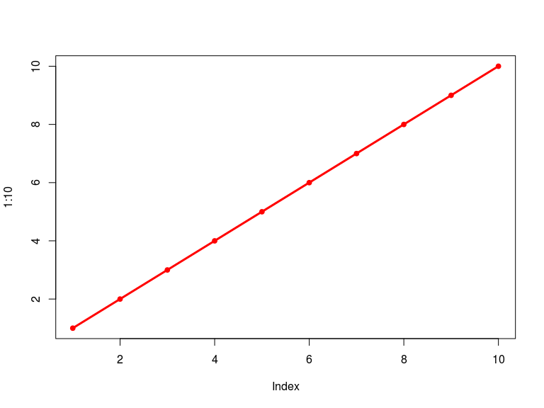
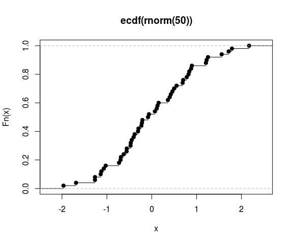
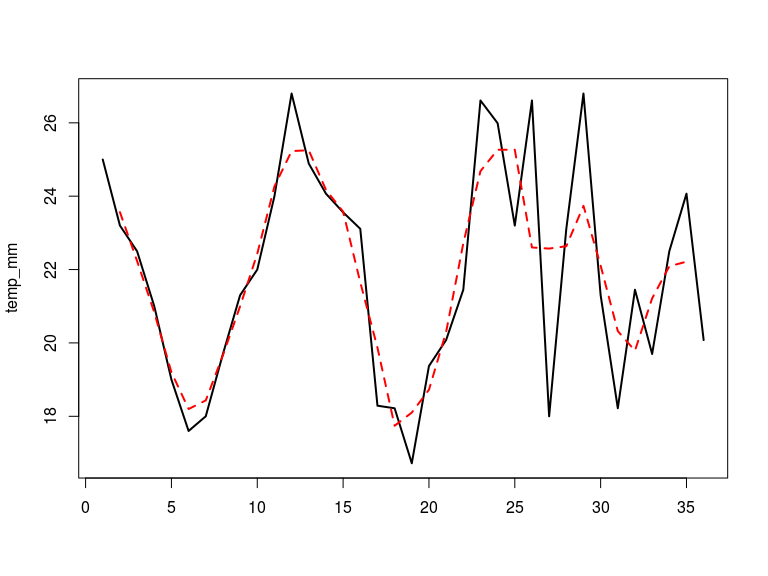

# Programação
Jônatan Tatsch  
`r format(Sys.Date(), format = '%d-%m-%Y')`  


- - -


- - -

# Introdução 

O Código de uma linguagem de programação mais do que servir para comunicar-se com o computador é uma ferramenta de comunicação com outras pessoas. Em geral seu projeto pode ser colaborativo e mesmo se você não trabalha com outras pessoas você estará trabalhando consigo mesmo no futuro.

Então escrever códigos de maneira clara é importante para você e para quem for usar o seu código. Assim você e alguém que for usar seu código não terá que gastar todo tempo que você investiu fazendo aquilo par entendê-lo.

# Função()

Quando repetimos um mesmo código várias vezes e alteramos os valores de algumas variáveis para obter um resultado diferente a partir de novos valores das variáveis, provavelmente é hora de convertermos esse código para uma função.

Em programação é sempre uma boa prática evitar a repetição onde possível. Há pelo menos 2 razões para isso: 

- legibilidade do código e
- facilidade de uso

Funções são o alicerce do R. Um conhecimento básico sobre funções os ajudará a evoluir na programação em R. Função é uma classe de objeto do R denominada `function`, assim como `data frame`, `matrizes` e `vetores` são objetos. 


```r
x <- 1:10
sum(x)
```

```
[1] 55
```

```r
class(sum)
```

```
[1] "function"
```

```r
is.function(sum)
```

```
[1] TRUE
```

Os tipos objetos que vimos até agora serviam geralmente para armazenar dados. Uma `function`, entretanto, permite fazermos coisas com os dados. Mais do que nomes, **funções são "verbos" ou seja ações**. 

Para criarmos funções usamos a função `function()` que pode ser seguida de um par de colchetes `{}`, assumindo a seguinte sintaxe de criação:

       nome_funcao <- function(argumento) { 
                        expressões 
       }

# Elementos de uma funçao

Uma função tem 3 partes básicas:

 + **nome**
 
 + **corpo da função**
 
 + **argumentos**

Um exemplo simplório de uma função que adiciona 1 a um dado valor é 


```r
## criando uma função 
soma1 <- function(x) {
  return(x + 1)
}
## para ver o código da função, digite o nome dela
soma1
```

```
function(x) {
  return(x + 1)
}
```

```r
## avaliando a função f para o argumento x = 2
soma1(x = 2)
```

```
[1] 3
```

```r
soma1(1:5)
```

```
[1] 2 3 4 5 6
```

Vamos acessar os elementos da função `soma1()`:


```r
formals(soma1)
```

```
$x
```

```r
args(soma1)
```

```
function (x) 
NULL
```

```r
names(formals(soma1))
```

```
[1] "x"
```

```r
body(soma1)
```

```
{
    return(x + 1)
}
```

No exemplo acima criamos a função `soma1()` para adicionar 1 a qualquer valor que seja atribuído ao argumento x. 

No lado direito, há dois argumentos: o primeiro é o `x` e o segundo é o corpo da função `return(x+1)` que deve ser uma expressão. 

Quando a função tem apenas uma expressão do direito os colchetes podem ser omitidos. Mas para adquirirmos bons hábitos de programação eles são recomendados. 

A função `return()` também poderia ser omitida pois dentro da função a última expressão no corpo da função seria retornada. Entretanto dentro do corpo da função a função `return()` tem prioridade, como no exemplo a seguir.


```r
# criando uma função 
mais_1 <- function(x) x + 1
# para ver o código da função, digite o nome dela
mais_1
```

```
function(x) x + 1
```

```r
# avaliando a função f para o argumento x = 2
mais_1(x = 2)
```

```
[1] 3
```

```r
mais_1(1:5)
```

```
[1] 2 3 4 5 6
```

```r
# Ultima função será retornada
plus_one <- function(x){
            x - 1
            x + 1
}
plus_one(x = 3)
```

```
[1] 4
```

```r
# return()
plus_1 <- function(x){
            return((x+1)^2)
            x - 1
            x + 1
}
plus_1(x = 3)
```

```
[1] 16
```

Note que os resultados da função `mais_1` são idênticos aos da `soma1()`.

# Argumentos de funções

## Argumentos pré-definidos 

Uma função pode ter valores pré-definidos para seus argumentos.


```r
soma_cte <- function(x = 3, k = 1){
  return(x + k)
}
soma_cte()
```

```
[1] 4
```

```r
soma_cte(x = 3)
```

```
[1] 4
```

```r
soma_cte(x = 4)
```

```
[1] 5
```

```r
soma_cte(x = 5, k = 2)
```

```
[1] 7
```

```r
soma_cte(x = 1:5, k = 5:1)
```

```
[1] 6 6 6 6 6
```

## Múltiplos argumentos

Uma função pode ter múltiplos argumentos.


```r
pitagoras <- function(x, y){
  return(sqrt(x^2 + y^2))
}
pitagoras(x = 3, y = 4)
```

```
[1] 5
```

```r
pitagoras(x = 24, y = 7)
```

```
[1] 25
```

```r
# argumentos explícitos, ordem pode ser trocada 
pitagoras(y = 24, x = 7)
```

```
[1] 25
```

```r
# sem nome dps argumentos, os valores devem seguir a ordem dos argumentos na função
pitagoras(24, 7)
```

```
[1] 25
```

## Argumentos faltantes

Uma função pode ser usada por outras funções e pode não ter argumentos.


```r
# para reprodutiblidade
set.seed(123)
joga_moeda <- function() {
    sorteio <- sample(1:2, size = 1)
    result <- ifelse(sorteio == 1, "cara", "coroa")
     return(result)
}
# note que as variáveis sorteio e result não foram criadas
sorteio
```

```
Error in eval(expr, envir, enclos): object 'sorteio' not found
```

```r
result
```

```
Error in eval(expr, envir, enclos): object 'result' not found
```

```r
ls()
```

```
[1] "joga_moeda" "mais_1"     "pcks"       "pitagoras"  "plus_1"    
[6] "plus_one"   "soma1"      "soma_cte"   "x"         
```

Note que apesar de criarmos dentro da função as variáveis `sorteio` e `result` elas não foram criadas em nosso ambiente de trabalho. As atribuições feitas dentro da função são locais e temporárias, sendo perdidas após sair da função.

Vamos avaliar a função `joga_moeda()` várias vezes e depois usar a função replicate para repetir a aplicação da função quantas vezes forem necessárias, sem termos que digitarmos a função `joga_moeda()`. 


```r
# avaliando a função joga_moeda
joga_moeda()
```

```
[1] "cara"
```

```r
joga_moeda()
```

```
[1] "coroa"
```

```r
joga_moeda()
```

```
[1] "cara"
```

```r
joga_moeda()
```

```
[1] "coroa"
```

```r
# função para jogar n vezes
lancamentos <- function(k = 100){
  replicate(n = k, joga_moeda())
}
lancamentos()
```

```
  [1] "coroa" "cara"  "coroa" "coroa" "coroa" "cara"  "coroa" "cara" 
  [9] "coroa" "coroa" "cara"  "coroa" "cara"  "cara"  "cara"  "coroa"
 [17] "coroa" "coroa" "coroa" "coroa" "coroa" "coroa" "coroa" "coroa"
 [25] "cara"  "cara"  "coroa" "coroa" "coroa" "coroa" "cara"  "cara" 
 [33] "coroa" "cara"  "cara"  "cara"  "cara"  "cara"  "cara"  "cara" 
 [41] "cara"  "cara"  "cara"  "cara"  "cara"  "coroa" "cara"  "cara" 
 [49] "coroa" "cara"  "coroa" "cara"  "cara"  "coroa" "coroa" "cara" 
 [57] "coroa" "cara"  "cara"  "cara"  "coroa" "cara"  "coroa" "coroa"
 [65] "coroa" "cara"  "coroa" "coroa" "coroa" "cara"  "cara"  "cara" 
 [73] "cara"  "coroa" "cara"  "cara"  "cara"  "coroa" "cara"  "coroa"
 [81] "cara"  "cara"  "coroa" "coroa" "coroa" "cara"  "cara"  "coroa"
 [89] "cara"  "coroa" "cara"  "cara"  "coroa" "cara"  "cara"  "coroa"
 [97] "coroa" "cara"  "cara"  "coroa"
```

## Argumentos Extras

O R oferece um operador especial que permite funções assumirem um número arbitrário de argumentos que não precisam ser especificados na definição da função. Este argumento é os 3 pontos `(...)`. Esse argumento deve ser usado com muito cuidado, embora forneça grande flexibilidade. 
Vamos ver como absorver argumentos extras; depois vamos encontrar um uso para isso quando passarmos argumentos entre funções.


```r
my_plot <- function(..., pch = 20, col = 2) plot(..., pch = pch, col = col)
my_plot(1:10, lwd = 3, type = "o")
```

<!-- -->

Vamos ver outro exemplo de uso do `...`, em que criamos uma função para montar a frase: 

**Olá nome_1 nome_2 nome_n**

onde `nome_1` é o primeiro argumento da função, `nome_2` é o segundo e `nome_n` é o e-nésimo argumento. Portanto a função que construirá a frase terá vários argumentos. Podemos usar os `...` para representar esses `n` argumentos.


```r
ola_pessoal <- function(nome_1, nome_2 = "Beltrano", ...) {    
  # número de argumentos extras
  extra_args <- list(...)
  # tamanho da lista extra_args
  len_extra_args <- length(extra_args)
  # mensagem de aviso
  message(len_extra_args, " argumento(s) extra(s)")
  # juntando argumentos extras em uma única string
  nomes_extras <- paste(unlist(extra_args), collapse = " ")
  # resultado: cola "Olá" com todos nomes
  res <- paste("Olá", nome_1, nome_2, nomes_extras)
  return(res)
} # end fun ola_pessoal
# chamando função com um argumento extra não definido explicitamente
ola_pessoal("Fulano", arg_extra = "Ciclano")
```

```
1 argumento(s) extra(s)
```

```
[1] "Olá Fulano Beltrano Ciclano"
```

```r
# chamando função com vários argumentos
ola_pessoal(nome1 = "Fulano", nome2 = "Beltrano", "Ciclano", "Zulano")
```

```
2 argumento(s) extra(s)
```

```
[1] "Olá Ciclano Zulano Fulano Beltrano"
```

# Passando Funções para (e de) outras funções

Suponha que tenhamos uma lista de argumentos de uma função:


```r
args_l <- list(1:10, na.rm = TRUE)
args_l
```

```
[[1]]
 [1]  1  2  3  4  5  6  7  8  9 10

$na.rm
[1] TRUE
```

Como aplicar a função `mean()` a essa lista? Usando a função `do.call()`:


```r
mean(args_l)
```

```
Warning in mean.default(args_l): argument is not numeric or logical:
returning NA
```

```
[1] NA
```

```r
do.call(what = mean, args = args_l)
```

```
[1] 5.5
```

Um outro exemplo:


```r
do.call(pitagoras, list(x = 3,y = 4))
```

```
[1] 5
```

```r
# mesmo que
pitagoras(3, 4)
```

```
[1] 5
```

Suponha que tenhamos lidos dados de diferentes arquivos e os aramazenado em uma lista.


```r
(dfr1 <-data.frame(x = 1:5,y = rnorm(5)))
```

```
  x           y
1 1 -0.04287046
2 2  1.36860228
3 3 -0.22577099
4 4  1.51647060
5 5 -1.54875280
```

```r
(dfr2 <-data.frame(x = 6:10,y = rnorm(5)))
```

```
   x          y
1  6  0.5846137
2  7  0.1238542
3  8  0.2159416
4  9  0.3796395
5 10 -0.5023235
```

```r
(dfr3 <-data.frame(x = 11:15,y = rnorm(5)))
```

```
   x          y
1 11 -0.3332074
2 12 -1.0185754
3 13 -1.0717912
4 14  0.3035286
5 15  0.4482098
```

```r
# lista com dados
data_l <- list(dfr1, dfr2, dfr3)
do.call(rbind, data_l) 
```

```
    x           y
1   1 -0.04287046
2   2  1.36860228
3   3 -0.22577099
4   4  1.51647060
5   5 -1.54875280
6   6  0.58461375
7   7  0.12385424
8   8  0.21594157
9   9  0.37963948
10 10 -0.50232345
11 11 -0.33320738
12 12 -1.01857538
13 13 -1.07179123
14 14  0.30352864
15 15  0.44820978
```

```r
# mesmo que
rbind(dfr1, dfr2, dfr3)
```

```
    x           y
1   1 -0.04287046
2   2  1.36860228
3   3 -0.22577099
4   4  1.51647060
5   5 -1.54875280
6   6  0.58461375
7   7  0.12385424
8   8  0.21594157
9   9  0.37963948
10 10 -0.50232345
11 11 -0.33320738
12 12 -1.01857538
13 13 -1.07179123
14 14  0.30352864
15 15  0.44820978
```

## Funções anônimas

Nós podemos também usar funções anônimas:


```r
x_mais_y <- function(x, y) x + y
do.call(x_mais_y, list(1:5, 5:1))
```

```
[1] 6 6 6 6 6
```

```r
# mesmo que
do.call(function(x,y) x + y, list(1:5, 5:1))
```

```
[1] 6 6 6 6 6
```

No exemplo acima a função `function(x,y) x + y` não tem nome e foi criada dinâmicamente na hora de execução da expressão na linha de comando.

## Funções que geram funções

Funções que retornam funções são raras, mas não menos válidas por isso. A função `ecdf()` retorna a função de distribuição empírica acumulada de um vetor, conforme a Figura abaixo:


```r
set.seed(123)
(emp_cum_dist_fn <-ecdf(rnorm(50)))
```

```
Empirical CDF 
Call: ecdf(rnorm(50))
 x[1:50] = -1.9666, -1.6867, -1.2654,  ..., 1.7869,  2.169
```

```r
#  CDF Empírica
# Call: ecdf(rnorm(50))
# x[1:50] = -2.2, -2.1, -2, ..., 1.9, 2.6
is.function(emp_cum_dist_fn)
```

```
[1] TRUE
```

```r
# [1] TRUEwith(a, plot(mfX, mfVals, type = "l"))

plot(emp_cum_dist_fn)
```

<!-- -->

```r
emp_cum_dist_fn(v = 1) # 86% dos dados estão abaixo de 1
```

```
[1] 0.86
```

```r
emp_cum_dist_fn(v = 0)
```

```
[1] 0.52
```

# Chamada de funções

Na linha de comando do R geralmente digitamos `dois_num <- c(3, 4)` e pressionamos <enter> para o interpretador do R traduzir a expressão na seguinte chamada:


```r
# atribuição usual
dois_num <- c(3, 4)
dois_num
```

```
[1] 3 4
```

```r
# atribuição de forma funcional 
`<-`(dois_num, c(5, 6))
dois_num
```

```
[1] 5 6
```

```r
4 + 5
```

```
[1] 9
```

```r
# + é uma função
`+`(4, 5)
```

```
[1] 9
```

```r
is.function(`+`)
```

```
[1] TRUE
```

```r
# avaliar uma expressão a partir de uma string
cmd <- "1 + 2 + 3 + 4 + 5"
eval(parse(text = cmd))
```

```
[1] 15
```

```r
a <- eval(parse(text = cmd))
get("a")
```

```
[1] 15
```

```r
eval(parse(text = "args_l[[1]]"))
```

```
 [1]  1  2  3  4  5  6  7  8  9 10
```

# Estruturas de controle

O código R em um script é executado sequencialmente de cima para baixo. Mas as vezes queremos executar **instruções** repetidamente ou somente quando algumas condições são atendidas. É para isso que servem as estruturas de controle. O R possui as estruturas de controle padrões das linguagens de programação modernas. 

## Instruções condicionais

### if-else

Instruções condicionais tem a seguinte forma:

      if (condição) expressão
      
ou, alternativamente:
  
      if (condição) {
           expressões_condição_verdadeira
      } else {
           expressões_condição_falsa
      }
      
Como exemplo vamos supor que nós queremos garantir que um número seja positivo:


```r
# se num < 0 é verdadeiro, multiplicamos num por -1 para num virar positivo
num <- -2
if (num < 0) {
  num <- -num 
}
num
```

```
[1] 2
```

```r
## se num < 0 é false num permanecerá com seu valor original
num <- 4
if (num < 0) {
  num <- -num
}
num
```

```
[1] 4
```

```r
typeof(`if`)
```

```
[1] "special"
```

A condição de um `if` deve avaliar um único TRUE ou FALSE. 

Se a condição cria um vetor de TRUEs ou de FALSEs, será impresso uma mensagem de aviso e somente o primeiro elemento do vetor será usado.

Expressões lógicas podem consensadas em um único TRUE ou FALSE através, por exemplo das funções, `any()` e `all()`, já vistas anteriormente.


```r
x <- c(1, NA, 4)
if (is.na(x)) cat("há dado faltante \n")
```

```
Warning in if (is.na(x)) cat("há dado faltante \n"): the condition has
length > 1 and only the first element will be used
```

```r
if (any(is.na(x))) cat("Há pelo menos um dado faltante. \n")
```

```
Há pelo menos um dado faltante. 
```

O próximo passo é incluir a instrução `else`. O Código que segue o `else` é executado se a condição do `if` for FALSE.

Vamos fazer um exemplo de arredondamento com `if-else`.


```r
a <- 3.14
if (a - trunc(a) >= 0.5) {
   # arredonda para cima
   a <- trunc(a) + 1
} else {
   # arredonda para o interiro mais próximo
   a <- trunc(a)
}
a
```

```
[1] 3
```

Se a situação tem mais de dois casos, podemos usar mais `if-else` juntos adicionando outros `if-else`.
Por exemplo:


```r
a <- 1
b <- 1
if (a > b) {
    print("A ganha")
} else {
    if (a < b) {
        print("B ganha")
    } else {
        print("Empate")
    }
}
```

```
[1] "Empate"
```

Lembre-se que avaliar condições para um vetor usamos a função `ifelse()`.


```r
prec <- c(0, 0, 10, 5.5, 1, 0, 0, 0.4)
ifelse(prec > 0, "úmido", "seco")
```

```
[1] "seco"  "seco"  "úmido" "úmido" "úmido" "seco"  "seco"  "úmido"
```

### Estilos de if

O uso de chaves `{` é opcional para `if` e funções em geral, mas é altamente recomendável seu uso, pois torna mais fácil a compreensão da hierarquia do código.
Uma `{` aberta deve sempre ser aberta em uma linha e a `}` deve ser fechada em uma nova linha, exceto se elea for seguida de um `else`. Sempre idente o código dentro das chaves.


```r
y <- -1; depura <- TRUE
# Bom
if (y < 0 && depura) {
  message("Y is negative")
}

if (y == 0) {
  log(x)
} else {
  y ^ x
}
```

```
[1] -1 NA  1
```


```r
# Ruim
if (y < 0 && depura)
message("Y is negative")

if (y == 0) {
  log(x)
} 
else {
  y ^ x
}
```

```
Error: <text>:8:1: unexpected 'else'
7: } 
8: else
   ^
```


```r
y <- 10
x <- if (y < 20) "Muito baixo" else "Muito alto"
# recomendado
if (y < 20) {
  x <- "Muito baixo" 
} else {
  x <- "Muito alto"
}
```


### switch

Códigos com muitos `if-else` tornam-se difíceis de entender e lentos.
Em tais casos uma opção mais versátil é usar a função `switch()`.

O uso mais comum pega o primeiro argumento uma expressão que retorna uma string, seguida por diversos argumentos com nome definido que fornecem resultados quando o nome está de acordo com o primeiro argumento da função. Os nomes devem concordar exatamente com o primeiro argumento e podemos executar múltiplas expressões usando as chaves:


```r
mostra_data <- function(data, tipo = c("curto","longo")){
  switch(tipo,
         longo = format(data, "%A %d %B %Y"),
         medio = format(data, "%d %m %Y"),
         curto = format(data, "%b %m"),
         cat(tipo, "não é um tipo reconhecido \n")
         )
}
hoje <- Sys.time()
hoje
```

```
[1] "2016-06-10 21:09:22 BRT"
```

```r
mostra_data(data = hoje, tipo = "curto")
```

```
[1] "Jun 06"
```

```r
mostra_data(data = hoje, tipo = "medio")
```

```
[1] "10 06 2016"
```

```r
mostra_data(data = hoje, tipo = "longo")
```

```
[1] "sexta 10 junho 2016"
```

```r
mostra_data(data = hoje, tipo = "qualquer")
```

```
qualquer não é um tipo reconhecido 
```

Exemplo de uma função versátil com o uso da switch().


```r
aritmetica <- 
function(x, y, op) {
  switch(op,
    plus = x + y,
    minus = x - y,
    times = x * y,
    divide = x / y,
    stop("Unknown op!")
  )
}
```

> Exercício: Crie uma função para definir o número de dias do mês de acordo com o mês do ano.


## Laços ou *loopings*

Há três formas de fazer laços no R. 

### `repeat()`

A mais simples é com a função `repeat()`, a qual simplesmente repete uma dada expressão.

      repeat instrução
      
Para parar a repetição da instrução usamos a função `break`. Para pular para próxima iteração em um laço usamos a função `next`.

Por exemplo, o código abaixo imprime na tela valores múltiplos de 5 até 25:


```r
 i <- 0
repeat { 
         if (i > 25) {
            break 
         } else {
           print(i)
           i <- i + 5
         } # end if 
       }# end repeat
```

```
[1] 0
[1] 5
[1] 10
[1] 15
[1] 20
[1] 25
```

### `while()`

Se não incluíssemos a função break, o código seria um lopping infinito. Isto pode ser útil para criar uma aplicação interativa. 
Outra função útil é a `while()`, que repete uma instrução enquanto a condição é verdadeira:

      while (condição) expressão
      
Como exemplo vamos reescrever o exemplo anterior usando o laço `while`:


```r
i <- 5
while (i <= 25) { print(i); i <- i + 5 }
```

```
[1] 5
[1] 10
[1] 15
[1] 20
[1] 25
```


### `for()`

Finalmente, o R fornece a função `for` para laços, que itera através de cada item em um vetor (ou lista):

      for (índice in vetor) expressão


```r
for (i in seq(from = 5, to = 25, by = 5)) print(i)
```

```
[1] 5
[1] 10
[1] 15
[1] 20
[1] 25
```

Podemos usar as funções `break` e `next` também dentro de laços. Existem duas propriedades importantes sobre laços que devem ser lembradas:

1. os resultados não são impressos dentro do laço execeto se chamamos a função print explicitamente:


```r
 for (i in seq(from = 5,to = 25,by = 5)) i
```

2. A variável `índice` que é definida no laço `for` é modificada no ambiente da função chamada:


```r
i <- 1
for (i in seq(from = 5, to = 25, by = 5)) i
i
```

```
[1] 25
```

```r
typeof(`for`)
```

```
[1] "special"
```

Como instruções condicionais as funções de laço `repeat`, `while()`, e `for` são um tipo especial, porque as expressões não são necessariamente avaliadas.


```r
ini <- 0
fim <- 25
x <- rep(NA, 25)
for (i in seq(from = ini, to = fim, by = 5)) x[i] <- i
x
```

```
 [1] NA NA NA NA  5 NA NA NA NA 10 NA NA NA NA 15 NA NA NA NA 20 NA NA NA
[24] NA 25
```

```r
## gerando vetor binário de chuva com for
estado <- vector(mode = "numeric", length = length(prec))
estado
```

```
[1] 0 0 0 0 0 0 0 0
```

```r
for (i in seq(along = prec)) if(prec[i] > 0) estado[i] <- "úmido" else estado[i] <- "seco"
estado
```

```
[1] "seco"  "seco"  "úmido" "úmido" "úmido" "seco"  "seco"  "úmido"
```

```r
ifelse(prec > 0, "úmido", "seco")
```

```
[1] "seco"  "seco"  "úmido" "úmido" "úmido" "seco"  "seco"  "úmido"
```

### Importância da inicialização em laços

Cada linha de código dentro do laço será rodada em cada iteração do laço. Portanto a velocidade do laço aumenta quando tiramos partes do código que podem ficar fora do laço. 
Segundo, certifique-se de que o objeto usado no laço é grande o suficiente para conter os resultados do laço. Por exemplo, ambos laços abaxo precisarão armazenar 10^4^ linhas. O primeiro armazena seus valores em um objeto chamado `saida` que começa com tamanho de 10^4^ elementos. 


```r
# Laço 1
nmax <- 10000
system.time(
  {
    saida1 <- NULL
    for (i in 1:nmax) {
      ii <- i + 1
      saida1 <- c(saida1, ii)
      rm(ii, i)
    }# end for
  } 
)
```

```
   user  system elapsed 
  0.348   0.004   0.352 
```

```r
# Laço 2
system.time(
  {
    saida2 <- NA
    for (i in 1:nmax) {
      saida2[i] <- i + 1
    }# end for
  } 
)
```

```
   user  system elapsed 
  0.139   0.000   0.138 
```

```r
# Laço 3
system.time(
  {
    saida3 <- rep(NA, nmax)
    for (i in 1:nmax) {
      saida3[i] <- i + 1
    }# end for
  } 
)
```

```
   user  system elapsed 
  0.009   0.000   0.009 
```

```r
system.time(soma1(1:nmax))
```

```
   user  system elapsed 
      0       0       0 
```
 
Os três laços fazem a  mesma coisa, mas no segundo e terceiro laço o R tem que aumentar o tamanho do vetor de saída por um elemento em cada iteração. Para fazer isso o R tem que encontrar um novo local na memória do computador que possa conter um objeto maior. O R então tem que copiar esse vetor de saída e apagar a versão antiga do vetor de saída antes de ir para próxima iteração do laço. No fim do laço o R reescreveu o vetor saída na memória do computador    10000.0 vezes.
 
# Aplicando funções a cada elemento de um objeto

Quando manipulamos dados uma operação comum é aplicar uma função a um conjunto de objetos ou partes de um objeto e retornar um novo conjunto de objetos de saída. 
O [pacote base do R](https://stat.ethz.ch/R-manual/R-devel/library/base/html/00Index.html) possui um conjunto de funções diferentes para fazer isso, conhecidas como família `*apply`. Onde o asterisco representa as letras `a, l, s, m e v`.

## Aplicando funções a uma `array` ou `matriz`

Para aplicar uma função a partes de uma matriz usamos a função `apply`:

      apply(X, MARGIN, FUN, ...)

que aceita pelo menos três argumentos, `X`: a matriz ou *array* , `FUN`: que é a função a ser aplicada e `MARGIN` especifica  as dimensões sobre as quais gostaríamos de aplicar a função.
Vamos ver alguns exemplos aplicados a matriz de temperatuas mensais gerada na Unidade sobre **Estrutura de dados do R**.


```r
temp_mat <- matrix(c(25, 24.89, 23.2, 23.2, 24.07, 26.61, 22.5, 23.56, 
18, 21, 23.11, 23.11, 19, 18.29, 26.8, 17.6, 18.22, 21.3, 18, 
16.72, 18.22, 19.7, 19.37, 21.45, 21.3, 20.08, 19.7, 22, 21.45, 
22.5, 24, 26.61, 24.07, 26.8, 25.99, 20.08), nrow = 3)
rownames(temp_mat) <- c("ano1990", "ano1991", "ano1992")
colnames(temp_mat) <- c("Jan", "Fev", "Mar", "Abr", "Mai", "Jun", "Jul","Ago", "Set", "Out", "Nov", "Dez")
temp_mat
```

```
          Jan   Fev   Mar   Abr   Mai   Jun   Jul   Ago   Set   Out   Nov
ano1990 25.00 23.20 22.50 21.00 19.00 17.60 18.00 19.70 21.30 22.00 24.00
ano1991 24.89 24.07 23.56 23.11 18.29 18.22 16.72 19.37 20.08 21.45 26.61
ano1992 23.20 26.61 18.00 23.11 26.80 21.30 18.22 21.45 19.70 22.50 24.07
          Dez
ano1990 26.80
ano1991 25.99
ano1992 20.08
```

Suponha que houvesse interesse em determinar os entremos de temperatura de cada ano e a média mensal dos três anos.


```r
(temp_range <- apply(temp_mat, MARGIN = 1, range))
```

```
     ano1990 ano1991 ano1992
[1,]    17.6   16.72    18.0
[2,]    26.8   26.61    26.8
```

```r
(temp_med <- apply(temp_mat, MARGIN = 2, mean))
```

```
     Jan      Fev      Mar      Abr      Mai      Jun      Jul      Ago 
24.36333 24.62667 21.35333 22.40667 21.36333 19.04000 17.64667 20.17333 
     Set      Out      Nov      Dez 
20.36000 21.98333 24.89333 24.29000 
```

Para determinar o número de meses com temperatura do ar acima de 20°C e o número de graus dia acumulados em um ano (considerando essa temperatura como basal) podemos usar as seguintes expressões:


```r
## função anônima
(temp_20_ano <- apply(temp_mat, MARGIN = 1, FUN = function(x) sum(x > 20)))
```

```
ano1990 ano1991 ano1992 
      8       8       9 
```

```r
## graus dia acumulado acima de uma temp. basal
gda <- function(x, tbase = 20) sum(x[x >= tbase])
(gd_acc <- apply(temp_mat, 1, gda))
```

```
ano1990 ano1991 ano1992 
 185.80  189.76  209.12 
```

```r
## exemplo usando as duas margens
apply(temp_mat, 
      MARGIN = 2, 
      FUN = paste, collapse = ",")
```

```
               Jan                Fev                Mar 
   "25,24.89,23.2" "23.2,24.07,26.61"    "22.5,23.56,18" 
               Abr                Mai                Jun 
  "21,23.11,23.11"    "19,18.29,26.8"  "17.6,18.22,21.3" 
               Jul                Ago                Set 
  "18,16.72,18.22" "19.7,19.37,21.45"  "21.3,20.08,19.7" 
               Out                Nov                Dez 
   "22,21.45,22.5"   "24,26.61,24.07" "26.8,25.99,20.08" 
```

```r
## apply inteligente: se tamanho dos resultados diferem, retorna uma lista
## função anônima para retornar casos de tar > 23
(tar_23 <- apply(temp_mat, MARGIN = 1, FUN = function(x) x[x > 23]))
```

```
$ano1990
 Jan  Fev  Nov  Dez 
25.0 23.2 24.0 26.8 

$ano1991
  Jan   Fev   Mar   Abr   Nov   Dez 
24.89 24.07 23.56 23.11 26.61 25.99 

$ano1992
  Jan   Fev   Abr   Mai   Nov 
23.20 26.61 23.11 26.80 24.07 
```

```r
str(tar_23)
```

```
List of 3
 $ ano1990: Named num [1:4] 25 23.2 24 26.8
  ..- attr(*, "names")= chr [1:4] "Jan" "Fev" "Nov" "Dez"
 $ ano1991: Named num [1:6] 24.9 24.1 23.6 23.1 26.6 ...
  ..- attr(*, "names")= chr [1:6] "Jan" "Fev" "Mar" "Abr" ...
 $ ano1992: Named num [1:5] 23.2 26.6 23.1 26.8 24.1
  ..- attr(*, "names")= chr [1:5] "Jan" "Fev" "Abr" "Mai" ...
```

## Aplicando funções a uma `list` ou `vector`

Vamos repetir alguns dos laços feitos anteriormente com as funções `repeat()`, `while()` e `for()` usando a função `sapply()`. `sapply`: do termo *simplified apply*. Estrutura de dados simplificadas incluem vetores, matrizes e *arrays* por isso o resultado esperado da aplicação da função `apply()` sobre um objeto é um vetor, matriz ou *array*.


```r
## indice sobre o qual o laço será feito
indice <- seq(from = 5, to = 25, by = 5)
## aplica
x <- sapply(X = indice, FUN = function(i) i)
x
```

```
[1]  5 10 15 20 25
```

Vamos ilustrar o uso do sapply sobre um vetor que queremos calcular uma média móvel usando o valor anterior e posterior ao ponto.


```r
## indice sobre o qual o laço será feito
(temp <- c(t(temp_mat)))
```

```
 [1] 25.00 23.20 22.50 21.00 19.00 17.60 18.00 19.70 21.30 22.00 24.00
[12] 26.80 24.89 24.07 23.56 23.11 18.29 18.22 16.72 19.37 20.08 21.45
[23] 26.61 25.99 23.20 26.61 18.00 23.11 26.80 21.30 18.22 21.45 19.70
[34] 22.50 24.07 20.08
```

```r
s <- seq(along.with = temp)
#mm <- sapply(s[-c(1, length(s))], 
mm <- sapply(s,              
             function(i) {
               if(i == 1 | i == length(s)) {
                 res <- NA
               } else {
                  res <- mean(c(temp[(i-1):(i+1)]))    
               }
               return(res)
             })
mm
```

```
 [1]       NA 23.56667 22.23333 20.83333 19.20000 18.20000 18.43333
 [8] 19.66667 21.00000 22.43333 24.26667 25.23000 25.25333 24.17333
[15] 23.58000 21.65333 19.87333 17.74333 18.10333 18.72333 20.30000
[22] 22.71333 24.68333 25.26667 25.26667 22.60333 22.57333 22.63667
[29] 23.73667 22.10667 20.32333 19.79000 21.21667 22.09000 22.21667
[36]       NA
```

```r
temp_mm <- cbind(temp, mm)
matplot(temp_mm, type = "l", lwd = 2)
```

<!-- -->


Para aplicar uma função a cada elemento em um vetor ou uma lista e retornar uma lista podemos usar a função `lapply()`. Uma situação prática de uso do `lapply()` é quando o resultado esperado da aplicação da função a uma parte do objeto pode ter uma saída de tamanhos diferentes em cada iteração do `lapply()`.
Vamos ilustrar essa situação buscando encontrar os meses em cada ano da temp_mat cuja a tar foi acima da média.


```r
ta1sd_l <- lapply(1:nrow(temp_mat), 
       function(irow) {
         tmes_ano <- temp_mat[irow, ]
          return(tmes_ano[tmes_ano > mean(temp_mat) + sd(temp_mat)])
       })
ta1sd_l
```

```
[[1]]
 Jan  Dez 
25.0 26.8 

[[2]]
  Jan   Nov   Dez 
24.89 26.61 25.99 

[[3]]
  Fev   Mai 
26.61 26.80 
```

Também podemos aplicar uma função sobre um *data frame*, e a função será aplicada cada coluna do data frame.


```r
d <- data.frame(x = 1:5,y = 6:10)
d
```

```
  x  y
1 1  6
2 2  7
3 3  8
4 4  9
5 5 10
```

```r
lapply(d, FUN = function(x) 2^x)
```

```
$x
[1]  2  4  8 16 32

$y
[1]   64  128  256  512 1024
```

```r
lapply(d, FUN = max)
```

```
$x
[1] 5

$y
[1] 10
```

Algumas vezes podemos preferir obter como saída um vetor ou uma matriz ao invés de uma lista. Nesse caso usamos a função `sapply()` que retorna um veto ou matriz quando apropriado.

```r
sapply(d, FUN = function(x) 2^x)
```

```
      x    y
[1,]  2   64
[2,]  4  128
[3,]  8  256
[4,] 16  512
[5,] 32 1024
```

Outra função da família apply é a `mapply()`, a versão “multivariada” da `sapply()`. Por exemplo suponha que você queira criar uma sequência cujo início é fornecido por um vetor e o fim por outro vetor.


```r
## mapply seq
ini <- 1:10
fim <- 10:1
mapply(seq, from = ini, to = fim)
```

```
[[1]]
 [1]  1  2  3  4  5  6  7  8  9 10

[[2]]
[1] 2 3 4 5 6 7 8 9

[[3]]
[1] 3 4 5 6 7 8

[[4]]
[1] 4 5 6 7

[[5]]
[1] 5 6

[[6]]
[1] 6 5

[[7]]
[1] 7 6 5 4

[[8]]
[1] 8 7 6 5 4 3

[[9]]
[1] 9 8 7 6 5 4 3 2

[[10]]
 [1] 10  9  8  7  6  5  4  3  2  1
```

```r
## mapply paste
mapply(paste, 
       c(1,2,3,4,5), 
       c("a","b","c","d","e"), 
       MoreArgs = list(sep="-")
       )
```

```
[1] "1-a" "2-b" "3-c" "4-d" "5-e"
```

```r
## mapply com pitágoras
mapply(pitagoras, x = 1:10, y = 10:1)
```

```
 [1] 10.049876  9.219544  8.544004  8.062258  7.810250  7.810250  8.062258
 [8]  8.544004  9.219544 10.049876
```

