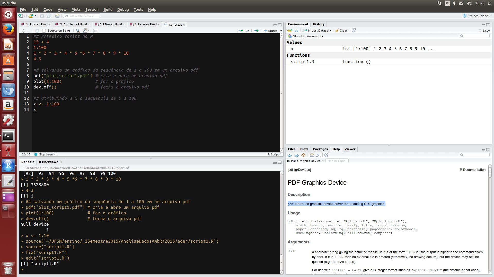

```{r, echo=FALSE, out.width = "200px", include = FALSE}
htmltools::img(src = knitr::image_uri("figs/adar.png"), 
               alt = 'logo', 
               style = 'position:absolute; top:0; right:0; padding:10px;width:500px; height=300px')
```

```{r setup, include = FALSE}
rm(list = ls())
pcks <- c("knitr", "tint")
easypackages::libraries(pcks)
# configuraçoes knitr
# original
#opts_chunk$set(cache = FALSE, fig.path = "figs/")
# com tint
knitr::opts_chunk$set(tidy = FALSE, 
                      cache = FALSE,
                      fig.path = "figs/",
                      cache.extra = packageVersion('tint'))
# invalidate cache when the tufte version changes
options(htmltools.dir.version = FALSE)
```

# RStudio

[RStudio]()

- Os 4 painéis do RStudio

  1. Editor para scripts e visualização de dados

     - abrir e criar scripts
     - código com sintaxe realçada
     - rodar partes do código `<Ctrl+enter>`
     - rodar todo script `<Ctrl+Shift+S>`
     - autopreenchimento das funções `<tab>`
     - comentar linhas `<Ctrl+Shift+C>`
     - desfazer `<Ctrl+Z>`
     - refazer `<Ctrl+Shift+Z>`
     - referência para teclas de atalho `<Ctrl+Shift+K>`
     - abrir script com `<Ctrl+Click>`
     - econtrar e substituir `Ctrl+F`
     
2. Console do R

3. Navegador do espaço de trabalho e histórico de comandos

4. Arquivos/Plots/Pacotes/Ajuda/Visualizador

```{r}
source("R/script1.R")
```


https://github.com/rstudio/cheatsheets/raw/master/rstudio-ide.pdf

* Histórico de comandos
* Espaço de trabalho
* Linha de comando do R

* Menus
    * Tools > global options
        * mostrar linhas, alterar realce da sintaxe
    * Session
    * Plots


```{r rstudio-fig, echo = FALSE, fig.fullwidth = TRUE, fig.cap="Rstudio"}

```

<br/>

<p style="font-family: verdana; font-size: 14px; font-style: italic; background: whitesmoke; color: black; line-height: 14px;width: 900px;">Próximo: [Operações Básicas](https://rawgit.com/lhmet/adar-ufsm/master/3_OperacoesBasicas.html)</p> 

                                                      