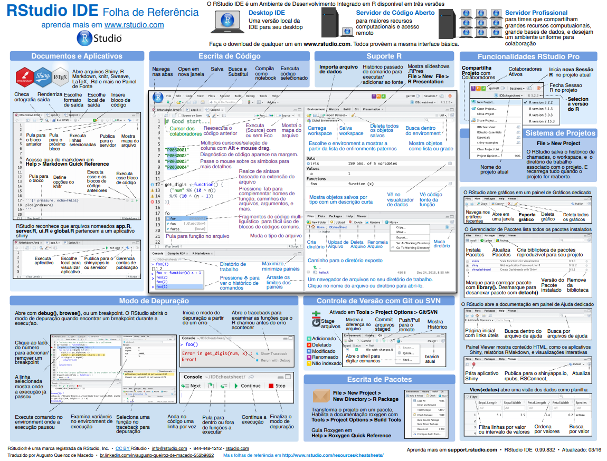

<br/>

```{r, echo=FALSE, out.width = "200px", include = FALSE}
htmltools::img(src = knitr::image_uri("figs/adar.png"), 
               alt = 'logo', 
               style = 'position:absolute; top:0; right:0; padding:10px;width:500px; height=300px')
```

```{r setup, include = FALSE}
rm(list = ls())
pcks <- c("knitr", "tint")
easypackages::libraries(pcks)
# configuraçoes knitr
# original
#opts_chunk$set(cache = FALSE, fig.path = "figs/")
# com tint
knitr::opts_chunk$set(tidy = FALSE, 
                      cache = FALSE,
                      fig.path = "figs/",
                      cache.extra = packageVersion('tint'))
# invalidate cache when the tufte version changes
options(htmltools.dir.version = FALSE)
```


O [RStudio](http://www.rstudio.com/) é um ambiente integrado de desenvolvimento (IDE) para o R. Essa ferramenta potencializará:

- o trabalho com o R e os gráficos do R interativamente

- a organização de seu código na forma de projetos

- a reprodutibilidade de sua pesquisa 

- a manutenção e criação de seus próprios pacotes do R

- a criação e compartilhamento de seus relatórios

- o compartilhamento de seu código e a colaboração com outros


<br/>
Os painéis do RStudio

```{r rstudio-fig, echo = FALSE, fig.fullwidth = TRUE, fig.cap="Rstudio"}
knitr::include_graphics('figs/Rstudio_panels.png')
```
<br/>

  1. Editor para scripts e visualização de dados

     - abrir e criar scripts
     - rodar scripts
     - código com sintaxe realçada
     - rodar partes do código `<Ctrl+enter>`
     - rodar todo script `<Ctrl+Shift+S>`
     - autopreenchimento das funções `<tab>`
     - comentar linhas `<Ctrl+Shift+C>`
     - desfazer `<Ctrl+Z>`
     - refazer `<Ctrl+Shift+Z>`
     - referência para teclas de atalho `<Alt+Shift+K>`
     - abrir script com `<Ctrl+Click>`
     - econtrar e substituir `Ctrl+F`
<br/>

2. Console do R
<br/>

3. Navegador do espaço de trabalho e histórico de comandos
<br/>

4. Arquivos/Plots/Pacotes/Ajuda/Visualizador

<br/>

Configuração de texto e painés em:

* Menus
    * Tools > global options > Appearance
        * mostrar linhas, alterar realce da sintaxe
    * Session
    * Plots

<br/>


Para saber mais sobre os recursos fornecidos pelo RStudio assista ao vídeo *[RStudio Essencials](https://www.rstudio.com/resources/webinars/rstudio-essentials-webinar-series-part-1/)*. Isso o ajudará a usar mais efetivamente o RStudio.

**Folha de referência do RStudio**


https://www.rstudio.com/wp-content/uploads/2016/03/rstudio-IDE-cheatsheet-portuguese.pdf

</style>
<div class="midcenter" style="margin-left:1px; margin-top:50px;">

</div>

<br/>

<p style="font-family: verdana; font-size: 14px; font-style: italic; background: whitesmoke; color: black; line-height: 14px;width: 900px;">Próximo: [Operações Básicas](https://rawgit.com/lhmet/adar-ufsm/master/3_OperacoesBasicas.html)</p> 

                                                      