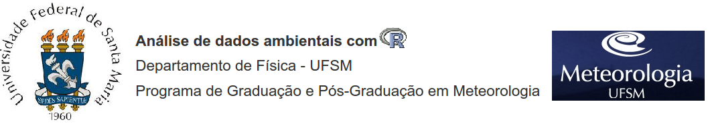

  

Professor Responsável: *Jônatan Tatsch*

Período: *2º Semestre de 2019*
  
 

- - -

# Informações do curso

A disciplina **FSC1104-Análise de dados ambientais com R** é oferecida pelo Departamento de Física da Universidade Federal de Santa Maria ([UFSM](http://site.ufsm.br/)) no âmbito dos Programas de [Graduação](http://w3.ufsm.br/meteorologia/) e [Pós-graduação](http://w3.ufsm.br/meteorologia/pos/index.php) em Meteorologia, mas é aberta a alunos de outros cursos.

# Objetivo

Este curso é uma introdução ao R designada para alunos sem experiência em programação. São ensinadas informações da sintaxe da linguagem R, a leitura e escrita de dados, a criação de gráficos, funções, a padronização e organização de um conjunto de dados e finalmente a elaboração de relatórios dinâmicos.

O objetivo é ensinar os conceitos básicos de programação necessários para o processamento, a visualização e a análise de dados ambientais com o sistema computacional R. 

Durante o curso, são utilizados dados ambientais de diferentes áreas (meteorologia, climatologia, hidrologia, sensoriamento remoto) como exemplos e em exercícios para estimular a prática da programação.

  

# Conteúdo 

- [Apresentação do curso](https://rawgit.com/lhmet/adar-ufsm/master/apres_course.html)

- [Instalação do R e Rstudio](https://rawgit.com/lhmet/adar-ufsm/master/1_Rinstall.html)

- [Interface do Usuário](https://rawgit.com/lhmet/adar-ufsm/master/2_InterfaceUsuario.html)
    - [RStudio](https://rawgit.com/lhmet/adar-ufsm/master/A2_rstudio.nb.html)

- [Operações Básicas](https://rawgit.com/lhmet/adar-ufsm/master/3_OperacoesBasicas.html)

- [Tipos de dados](https://rawgit.com/lhmet/adar-ufsm/master/4_TiposDeDados.html)

- [Estrutura de dados](https://rawgit.com/lhmet/adar-ufsm/master/5_EstruturaDeDados.html)

- [Entrada/saída de dados](https://rawgit.com/lhmet/adar-ufsm/master/6_EntradaDeDados.html)

- [Programação](https://rawgit.com/lhmet/adar-ufsm/master/7_Programacao.html)

# Tutoriais

- [Mapa da região de estudo](https://rawgit.com/lhmet/adar-ufsm/master/mapa_loc.nb.html)

- [Conversão de shapefile para KML](https://rawgit.com/lhmet/adar-ufsm/master/shapefile2kml.nb.html)

- [Visualização de raster com dados categóricos](https://rawgit.com/lhmet/adar-ufsm/master/plot-dados-categ-raster.html)

# Local

Laboratório Setorial de Informática (LSI) do Centro de Ciências Naturais e Exatas ([CCNE](http://w3.ufsm.br/ccne/)) da [UFSM](http://site.ufsm.br/) na biblioteca setorial.

# Horários

- 8:30-12:30 (6ª-feira)

  

# Notas de aula

Neste [link](https://www.dropbox.com/sh/9pmeuj36r0odcdl/AAB9_zxFaCrHDtDMDCJliy_Ea?dl=0) estão disponíveis os scripts utilizados durante as aulas.

  

 Próximo: [Apresentação do curso](https://rawgit.com/lhmet/adar-ufsm/master/apres_course.html)
 

 
 
