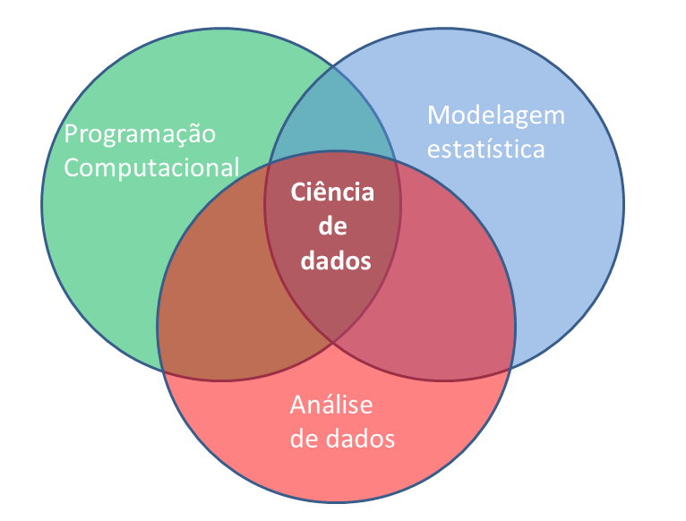
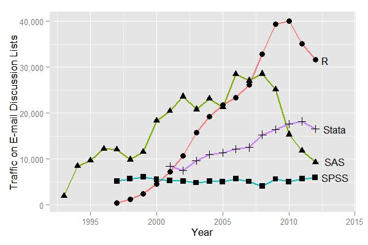

Análise de dados ambientais com R (ADAR)
========================================================
width: 1440
height: 900
transition: none
font-family: 'Helvetica'
css: my_style.css
author: Jonatan Tatsch, UFSM
date: Santa Maria, 10, março de 2016

</style>
<div class="midcenter" style="margin-left:10px; margin-top:100px;">

</div>


Introdução
=======================
<br/>
## Análise de dados meteorológicos 
<br/> 
<br/>
<br/>
> <span style="color:black; font-size:1.25em;">Processo pelo qual adquire-se conhecimento, compreensão e percepção dos fenômenos meteorológicos a partir de observações (dados) qualitativas e quantitativas.</span>

<br/>
<br/>
<br/>

Ciência de dados
========================================================

</style>
<div class="midcenter" style="margin-left:250px; margin-top:50px;">

</div>


Etapas para abordagem de um problema 
=======================
<br/>
 1. **Questão científica/problema**
<br/>
 2. **Obtenção de dados:** coleta/medida do(as) estado/condições da atmosfera
    - Instrumentos e sensores
<br/>
 3. **Tratamento de dados:**
    *download* ---> limpeza ---> formatação ---> <br/>
     transformação ---> controle de qualidade
       - ferramenta/software
         - <span style="color: red">conhecimento em programação</span>
<br/>
 4. **Análise de dados**
    - ferramenta/software
      - <span style="color: red">conhecimento em programação</span>
<br/>      
 5. **Proposta de um modelo** (estatístico, empírico, físicamente baseado)
<br/> 
 6. **Apresentação/divulgação/publicação**


Programação computacional
=======================

</style>
<div class="midcenter" style="margin-left:80px; margin-top:50px;">

</div>

</style>
<div class="midcenter" style="margin-left:80px; margin-top:60px;">

</div>

R
=======================
<br/>  
* Comunidade fantástica
<br/>  
* **Software Free**
<br/>  
* Código aberto
<br/>  
* Linguagem de Programação (intuitiva)
<br/>  
* **Ambiente para Análise de dados interativa**


Por que o R?
=======================
<br/> 
-  Acesso ao estado da arte em análise de dados
<br/>  
- Modelagem numérica, otimização
<br/>  
- Interface com Fortran, C, C++, Python
<br/>  
- Visualização de dados
<br/>  

-----------------
<br/> 
- [Importação](https://cran.r-project.org/doc/manuals/R-data.html) e [Manipulação de dados](http://blog.rstudio.org/2014/07/22/introducing-tidyr/)
<br/>  
- [Relatório dinâmicos](http://rmarkdown.rstudio.com/articles.html) e [interativos](http://shiny.rstudio.com/)

- **Existe grande chance de alguém já ter feito o modelo ou gráfico que você está querendo fazer**

- **Você poderá ir além, construir ou aperfeiçoar aquilo que já está livremente disponível**


Pacotes da comunidade do R
====================================
Evolução do nº de pacotes disponíveis no [CRAN](http://cran.r-project.org/mirrors.html)
</style>
<div class="midcenter" style="margin-left:250px; margin-top:50px;">

</div>


Popularidade do R
====================================


</style>
<div class="midcenter" style="margin-left:250px; margin-top:50px;">

</div>


Tráfego mensal de e-mails nas principais fóruns de discussão de softwares


Por que um meteorologista usaria o R?
=======================
<br/>  
A meteorologia é 4D: 

```r
meteorologia <- function(x, y, z, t){
  ...muita coisa para caber em um slide...
}
```
<br/>  
Logo, requer ferramentas específicas para:
<br/>  
* manipulação de dados espacias
<br/>  
* análise de séries temporais
<br/>  
* importação e ferramentas de [SIG](https://pt.wikipedia.org/wiki/Sistema_de_informa%C3%A7%C3%A3o_geogr%C3%A1fica)
<br/>  
* leitura de dados em formatos específicos ([netcdf](https://en.wikipedia.org/wiki/NetCDF), [binários](https://en.wikipedia.org/wiki/Binary_file), [grib2](https://en.wikipedia.org/wiki/GRIB), ...)


Por que o R?
=======================
<br/>  

(se quiser mais motivos ainda ... assista o vídeo abaixo)

<center>
[](https://www.youtube.com/watch?v=UgPX49gkby4 "Video Title")
<center>

R não é perfeito!
========================================================
<br/>  
* Muitos códigos em R são escritos para resolver um problema;
  * foco nos resultados e não no processo
  * usuários não são programadores
  * códigos deselegantes, lentos e difíceis de entender
<br/>  
* Como o nosso idioma, há muitas exceções para serem lembradas
<br/>  
* R não é muito rápido e códigos mal escritos serão lentos
<br/>  
* São apenas 20 anos de evolução
<br/>  
* Há muito o que melhorar

Editores de texto
========================================================

[Vim-R](http://www.vim.org/scripts/script.php?script_id=2628) plug-in para o Vim

[kate](http://kate-editor.org/about-kate/)

[nedit](http://sourceforge.net/projects/nedit/)

[NppToR](http://notepad-plus-plus.org/) *plugin* do R para o Notepad++ 

[emacs](http://www.gnu.org/software/emacs/) + [ess](http://ess.r-project.org/)

[eclipse](https://eclipse.org/)

[Tinn-R](https://sourceforge.net/projects/tinn-r/) : para Windows.

RStudio
=======

[RStudio](https://www.rstudio.com/) é um ambiente de desenvolvimento integrado livre e de código aberto. 


-------------
- Para Windos, Linux e Mac
<br/>  
- ênfase da sintaxe do R, auto-preenchimento de código, identação inteligente
<br/>  
- execução do R diretamente do editor
<br/>  
- manejo de diretórios e projetos
<br/>  
- histórico de gráficos, zoom, atalhos para exportar imagens 
<br/>  
- Integrado com [knitr](https://en.wikipedia.org/wiki/Knitr)
<br/>  
- Integrado com [GitHub](https://github.com/) para controle de versões


=======================
<br/>
<br/>
<br/>
<br/>
<br/>
<br/>
<br/>
<br/>
<span style="color:black; font-size:1.7em;">Material do curso disponível no [GitHub](https://github.com/jdtatsch/adar-ufsm) </span>

Para saber mais sobre o R
=======================
<br/>
[**Documentação oficial**](http://cran.r-project.org/manuals.html)
<br/>
<br/>
[**Livros relacionados ao R**](http://www.r-project.org/doc/bib/R-books.html)
- [Livros gratuitos](https://github.com/vhf/free-programming-books/blob/master/free-programming-books.md#r)
<br/>
<br/>

**Fóruns:** 
- lista Brasileira de discussão do programa R: [**R-br**](https://listas.inf.ufpr.br/cgi-bin/mailman/listinfo/r-br)
- [stackoverflow](http://stackoverflow.com/questions/tagged/r)
<br/>
<br/>
<br/>
<br/>
<br/>
Próximo: [Instalando o R e Rstudio](https://rawgit.com/jdtatsch/adar-ufsm/master/1_Rinstall.html)
