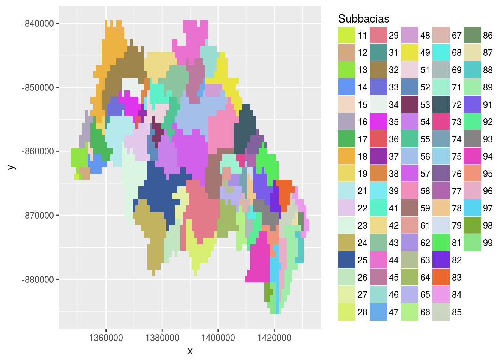

# Geração de KML a partir de *shapefile* da [ANA](http://www.ana.gov.br/)
| Jônatan Tatsch - UFSM
  
`r format(Sys.Date(), format = '%d-%m-%Y')`  


# Introdução 

A Agência Nacional das Águas ([ANA](http://www.ana.gov.br/)) disponibiliza um banco de informações hidrológicas para as regiões hidrográficas brasileiras através do site [hidroweb](http://hidroweb.ana.gov.br/HidroWeb.asp?TocItem=4100)[^1]. As informações são fornecidas no formato [shapefile](https://en.wikipedia.org/wiki/Shapefile) (extensão `.shp`). Na verdade, um *shapefile* está associado a um conjunto de arquivos (no mínimo 3). Os dados são divididos por [regiões hidrográficas](https://pt.wikipedia.org/wiki/Regi%C3%B5es_hidrogr%C3%A1ficas_do_Brasil):

- Bacia 1 (Rio Amazonas)

- Bacia 2 (Rio Tocantins)

- Bacia 3 (Atlântico, Trecho Norte/Nordeste)

- Bacia 4 (Rio São Francisco)

- Bacia 5 (Atlântico, Trecho Leste)

- Bacia 6 (Rio Paraná)

- Bacia 7 (Rio Uruguai)

- Bacia 8 (Atlântico, Trecho Sudeste)

Nesse tutorial veremos como converter o conjunto de arquivos associados ao *shapefile* da hidrografia da região hidrográfica do Rio Uruguai (Bacia 7) para o formato [KML](https://en.wikipedia.org/wiki/Keyhole_Markup_Language) para visualização no [Google Earth](https://en.wikipedia.org/wiki/Google_Earth). Arquivos KML são geralmente distribuídos como arquivos KMZ, que são arquivos KML zipados e com uma extensão `.kmz`.


</style>
<div class="midcenter" style="margin-left:150px; margin-top:50px;">

</div>

# Pré-requisitos

Este tutorial foi produzido com o software [R](http://www.r-project.org/) através do [RStudio](http://www.rstudio.com/) em um desktop com linux ubuntu.

Para manipulação de dados espaciais existem bibliotecas (externas ao R) específicas que precisam ser instaladas. Essas bibliotecas são acessadas através do R por meio de pacotes. Um exemplo desse tipo de interface entre o R e uma biblioteca externa é o pacote [RGDAL](https://cran.r-project.org/web/packages/rgdal/index.html) que faz a interface com a biblioteca *Geospatial Data Abstraction Library* [GDAL](http://www.gdal.org/) que possibilita realizar operações de transformação/projeção com a biblioteca [PROJ.4](https://en.wikipedia.org/wiki/PROJ.4). Então para usarmos o pacote [RGDAL](https://cran.r-project.org/web/packages/rgdal/index.html) é necessário a instalação das bibliotecas: `proj-bin`, `libproj-dev`, `gdal-bin`, `libgdal1-dev`. Elas podem ser instaladas digitando em um terminal linux o comando abaixo.


```bash
# instala bibliotecas linux, adicione sudo antes do comando abaixo para ter acesso como super usuário
apt-get install proj-bin libproj-dev gdal-bin libgdal1-dev
```


Para converter os arquivos associados ao *shapefile* utilizaremos a função `KML()` disponibilizada com o pacote [raster](https://cran.r-project.org/web/packages/raster/index.html). Para instalar um pacote no R, digite `install.packages("nomeDoPacote")`.


```r
# carregando pacotes 
library(raster)
library(sp)
library(rgdal)
# opção para não interpretar caracteres como factor (uma tipo de objeto do R especial para variáveis categóricas)
options(stringsAsFactors = TRUE)
```


# *Download* de arquivo *shapefile*

Para baixar o arquivo compactado com as informações hidrológicas de uma região hidrográfica precisamos do código identificador da região. No caso da região hidrográfica do Rio Uruguai o identificador é o número 7.


```r
# identificador da bacia hidrográfica (BH)
id_bh <- 7
# site do arquivo definido conforme nº identificador da BH
website <- "http://hidroweb.ana.gov.br/baixar/mapa/BaciaX.zip"
(website <- gsub("X", id_bh, website))
```

```
[1] "http://hidroweb.ana.gov.br/baixar/mapa/Bacia7.zip"
```

```r
# nome e caminho para o arquivo que será baixado 
(zip_file <- paste0("data/", basename(website)))
```

```
[1] "data/Bacia7.zip"
```


```r
# baixand arquico compactado
download.file(website, destfile = zip_file)
```


```r
# descompactando arquivo
(extract_dir <- gsub("\\.zip","",zip_file))
```

```
[1] "data/Bacia7"
```


```r
unzip(zip_file, exdir = extract_dir)
```

Lista dos arquivos shapefile da ANA baixados.


```r
#lista dos shapefiles contidos no arquivo compactado
shapefiles_list <- list.files(extract_dir,
                              pattern = "shp$", 
                              recursive = T, 
                              full.names = T)
```

# Conversão do shapefile para KMZ

Vamos importar o arquivo shapefile e ver as diversas informações contidas nele:


```r
# nome do shapefile com a rede drenagem da bacia de interesse
dren_file <- grep(x = shapefiles_list, 
                  pattern = "Hidrografia 1000000", 
                  value = T)
dren_file
```

```
[1] "data/Bacia7/Hidrografia 1000000.shp"
```

```r
# importando shapefile
dren <- shapefile(dren_file)
plot(dren, axes = TRUE, las = 1)
```

<!-- -->

```r
# primeiras linhas da tabela de dados do shapefile
head(dren@data)
```

```
  COTRECHO COCURSODAG COBACIA     CORIO NUCOMPTREC NUDISTBACT NUDISTCDAG
0   119193    7754994 7754994 7754994_0      26.74     249.20          0
1   119205    7754992 7754992 7754992_0      22.23     236.06          0
2   119232     775496  775496  775496_0      54.82     226.03          0
3   119330    7754896 7754896 7754896_0      19.49     239.46          0
4   119334    7754898 7754898 7754898_0      22.48     240.18          0
5   119338    7756966 7756966 7756966_0       9.45     136.48          0
  NUAREACONT NUAREAMONT NUNIVOTTO DEDIREC DECORPODAG DELIGACAO NORIO
0     174.02     174.02         7       1       <NA>      <NA>  <NA>
1     134.21     134.21         7      -1       <NA>      <NA>  <NA>
2     472.32     472.32         6      -1        Rio      <NA>  Taió
3      88.65      88.65         7      -1       <NA>      <NA>  <NA>
4     117.04     117.04         7      -1       <NA>      <NA>  <NA>
5      37.89      37.89         7       1       <NA>      <NA>  <NA>
  NORIOCOMP NUCOMPRIO NUDISTBACR COCDADESAG NUCOMPCDA NUTRJUS NUTRMON
0      <NA>     26.74     249.20       7754     26.74  119197  119183
1      <NA>     22.23     236.06       7754     22.23  119200  119197
2  Rio Taió     54.82     226.03       7754     54.82  119219  119208
3      <NA>     19.49     239.46      77548     19.49  119312  119313
4      <NA>     22.48     240.18      77548     22.48  119313  119320
5      <NA>      9.45     136.48     775696      9.45  119346  119337
  NUTRAFL NUDISTBACC NUAREABACC DEMARGCONF NUORDEMCDA NUNIVOTCDA
0  119193     249.20     174.02    direita          2          7
1  119205     236.06     134.21    direita          2          7
2  119232     226.03     472.32    direita          2          6
3  119330      71.79      88.65   esquerda          3          7
4  119334      72.51     117.04   esquerda          3          7
5  119338      16.74      37.89    direita          3          7
  NULONGNOPA NULATNOPA NULONGNODE NULATNODE   DTVERSAO
0   -50.1648  -27.0127   -50.2988  -27.0100 07/12/2006
1   -50.0696  -27.0874   -50.2399  -27.0916 07/12/2006
2   -50.0043  -27.1173   -50.3296  -27.1291 07/12/2006
3   -49.3325  -27.6930   -49.3115  -27.8326 07/12/2006
4   -49.3248  -27.6928   -49.2797  -27.8578 07/12/2006
5   -49.2017  -27.8977   -49.2907  -27.8936 07/12/2006
```

Nós não precisamos das 32 variáveis contidas na tabela de dados do *shapefile*. Quanto mais variáveis, maior será o tamanho do arquivo KMZ gerado. Então vamos selecionar somente algumas variáveis de interesse, como o nome do rio, o código da bacia hidrográfica e o do rio. Essas informações poderão ser visualizadas no *Google Earth* ao clicar sobre o rio de interesse. Entretanto, nem todos rios possuem nomes definidos como pode ser visto pelos valores `<NA>` na tabela de dados acima.


```r
#selecionando somente as variáveis de interesse no slot de dados do objeto dren (SpatialLinesDataFrame)  
dren@data <- subset(dren@data, sel = c("NORIO", "NORIOCOMP", "COBACIA", "CORIO")) 
# projeção do shapefile da ANA
projection(dren)
```

```
[1] "+proj=longlat +ellps=aust_SA +no_defs"
```

```r
# classe de dados espaciais
class(dren)
```

```
[1] "SpatialLinesDataFrame"
attr(,"package")
[1] "sp"
```

Antes de exportar o objeto `dren` para KML (ou KMZ) devemos primeiro reprojetá-lo para Lat/Lon já que o *Google Earth* usa esta projeção. A função `spTransform()` permite reprojetar objetos da classe `SpatialLinesDataFrame` para qualquer outra projeção. Essa usa  a biblioteca `PROJ.4` (biblioteca de referência, externa ao R, para trabalhar com projeções cartográficas e realizar transformações entre projeções). O pacote `rgdal` é a interface entre a biblioteca `PROJ4` e o R que permite realizar essa operação. O argumento `CRSobj`deve receber uma expressão `proj4`. Expressões `proj4` são  *strings* que fornecem os parâmetros das projeções cartográficas. Um local para para procurar por projeções o [site de referência espacial](http://spatialreference.org/). Dessa base de dados podemos buscar qualquer referência e obtê-la em qualquer formato, incluindo o formato das expressões `proj4`.


```r
# definindo o a projeção de acordo com a do Google Earth
dren_ll <- sp::spTransform(dren, CRSobj = "+proj=longlat +ellps=WGS84 +datum=WGS84 +no_defs +towgs84=0,0,0")
```

Finalmente, exportamos os dados reprojetados para KMZ.


```r
## gerando arquivo KML para visualização no google-earth
(kml_file <- gsub("X", id_bh, "data/drenX.kmz"))
```

```
[1] "data/dren7.kmz"
```

```r
KML(x = dren_ll, 
    file = kml_file, 
    overwrite = TRUE)
file.exists(kml_file)
```

```
[1] TRUE
```


Agora, tendo o *Google Earth* instalado, podemos visualizar o arquivo KMZ da Hidrografia da região hidrográfica do Uruguai, clicando duas vezes sobre o ele. 

Para gerar o arquivo KMZ para outras regiões é só repetir os procedimentos descritos acima, alterando `id_bh` de acordo com a região hidrográfica de interesse, ou seja, `id_bh = 6` para região do Paraná e `id_bh = 8` para região do Atlântico, Trecho Sudeste.

# Informações da sessão R


```r
sessionInfo()
```

```
R version 3.3.1 (2016-06-21)
Platform: x86_64-pc-linux-gnu (64-bit)
Running under: Ubuntu 14.04.5 LTS

locale:
 [1] LC_CTYPE=en_US.UTF-8       LC_NUMERIC=C              
 [3] LC_TIME=pt_BR.UTF-8        LC_COLLATE=en_US.UTF-8    
 [5] LC_MONETARY=pt_BR.UTF-8    LC_MESSAGES=en_US.UTF-8   
 [7] LC_PAPER=pt_BR.UTF-8       LC_NAME=C                 
 [9] LC_ADDRESS=C               LC_TELEPHONE=C            
[11] LC_MEASUREMENT=pt_BR.UTF-8 LC_IDENTIFICATION=C       

attached base packages:
[1] stats     graphics  grDevices utils     datasets  methods   base     

other attached packages:
[1] rgdal_1.1-10 raster_2.5-8 sp_1.2-3    

loaded via a namespace (and not attached):
 [1] Rcpp_0.12.7        lattice_0.20-33    digest_0.6.10     
 [4] assertthat_0.1     grid_3.3.1         formatR_1.4       
 [7] magrittr_1.5       evaluate_0.9       stringi_1.1.1     
[10] rmarkdown_1.0.9013 tools_3.3.1        stringr_1.1.0     
[13] yaml_2.1.13        htmltools_0.3.5    knitr_1.14.1      
[16] tibble_1.2        
```

[^1]: Para saber mais o conjunto de informações hidrológicas disponibilizadas pela ANA clique [aqui](http://www2.ana.gov.br/Paginas/servicos/informacoeshidrologicas/redehidro.aspx)


